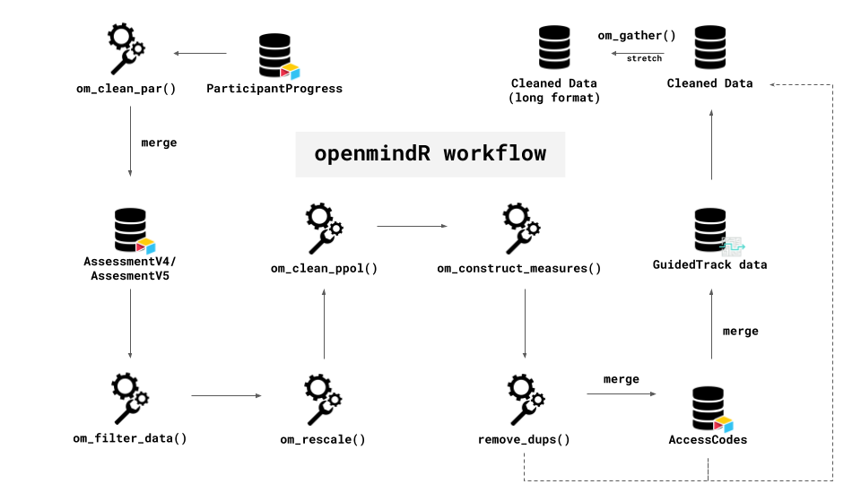

**Overview**

+ [openmindR Cleaning Functions](https://github.com/openmindplatform/openmindR#openmindr-cleaning-functions)
+ [openmindR Analysis Functions](https://github.com/openmindplatform/openmindR#openmindr-analysis-functions)
+ [openmindR ggplot2 theme](https://github.com/openmindplatform/openmindR#openmindr-ggplot2-theme)

Install package like this:

```{r setup, eval=FALSE}
devtools::install_github("openmindplatform/openmindR")
```

```{r, echo=F}
knitr::opts_chunk$set(message = F, 
                      warning = F)

# AssessmentV6Codebook <- readRDS("data/AssessmentV6Codebook.RDS")
# 
# usethis::use_data(AssessmentV6Codebook)
```


Load package(s):

```{r}
library(openmindR)
library(dplyr)

```

# New Functions

+ [om_parse_lifehacks](https://github.com/openmindplatform/openmindR#om_parse_lifehacks)
+ [merge_assessments](https://github.com/openmindplatform/openmindR#merge_assessments)
+ [om_download_at](https://github.com/openmindplatform/openmindR#om_download_at)


## `om_parse_lifehacks`

This function  The input dataset needs to have the four following columns: `LifeHacksChosen`, `LifeHacksComplete`, `LifeHacksUseful` and `LifeHacksReason`. You can find them in the ParticipantProgress table in Airtable. The function will parse these four columns into 4 x 5 Steps variables (so 20 in total):

+ `LifeHack1` - `LifeHack5`: Which Lifehack was chosen
+ `LifeHacksComplete1` - `LifeHacksComplete5`: Did the user complete the lifehack
+ `LifeHacksUseful1` - `LifeHacksUseful5`: Did the user find completing the lifehack useful
+ `LifeHacksReason1` - `LifeHacksReason5`: Why didn't the user complete the lifehack

```{r, eval = F}
## get key
key <- read_lines("../../Keys/airtabler.txt")

## download participant progress data
pp_dat <- om_download_at(key, tables = "ParticipantProgress")


## this parses all Lifehack data so far
parsed_lh <-  om_parse_lifehacks(pp_dat)


## if you want just the newest life hack data you can filter by OpenMind version
parsed_lh <-  pp_dat %>%
  ## making sure OpenMindVersion is numeric
  mutate(OpenMindVersion = as.numeric(OpenMindVersion)) %>% 
  ## Only include OM Version 3 and above
  filter(OpenMindVersion >= 3) %>% 
  ## parse Life hacks
  om_parse_lifehacks()

## just select the OMID and all LifeHack data (remove all other PP variables)
parsed_lh %>% 
  select(OMID, LifeHack1:LifeHacksReason5)
```


## `merge_assessments`

This function merges assessment v4, v5 and v6 data and only keeps common variables. 

```{r, eval= F}
## get previous assessment dat
v4 <- read.csv("../../../Data/2019-10-29_assessmentv4.csv") 
v5 <- read.csv("../../../Data/2019-10-29_assessmentv5.csv") 

## get key
key <- readr::read_lines("../../Keys/airtabler.txt")

## get (clean) assessment v6 data
v6 <- om_download_at(key = key, tables = "AssessmentV6", clean = T)


## merge all three datasets and only keep comman variables
merge_assessments(v4, v5, v6)

```

## `om_download_at`

`openmindR` can download and clean data directly from Airtable. There are three new arguments for Assessment v6:

+ `clean`: Whether to return "clean" data (i.e. numeric data is numeric and minors or opt-outs are `NA` (`TRUE`/`FALSE`)
+ `file`: give a file path to where the downloaded data should be stored
+ `v6.1`: filter down the dataset to only include Assessment V6.1 (`TRUE/FALSE`)

Here is a code example that will download Assessment V6, clean it, save it into a folder called "Data" under Research and filter down to only include V6.1 data.


```{r, eval=F}
key <- readr::read_lines("../../Keys/airtabler.txt")

assessmentv6 <- om_download_at(key, 
                            tables = "AssessmentV6", 
                            clean = TRUE, 
                            file = "../../../Data/assessmentv6.1.csv",
                            v6.1 = TRUE)
```


# openmindR Cleaning Functions

The following functions are meant to turn AirTable (and GuidedTrack) data into a single clean file that can be analyzed. Along the way it parses the data, constructs measures, removes duplicates and optionally turns it into long format. The solid line is the suggested workflow for a complete dataset. The dashed lines are optional (if you don't want to add GuidedTrack data).

+ [om_filter_data](https://github.com/openmindplatform/openmindR#om_filter_data)
+ [om_clean_par](https://github.com/openmindplatform/openmindR#om_clean_par)
+ [om_rescale](https://github.com/openmindplatform/openmindR#om_rescale)
+ [om_construct_measures](https://github.com/openmindplatform/openmindR#om_construct_measures)
+ [om_clean_ppol](https://github.com/openmindplatform/openmindR#om_clean_ppol)
+ [remove_dups](https://github.com/openmindplatform/openmindR#remove_dups)
+ [om_gather](https://github.com/openmindplatform/openmindR#om_gather)



```{r, eval=F}
cleaned_dat <-
  ## Participant Progress Data
  dat.par %>% 
  ## calculating step scores and more
  om_clean_par(parse_feedback = T) %>% 
  ## Assessment Data
  left_join(app.dat) %>%
  ## adding actual time
  mutate(createdTime = ifelse(is.na(createdTime), at_date, createdTime)) %>% 
  ## Make variables Q1 and Q2 as well as Q3 to C3 range 0 to 1
  om_rescale() %>% 
  ## construct ppol measures
  om_clean_ppol()  %>% 
  ## construct measures such as intellectual humility
  om_construct_measures() %>% 
  ## AccessCode Data  (only keep variables specified in acc_filters)
  left_join(dat.acc %>% select(acc_filters)) %>% 
  ## remove duplicates
  remove_dups() %>% 
  ## make vars numeric
  mutate_at(vars(matches(var_strings)), as.numeric) %>% 
  mutate_at(vars(Step1:Step5_Q5), as.character) %>%  
  mutate(AssessmentsDone = as.character(AssessmentsDone)) %>% 
  ##  GuidedTrack Data
  mutate(Source = "AirTable") %>% 
  ## TODO: Should happen automatically in om_clean_par but not, whats going on
  mutate(AppRating = as.character(AppRating)) %>% 
  coalesce_join(gt_parsed_feedback %>%
                  mutate(Source = "GT") %>%
                  mutate(AppRating = as.character(AppRating)) %>%
                  mutate_at(vars(Step1:Step5_Q5), as.character) %>%
                  mutate(AssessmentsDone = as.character(AssessmentsDone)) %>%
                  mutate(createdTime = date), by = "OMID") %>%
  ## weird case where UserType is empty string
  mutate(UserType = ifelse(nchar(UserType) == 0, NA, UserType)) %>%
  drop_na(UserType) %>% 
  mutate(createdTime = as_datetime(createdTime)) %>% 
  ## Count how many steps complete
  mutate(steps_complete = str_count(StepsComplete, "1") %>% as.character) %>% 
  ## we only want AssessmentsDone 1 thru 3
  ## Problem: There are AssessmentsDone 0 in the data.. they have completed steps but no Assessment.. how is that possible?
  filter(AssessmentsDone %in% 1:3) %>% 
  ## TODO: maybe this is not needed
  mutate(AppRating = as.numeric(AppRating)) 

## Turn data into long format
gathered_dat <- om_gather(cleaned_dat, q_c_strings)

```


```{r, echo = F}

db_get_data <- function(tbl_dat) {
  con <- DBI::dbConnect(RSQLite::SQLite(), "../../Research/Projects/Current Projects/om_metrics_report/sql_data/omdata.db")

  out <- con %>%
    dplyr::tbl(tbl_dat) %>%
    dplyr::collect()

  DBI::dbDisconnect(con)

  return(out)
}


# Matching string for all Q variables
# q_strings <- paste0(
#   paste0("Q", 1:18, "P", collapse = "|"), "|", paste0("Q", 1:18, "F", collapse = "|")
#   )
# ## Matching string for all (relevant) D variables
# d_strings <- paste0("D", 1, collapse = "|")
# ## Matching string for all C variables
# c_strings <- paste0("C", 1:3, collapse = "|")
# 
# ## Matching string for all (relevant) D, Q and C variables
# var_strings <- paste0(q_strings, "|", d_strings, "|", c_strings, collapse = "|")
# ## Matching string for all Q and C variables
# q_c_strings <- paste0(q_strings, "|", c_strings, collapse = "|")
# ## Matching string for ranging vars from 0 to 1
# range01_strings <- stringr::str_c(stringr::str_c("Q", 3:12, "P", collapse = "|"), "|",
#                          stringr::str_c("Q", 3:12, "F", collapse = "|"),
#                          stringr::str_c("|", c_strings, collapse = "|")
# )


# Read in data
dat.acc <- db_get_data("dat.acc")
dat.par <- db_get_data("dat.par")
# dat.ass4 <- db_get_data("dat.ass4")
# dat.ass5 <- db_get_data("dat.ass5")
# dat.ass <- db_get_data("cleaned_dat")

dat.ass <- readr::read_csv("../../Research/Data/2019-10-29_assessmentv4.csv") %>% 
  dplyr::bind_rows(readr::read_csv("../../Research/Data/2019-10-29_assessmentv5.csv"))


# dat.ass <- dat.ass4 %>% 
#   dplyr::rename_at(dplyr::vars(dplyr::matches("Followup")), ~stringr::str_replace(., "Followup", "FollowUp")) %>%
#   mutate(OMID = as.character(OMID)) %>% 
#   dplyr::bind_rows(dat.ass5 %>% 
#                      mutate(AssessmentVersion = as.numeric(AssessmentVersion)) %>% 
#                      mutate(AssessmentsDone = as.numeric(AssessmentsDone)))


```


## `om_filter_data`

Filter down Assessment data from AirTable by `AssessmentsDone`, `AssessmentVersion` and `AccessCodes`.

```{r}

dat.ass %>% 
  # specify which number of assessment you want to have
  om_filter_data(n_assessments = 1:3,
             # assessment version?
             version = 4,
             # select Accesscode(s) to produce report for
             accesscode = "Wilkes"
             # "Wilkes" #try this out :)
  )
```

This dataset was filtered down to only AccessCodes that include "Wilkes". The `accesscode` argument is not case-sensitive and can both be used with vectors:

```{r}
dat.ass %>% 
  # specify which number of assessment you want to have
  om_filter_data(n_assessments = 1:3,
             # assessment version?
             version = 4,
             # select Accesscode(s) to produce report for
             accesscode = c("SuszkoWilkesUF18", "KarimiWilkesUF18")
  )
```

And individual strings:

```{r}
dat.ass %>% 
  # specify which number of assessment you want to have
  om_filter_data(n_assessments = 1:3,
             # assessment version?
             version = 4,
             # select Accesscode(s) to produce report for
             accesscode = c("suszko|karimi")
  )
```


## `om_clean_par`

Cleans up ParticipantProgress data and creates several measures:

+ **StepTimes1 to StepTimes5:** Duration in minutes to complete a step

+ **StepCorrect1 to StepCorrect5:** Percentage of correct answers for each step

+ **FeedbackAnswers:** Q1 to Q5 for each individual step

Takes the following arguments:

+ **dat.par:** ParticipantProgress data from AirTable

+ **parse_feedback:**	Parse Feedback answers (Q1 to Q5 for Step 1 to 5). Default is `FALSE`.

+ **...**	Arguments for select to get additional variables from ParticipantProgress

```{r}
dat.par %>% 
  om_clean_par(parse_feedback = T) 
```

## `om_rescale`

This function rescales variables from 0 to 1. 

Q1 and Q2 is divided by 100 and Q3 - Q12 and C1 - C3 is divided by 6. 

**Should be run before any measures are constructed so that they are all on the same scale.**


```{r, eval = F}
dat.ass %>% 
  om_rescale()
```


## `om_construct_measures`

This is a higher-level function that uses both `polar_measures` and `calc_ih` to constuct various measures.

Creates the following variables:

+ **Q14:** Affective Polarization
+ **Q15:** Ingroup
+ **Q16:** Outgroup
+ **Q17:** Ingroup vs. Outgroup Affective Polarization
+ **Q18:** Intellectual Humility

Function automatically accounts for Assessment Version 4 and 5/5.1.


```{r, eval = F}
dat.ass %>% 
  om_construct_measures()
```

> Error in polar_measures(., Q1Pre, Q2Pre) : Input data is missing column `ppol_cat`. Please make sure to run om_clean_ppol before you run om_construct_measures.

Uh oh! That didn't work! `om_construct_measures` needs the column `ppol_cat` to run which can be created with the function `om_clean_ppol`.


## `om_clean_ppol`

Creates the following measures of Political Orientation

+ **ppol_raw:** a variable that merges Assessment V4 and V5.1 spelling of Political Orientation (D4)
+ **ppol:** a factor variable ordered from "Very Progressive/left" to "Very Conservative/right". Excludes all other categories as NA (classical liberal etc.)
+ **ppol_num:** numeric variable ranging from 1 "Very Progressive/left" to 7 "Very Conservative/right"
+ **ppol_cat:** a factor variable which has two categories "Progressive" and "Conservative". The rest is NA.

```{r, eval = F}

dat.ass <- dat.ass %>% 
  om_clean_ppol()


```

Now `om_construct_measures` will work!

```{r, eval = F}
dat.ass %>% 
  om_construct_measures()
```

## `remove_dups`

This function is really important to clean up duplicated OMIDs that occasionally occur within AirTable. 

```{r, message = T}
dat.ass %>% 
  remove_dups()
```


## `om_gather`

This function will turn Assessment data into long format.
 
Creates the following variables:

+ **Question:** Q1Pre, Q2Pre, Q3Pre etc.
+ **Type:** Pre, Post, or FollowUp
+ **Response:** Values of the Question
+ **variable_code:** Q1, Q2, Q3 etc.
 
Takes the following arguments:

+ **.data** Assessment data
+ **which_strings** a string indicating which variables should be parsed out (`q_c_strings` indicates all Q and C questions)


```{r, eval = F}
dat.ass %>% 
  om_gather(q_c_strings) %>% 
  ## select just the relevant vars as showcase
  select(Question, Response, Type, variable_code)
```

# openmindR Analysis Functions

This section introduces the openmindR analysis functions.

+ [om_summarize_comparisons](https://github.com/openmindplatform/openmindR#om_summarize_comparisons)
+ [om_label_stats](https://github.com/openmindplatform/openmindR#om_label_stats)
+ [om_mix_models](https://github.com/openmindplatform/openmindR#om_mix_models)
+ [om_mix_plot](https://github.com/openmindplatform/openmindR#om_mix_plot)
+ [om_mix_complete](https://github.com/openmindplatform/openmindR#om_mix_complete)

## `om_summarize_comparisons`

This is a higher-level function that uses "om_compare", "bind_questions" and "summarize_comparison" to calculate t-tests and Cohen's d using long-format Assessment data.

The `aversion` argument specifies which Assessment version you want to perform models for. Should be one of `"V4"`, `"V5/V5.1"` or `"All"`

With the `compare` argument you can specify either `"PrePost"`, `"PreFollow"` or both `c("PrePost", "PreFollow")` comparisons (the latter is the default).

```{r, eval = F}
## Prepare gathered_dat
gathered_dat <- dat.ass %>% 
  om_rescale() %>% 
  om_construct_measures() %>%
  remove_dups() %>%  
  om_gather(q_c_strings)

gathered_dat %>% 
  om_summarize_comparisons(aversion = "V4",
                           compare = c("PrePost", "PreFollow")) %>% 
  arrange(desc(percentimproved))
```

## `om_label_stats`

Prepare paired data for plot with within subject error term.

The `aversion` argument specifies which Assessment version you want to perform models for. Should be one of `"V4"`, `"V5/V5.1"` or `"All"`

```{r, eval = F}
om_label_stats(gathered_dat, aversion = "V4")
```


# Analyzing mixed effects

Example workflow for Ann Miller experimental data

```{r, eval = F}
load("../om_parser/data/ann_miller_merged.Rdata")

cleaned_data <- ann_miller_merged %>% 
  ## make unique OMID
  mutate(OMID = ifelse(is.na(OMID), ResearchID, OMID)) %>% 
  ## rescale vars
  om_rescale() %>% 
  ## make D4 to standard PoliticalAffil
  mutate(D4 = ifelse(is.na(D4), PoliticalAffil, D4)) %>% 
  ## create ppols
  om_clean_ppol() %>%
  ## om_construct measures needs a complete AV4
  mutate(AssessmentVersion = 4) %>% 
  ## construct measures
  om_construct_measures() %>%
  ## remove duplicates
  remove_dups()  
  

gathered_dat <- cleaned_data %>% 
  om_gather(q_c_strings)
```

Now that we have the Ann Miller data in long format we can use our analysis functions to perform mixed models. All mixed models functions follow the same pattern `om_mix_*`

## `om_mix_models`

This function performs mixed models (Currently only works on Ann Miller experimental data).

Takes the following arguments:

+ **gathered_dat** Assessment data as long format

+ **question** Specify question that you want to perform analysis for (ex: `"Q18"`)

+ **plot_model** logical. Show a coefficient plot of the model. Default is `FALSE`

+ **get_effects** logical. Get marginal effects. Default is `FALSE`

+ **get_tidy** logical. Get a tidy dataframe with estimates. Also calculates pseudo cohen's d effect sizes. Default is `FALSE`

Lets perform a model on `Q11` with all arguments turned on.

```{r, eval = F}
Q11_dat <- om_mix_models(gathered_dat, 
              question = "Q11", 
              plot_model = T, 
              get_effects = T, 
              get_tidy = T)
```

`om_mixed_models` outputs the results of mixed effects in several ways.

For instance, the argument `plot_model = T` will give us a coefficient plot of the model:

```{r, fig.width = 8, fig.height = 5, eval = F}
Q11_dat$ggmod
```

The argument `get_effects = T` will give us marginal effects of the model:

```{r, eval = F}
Q11_dat$effects_dat %>% 
  knitr::kable()
```


The argument `get_tidy = T` will give us coefficients and pseudo cohen's d values of the model as a tidy dataframe:

```{r, eval = F}
Q11_dat$tidy_dat %>% 
  knitr::kable()
```

Finally, by default `om_mixed_models` produces the raw `lme4` object containing the model:

```{r, eval = F}
Q11_dat$lme_dat
```


## `om_mix_plot`

This function plots the results of mixed models (currently only works on Ann Miller experimental data).

Takes the following arguments:

+ **effects_dat** is a dataset produced by `om_mix_models` and supplies the marginal effects of the model
+ **tidy_dat** is a dataset produced by `om_mix_models` and supplies the pseudo cohen's d for plotting
+ **var_label** supply a character that is plotted as title and y-axis
+ **show_stats** Show statistics on the bottom right. Only possible if you supply `tidy_dat`

```{r, fig.width = 12, fig.height = 8.58, eval = F}
om_mix_plot(effects_dat = Q11_dat$effects_dat, 
            tidy_dat = Q11_dat$tidy_dat, 
            var_label = "Growth Mindset",
            show_stats = T)
```


## `om_mix_complete`

This function allows to run **and** plot a mixed model. It makes use of both `om_mix_models` and `om_plot_mix` (currently only works on Ann Miller experimental data).

Just specify data and title where the latter needs to be one of the following (at the moment):

+ `"Growth Mindset"`
+ `"Intellectual Humility"`
+ `"Affective Polarization"`
+ `"Social Closeness"`
+ `"Perspective-Taking"`

```{r, fig.width = 12, fig.height = 8.58, eval = F}
om_mix_complete(gathered_dat, "Growth Mindset")
```


# openmindR ggplot2 theme

There are three functions for the ggplot2 theme:

+ `theme_om`
+ `scale_fill_om`
+ `scale_color_om`

Make sure you have the Poppins font installed!

```{r, eval = F}
extrafont::font_import()
```


```{r}
windowsFonts(`Poppins` = windowsFont("Poppins"))

```


[Good tutorial on how to install custom fonts in R](https://www.andrewheiss.com/blog/2017/09/27/working-with-r-cairo-graphics-custom-fonts-and-ggplot/)

**Example**

```{r fig.width=8, fig.height=5, message=F, warning=F}
## Load tidyverse
library(tidyverse)

titanic_dat <- Titanic %>% as_tibble()

titanic_dat %>% 
  ggplot(aes(Sex, n)) +
  geom_col(aes(fill = Class), position = position_dodge()) +
  theme_om(legend_position = c(0.9, 0.75)) +
  scale_fill_om("Class") +
  facet_wrap(~Survived) +
  labs(title = "Titanic Survival by Age and Class") 
  
```

**Adapt `theme_om`**

+ `legend_position`
+ `axis_text_size`
+ `axis_title_size`
+ `legend_text_size`
+ `title_size`

```{r fig.width=8, fig.height=5, message=F}
titanic_dat %>% 
  ggplot(aes(Class, n, fill = Class)) +
  geom_col() +
  theme_om(legend_position = "bottom",
           axis_text_size = 10,
           axis_title_size = 15, 
           legend_text_size = 10,
           title_size = 20) +
  scale_fill_om() +
  facet_wrap(~Survived) +
  labs(title = "Titanic Survival by Class") 
```

Or all text sizes at once

+ `overall_text_size`

```{r fig.width=8, fig.height=5, message=F}
titanic_dat %>% 
  ggplot(aes(Class, n, fill = Class)) +
  geom_col() +
  theme_om(legend_position = "top",
           overall_text_size = 15) +
  scale_fill_om() +
  facet_wrap(~Survived) +
  labs(title = "Titanic Survival by Class") 
```


In case your pandoc is having problems check out this very neat fix:  https://github.com/rstudio/rstudio/issues/3661#issuecomment-475705806
