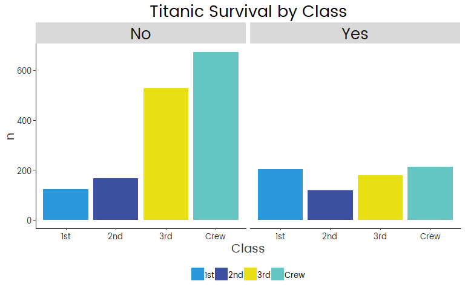

openmindR
================

Install package like this:

``` r
devtools::install_github("openmindplatform/openmindR")
```

Load package(s):

``` r
library(openmindR)
library(tidyverse)
```

## OpenMind Cleaning Functions

## `om_filter_data`

Filter down Assessment data from AirTable by `AssessmentsDone`,
`AssessmentVersion` and `AccessCodes`.

``` r
dat.ass %>% 
  # specify which number of assessment you want to have
  om_filter_data(n_assessments = 1:3,
             # assessment version?
             version = 4,
             # select Accesscode(s) to produce report for
             accesscode = "Wilkes"
             # "Wilkes" #try this out :)
  )
```

    ## # A tibble: 653 x 78
    ##    id    OMID  AccessCode AssessmentVersi~ AssessmentsDone Q1Pre Q2Pre
    ##    <chr> <chr> <chr>      <chr>                      <dbl> <chr> <chr>
    ##  1 rec0~ 5717~ TalpashWi~ 4                              3 56    54   
    ##  2 rec0~ 1101~ ThomasWil~ 4                              2 70    40   
    ##  3 rec0~ 1430~ MaykWilke~ 4                              2 50    50   
    ##  4 rec0~ 1144~ SuszkoWil~ 4                              2 31    65   
    ##  5 rec0~ 4351~ WilliamsW~ 4                              3 77    25   
    ##  6 rec0~ 2247~ PradoWilk~ 4                              2 19    100  
    ##  7 rec0~ 3909~ VosikPeka~ 4                              2 50    58   
    ##  8 rec0~ 3873~ BalesterW~ 4                              2 63    85   
    ##  9 rec1~ 7625~ BalesterW~ 4                              2 73    30   
    ## 10 rec1~ 6771~ KarimiWil~ 4                              3 90    20   
    ## # ... with 643 more rows, and 71 more variables: Q3Pre <chr>, Q4Pre <chr>,
    ## #   Q5Pre <chr>, Q6Pre <chr>, Q7Pre <chr>, Q8Pre <chr>, Q9Pre <chr>,
    ## #   Q10Pre <chr>, Q11Pre <chr>, Q12Pre <chr>, C1Pre <chr>, C2Pre <chr>,
    ## #   C3Pre <chr>, D1 <chr>, D2 <chr>, D3 <chr>, D4 <chr>, D5 <chr>,
    ## #   DatePre <chr>, Q1Post <chr>, Q2Post <chr>, Q3Post <chr>, Q4Post <chr>,
    ## #   Q5Post <chr>, Q6Post <chr>, Q7Post <chr>, Q8Post <chr>, Q9Post <chr>,
    ## #   Q10Post <chr>, Q11Post <chr>, Q12Post <chr>, DatePost <chr>,
    ## #   B1Pre <chr>, B1Post <chr>, Q1FollowUp <chr>, Q2FollowUp <chr>,
    ## #   Q3FollowUp <chr>, Q4FollowUp <chr>, Q5FollowUp <chr>,
    ## #   Q6FollowUp <chr>, Q7FollowUp <chr>, Q8FollowUp <chr>,
    ## #   Q9FollowUp <chr>, Q10FollowUp <chr>, Q11FollowUp <chr>,
    ## #   Q12FollowUp <chr>, C1FollowUp <chr>, C2FollowUp <chr>,
    ## #   C3FollowUp <chr>, DateFollowUp <chr>, W1FollowUp <chr>,
    ## #   B1FollowUp <chr>, createdTime <chr>, S1Pre <chr>, BTaskPre <chr>,
    ## #   B2Pre <chr>, B3Pre <chr>, S1Post <chr>, C1Post <chr>, C2Post <chr>,
    ## #   C3Post <chr>, BTaskPost <chr>, B2Post <chr>, B3Post <chr>,
    ## #   W1Post <chr>, W1Pre <chr>, D6 <chr>, S1FollowUp <chr>,
    ## #   BTaskFollowUp <chr>, B2FollowUp <chr>, B3FollowUp <chr>

This dataset was filtered down to only AccessCodes that include
“Wilkes”. The `accesscode` argument is not case-sensitive and can
both be used with vectors:

``` r
dat.ass %>% 
  # specify which number of assessment you want to have
  om_filter_data(n_assessments = 1:3,
             # assessment version?
             version = 4,
             # select Accesscode(s) to produce report for
             accesscode = c("SuszkoWilkesUF18", "KarimiWilkesUF18")
  )
```

    ## # A tibble: 31 x 78
    ##    id    OMID  AccessCode AssessmentVersi~ AssessmentsDone Q1Pre Q2Pre
    ##    <chr> <chr> <chr>      <chr>                      <dbl> <chr> <chr>
    ##  1 rec0~ 1144~ SuszkoWil~ 4                              2 31    65   
    ##  2 rec1~ 6771~ KarimiWil~ 4                              3 90    20   
    ##  3 rec5~ 5923~ SuszkoWil~ 4                              2 50    50   
    ##  4 rec5~ 1915~ KarimiWil~ 4                              2 35    5    
    ##  5 rec7~ 1018~ SuszkoWil~ 4                              2 30    85   
    ##  6 recA~ 1326~ KarimiWil~ 4                              2 70    45   
    ##  7 recE~ 3793~ KarimiWil~ 4                              2 100   30   
    ##  8 recH~ 2939~ SuszkoWil~ 4                              2 <NA>  <NA> 
    ##  9 recL~ 7456~ SuszkoWil~ 4                              2 25    75   
    ## 10 recT~ 3521~ KarimiWil~ 4                              2 25    67   
    ## # ... with 21 more rows, and 71 more variables: Q3Pre <chr>, Q4Pre <chr>,
    ## #   Q5Pre <chr>, Q6Pre <chr>, Q7Pre <chr>, Q8Pre <chr>, Q9Pre <chr>,
    ## #   Q10Pre <chr>, Q11Pre <chr>, Q12Pre <chr>, C1Pre <chr>, C2Pre <chr>,
    ## #   C3Pre <chr>, D1 <chr>, D2 <chr>, D3 <chr>, D4 <chr>, D5 <chr>,
    ## #   DatePre <chr>, Q1Post <chr>, Q2Post <chr>, Q3Post <chr>, Q4Post <chr>,
    ## #   Q5Post <chr>, Q6Post <chr>, Q7Post <chr>, Q8Post <chr>, Q9Post <chr>,
    ## #   Q10Post <chr>, Q11Post <chr>, Q12Post <chr>, DatePost <chr>,
    ## #   B1Pre <chr>, B1Post <chr>, Q1FollowUp <chr>, Q2FollowUp <chr>,
    ## #   Q3FollowUp <chr>, Q4FollowUp <chr>, Q5FollowUp <chr>,
    ## #   Q6FollowUp <chr>, Q7FollowUp <chr>, Q8FollowUp <chr>,
    ## #   Q9FollowUp <chr>, Q10FollowUp <chr>, Q11FollowUp <chr>,
    ## #   Q12FollowUp <chr>, C1FollowUp <chr>, C2FollowUp <chr>,
    ## #   C3FollowUp <chr>, DateFollowUp <chr>, W1FollowUp <chr>,
    ## #   B1FollowUp <chr>, createdTime <chr>, S1Pre <chr>, BTaskPre <chr>,
    ## #   B2Pre <chr>, B3Pre <chr>, S1Post <chr>, C1Post <chr>, C2Post <chr>,
    ## #   C3Post <chr>, BTaskPost <chr>, B2Post <chr>, B3Post <chr>,
    ## #   W1Post <chr>, W1Pre <chr>, D6 <chr>, S1FollowUp <chr>,
    ## #   BTaskFollowUp <chr>, B2FollowUp <chr>, B3FollowUp <chr>

And individual strings:

``` r
dat.ass %>% 
  # specify which number of assessment you want to have
  om_filter_data(n_assessments = 1:3,
             # assessment version?
             version = 4,
             # select Accesscode(s) to produce report for
             accesscode = c("suszko|karimi")
  )
```

    ## # A tibble: 31 x 78
    ##    id    OMID  AccessCode AssessmentVersi~ AssessmentsDone Q1Pre Q2Pre
    ##    <chr> <chr> <chr>      <chr>                      <dbl> <chr> <chr>
    ##  1 rec0~ 1144~ SuszkoWil~ 4                              2 31    65   
    ##  2 rec1~ 6771~ KarimiWil~ 4                              3 90    20   
    ##  3 rec5~ 5923~ SuszkoWil~ 4                              2 50    50   
    ##  4 rec5~ 1915~ KarimiWil~ 4                              2 35    5    
    ##  5 rec7~ 1018~ SuszkoWil~ 4                              2 30    85   
    ##  6 recA~ 1326~ KarimiWil~ 4                              2 70    45   
    ##  7 recE~ 3793~ KarimiWil~ 4                              2 100   30   
    ##  8 recH~ 2939~ SuszkoWil~ 4                              2 <NA>  <NA> 
    ##  9 recL~ 7456~ SuszkoWil~ 4                              2 25    75   
    ## 10 recT~ 3521~ KarimiWil~ 4                              2 25    67   
    ## # ... with 21 more rows, and 71 more variables: Q3Pre <chr>, Q4Pre <chr>,
    ## #   Q5Pre <chr>, Q6Pre <chr>, Q7Pre <chr>, Q8Pre <chr>, Q9Pre <chr>,
    ## #   Q10Pre <chr>, Q11Pre <chr>, Q12Pre <chr>, C1Pre <chr>, C2Pre <chr>,
    ## #   C3Pre <chr>, D1 <chr>, D2 <chr>, D3 <chr>, D4 <chr>, D5 <chr>,
    ## #   DatePre <chr>, Q1Post <chr>, Q2Post <chr>, Q3Post <chr>, Q4Post <chr>,
    ## #   Q5Post <chr>, Q6Post <chr>, Q7Post <chr>, Q8Post <chr>, Q9Post <chr>,
    ## #   Q10Post <chr>, Q11Post <chr>, Q12Post <chr>, DatePost <chr>,
    ## #   B1Pre <chr>, B1Post <chr>, Q1FollowUp <chr>, Q2FollowUp <chr>,
    ## #   Q3FollowUp <chr>, Q4FollowUp <chr>, Q5FollowUp <chr>,
    ## #   Q6FollowUp <chr>, Q7FollowUp <chr>, Q8FollowUp <chr>,
    ## #   Q9FollowUp <chr>, Q10FollowUp <chr>, Q11FollowUp <chr>,
    ## #   Q12FollowUp <chr>, C1FollowUp <chr>, C2FollowUp <chr>,
    ## #   C3FollowUp <chr>, DateFollowUp <chr>, W1FollowUp <chr>,
    ## #   B1FollowUp <chr>, createdTime <chr>, S1Pre <chr>, BTaskPre <chr>,
    ## #   B2Pre <chr>, B3Pre <chr>, S1Post <chr>, C1Post <chr>, C2Post <chr>,
    ## #   C3Post <chr>, BTaskPost <chr>, B2Post <chr>, B3Post <chr>,
    ## #   W1Post <chr>, W1Pre <chr>, D6 <chr>, S1FollowUp <chr>,
    ## #   BTaskFollowUp <chr>, B2FollowUp <chr>, B3FollowUp <chr>

## `om_clean_par`

Cleans up ParticipantProgress data and creates several measures:

  - **StepTimes1 to StepTimes5:** Duration in minutes to complete a step

  - **StepCorrect1 to StepCorrect5:** Percentage of correct answers for
    each step

  - **FeedbackAnswers:** Q1 to Q5 for each individual step

<!-- end list -->

``` r
dat.par %>% 
  om_clean_par()
```

    ## # A tibble: 16,896 x 36
    ##    OMID  StepTimes StepsComplete StepCorrect1 StepCorrect2 StepCorrect3
    ##    <chr> <chr>     <chr>                <dbl>        <dbl>        <dbl>
    ##  1 7806~ <NA>      1, 1, 1, 1, 1        0.667        0.625        0.667
    ##  2 1000~ <NA>      1, 1, 1, 1, 1        0.75         1            0.833
    ##  3 1945~ <NA>      1, 1, 1, 1, 1        0.667        1            0.667
    ##  4 7858~ <NA>      1, 0, 0, 0, 0        0.833       NA           NA    
    ##  5 9277~ <NA>      1, 1, 1, 1, 1        1            1            1    
    ##  6 6750~ <NA>      1, 1, 1, 1, 1        1            1            1    
    ##  7 4023~ <NA>      1, 1, 1, 1, 1        0.833        1            0.667
    ##  8 1000~ <NA>      1, 1, 1, 1, 1        0.625        1            0.667
    ##  9 2458~ <NA>      1, 1, 1, 1, 0        1            1            1    
    ## 10 9406~ <NA>      1, 1, 0, 0, 0        1            1           NA    
    ## # ... with 16,886 more rows, and 30 more variables: StepCorrect4 <dbl>,
    ## #   StepCorrect5 <dbl>, StepTimes1 <dbl>, StepTimes2 <dbl>,
    ## #   StepTimes3 <dbl>, StepTimes4 <dbl>, StepTimes5 <dbl>, Step1 <chr>,
    ## #   Step1_Q1 <chr>, Step1_Q2 <chr>, Step1_Q3 <chr>, Step1_Q4 <chr>,
    ## #   Step1_Q5 <chr>, Step2 <chr>, Step2_Q1 <chr>, Step2_Q2 <chr>,
    ## #   Step2_Q3 <chr>, Step2_Q4 <chr>, Step2_Q5 <chr>, Step5 <chr>,
    ## #   Step5_Q1 <chr>, Step5_Q2 <chr>, Step5_Q3 <chr>, Step5_Q4 <chr>,
    ## #   Step5_Q5 <chr>, FeedbackAnswers <chr>,
    ## #   FeedbackAnswersVariableNames <chr>, AppRating <chr>,
    ## #   AppRecommend <chr>, at_date <chr>

## `om_construct_measures`

This is a higher-level function that uses both `polar_measures` and
`calc_ih` to constuct various measures.

Creates the following variables:

  - **Q14:** Affective Polarization
  - **Q15:** Ingroup
  - **Q16:** Outgroup
  - **Q17:** Ingroup vs. Outgroup Affective Polarization
  - **Q18:** Intellectual Humility

Function automatically accounts for Assessment Version 4 and 5/5.1.

``` r
dat.ass %>% 
  om_construct_measures()
```

> Error in polar\_measures(., Q1Pre, Q2Pre) : Input data is missing
> column `ppol_cat`. Please make sure to run om\_clean\_ppol before you
> run om\_construct\_measures.

Uh oh\! That didn’t work\! `om_construct_measures` needs the column
`ppol_cat` to run which can be created with the function
`om_clean_ppol`.

## `om_clean_ppol`

Creates the following measures of Political Orientation

  - **ppol\_raw:** a variable that merges Assessment V4 and V5.1
    spelling of Political Orientation (D4)
  - **ppol:** a factor variable ordered from “Very Progressive/left” to
    “Very Conservative/right”. Excludes all other categories as NA
    (classical liberal etc.)
  - **ppol\_num:** numeric variable ranging from 1 “Very
    Progressive/left” to 7 “Very Conservative/right”
  - **ppol\_cat:** a factor variable which has two categories
    “Progressive” and “Conservative”. The rest is NA.

<!-- end list -->

``` r
dat.ass <- dat.ass %>% 
  om_clean_ppol()

dat.ass
```

    ## # A tibble: 16,805 x 82
    ##    id    OMID  AccessCode AssessmentVersi~ AssessmentsDone Q1Pre Q2Pre
    ##    <chr> <chr> <chr>      <chr>            <chr>           <dbl> <dbl>
    ##  1 rec0~ 4616~ GottlickU~ 4                2                  40    60
    ##  2 rec0~ 4001~ PotterYCI~ 4                1                  NA    NA
    ##  3 rec0~ 3465~ LittleUGA~ 4                2                  30    36
    ##  4 rec0~ 8406~ Jayawickr~ 4                2                  50    50
    ##  5 rec0~ 8721~ BurmanCha~ 4                2                  NA    NA
    ##  6 rec0~ 7194~ Jayawickr~ 4                2                  80    45
    ##  7 rec0~ 5743~ ZipayUOre~ 4                2                  78    34
    ##  8 rec0~ 5717~ TalpashWi~ 4                3                  56    54
    ##  9 rec0~ 5370~ Individua~ 4                2                  50    37
    ## 10 rec0~ 6459~ BursonInd~ 4                2                  50    50
    ## # ... with 16,795 more rows, and 75 more variables: Q3Pre <dbl>,
    ## #   Q4Pre <dbl>, Q5Pre <dbl>, Q6Pre <dbl>, Q7Pre <dbl>, Q8Pre <dbl>,
    ## #   Q9Pre <dbl>, Q10Pre <dbl>, Q11Pre <dbl>, Q12Pre <dbl>, C1Pre <dbl>,
    ## #   C2Pre <dbl>, C3Pre <dbl>, D1 <dbl>, D2 <chr>, D3 <chr>, D4 <chr>,
    ## #   D5 <chr>, DatePre <chr>, Q1Post <dbl>, Q2Post <dbl>, Q3Post <dbl>,
    ## #   Q4Post <dbl>, Q5Post <dbl>, Q6Post <dbl>, Q7Post <dbl>, Q8Post <dbl>,
    ## #   Q9Post <dbl>, Q10Post <dbl>, Q11Post <dbl>, Q12Post <dbl>,
    ## #   DatePost <chr>, B1Pre <chr>, B1Post <chr>, Q1FollowUp <dbl>,
    ## #   Q2FollowUp <dbl>, Q3FollowUp <dbl>, Q4FollowUp <dbl>,
    ## #   Q5FollowUp <dbl>, Q6FollowUp <dbl>, Q7FollowUp <dbl>,
    ## #   Q8FollowUp <dbl>, Q9FollowUp <dbl>, Q10FollowUp <dbl>,
    ## #   Q11FollowUp <dbl>, Q12FollowUp <dbl>, C1FollowUp <dbl>,
    ## #   C2FollowUp <dbl>, C3FollowUp <dbl>, DateFollowUp <chr>,
    ## #   W1FollowUp <chr>, B1FollowUp <chr>, createdTime <chr>, S1Pre <chr>,
    ## #   BTaskPre <chr>, B2Pre <chr>, B3Pre <chr>, S1Post <chr>, C1Post <dbl>,
    ## #   C2Post <dbl>, C3Post <dbl>, BTaskPost <chr>, B2Post <chr>,
    ## #   B3Post <chr>, W1Post <chr>, W1Pre <chr>, D6 <chr>, S1FollowUp <chr>,
    ## #   BTaskFollowUp <chr>, B2FollowUp <chr>, B3FollowUp <chr>,
    ## #   ppol_raw <chr>, ppol <fct>, ppol_num <dbl>, ppol_cat <fct>

Now `om_construct_measures` will work\!

``` r
dat.ass %>% 
  om_construct_measures()
```

    ## # A tibble: 16,805 x 97
    ##    id    OMID  AccessCode AssessmentVersi~ AssessmentsDone Q1Pre Q2Pre
    ##    <chr> <chr> <chr>                 <dbl> <chr>           <dbl> <dbl>
    ##  1 rec0~ 4616~ GottlickU~                4 2                  40    60
    ##  2 rec0~ 4001~ PotterYCI~                4 1                  NA    NA
    ##  3 rec0~ 3465~ LittleUGA~                4 2                  30    36
    ##  4 rec0~ 8406~ Jayawickr~                4 2                  50    50
    ##  5 rec0~ 8721~ BurmanCha~                4 2                  NA    NA
    ##  6 rec0~ 7194~ Jayawickr~                4 2                  80    45
    ##  7 rec0~ 5743~ ZipayUOre~                4 2                  78    34
    ##  8 rec0~ 5717~ TalpashWi~                4 3                  56    54
    ##  9 rec0~ 5370~ Individua~                4 2                  50    37
    ## 10 rec0~ 6459~ BursonInd~                4 2                  50    50
    ## # ... with 16,795 more rows, and 90 more variables: Q3Pre <dbl>,
    ## #   Q4Pre <dbl>, Q5Pre <dbl>, Q6Pre <dbl>, Q7Pre <dbl>, Q8Pre <dbl>,
    ## #   Q9Pre <dbl>, Q10Pre <dbl>, Q11Pre <dbl>, Q12Pre <dbl>, C1Pre <dbl>,
    ## #   C2Pre <dbl>, C3Pre <dbl>, D1 <dbl>, D2 <chr>, D3 <chr>, D4 <chr>,
    ## #   D5 <chr>, DatePre <chr>, Q1Post <dbl>, Q2Post <dbl>, Q3Post <dbl>,
    ## #   Q4Post <dbl>, Q5Post <dbl>, Q6Post <dbl>, Q7Post <dbl>, Q8Post <dbl>,
    ## #   Q9Post <dbl>, Q10Post <dbl>, Q11Post <dbl>, Q12Post <dbl>,
    ## #   DatePost <chr>, B1Pre <chr>, B1Post <chr>, Q1FollowUp <dbl>,
    ## #   Q2FollowUp <dbl>, Q3FollowUp <dbl>, Q4FollowUp <dbl>,
    ## #   Q5FollowUp <dbl>, Q6FollowUp <dbl>, Q7FollowUp <dbl>,
    ## #   Q8FollowUp <dbl>, Q9FollowUp <dbl>, Q10FollowUp <dbl>,
    ## #   Q11FollowUp <dbl>, Q12FollowUp <dbl>, C1FollowUp <dbl>,
    ## #   C2FollowUp <dbl>, C3FollowUp <dbl>, DateFollowUp <chr>,
    ## #   W1FollowUp <chr>, B1FollowUp <chr>, createdTime <chr>, S1Pre <chr>,
    ## #   BTaskPre <chr>, B2Pre <chr>, B3Pre <chr>, S1Post <chr>, C1Post <dbl>,
    ## #   C2Post <dbl>, C3Post <dbl>, BTaskPost <chr>, B2Post <chr>,
    ## #   B3Post <chr>, W1Post <chr>, W1Pre <chr>, D6 <chr>, S1FollowUp <chr>,
    ## #   BTaskFollowUp <chr>, B2FollowUp <chr>, B3FollowUp <chr>,
    ## #   ppol_raw <chr>, ppol <fct>, ppol_num <dbl>, ppol_cat <fct>,
    ## #   Q14Pre <dbl>, Q15Pre <dbl>, Q16Pre <dbl>, Q17Pre <dbl>, Q18Pre <dbl>,
    ## #   Q14Post <dbl>, Q15Post <dbl>, Q16Post <dbl>, Q17Post <dbl>,
    ## #   Q18Post <dbl>, Q14FollowUp <dbl>, Q15FollowUp <dbl>,
    ## #   Q16FollowUp <dbl>, Q17FollowUp <dbl>, Q18FollowUp <dbl>

## `remove_dups`

This function is really important to clean up duplicated OMIDs that
occasionally occur within AirTable.

``` r
dat.ass %>% 
  remove_dups()
```

    ## Removing 256 duplicates...

    ## # A tibble: 16,293 x 83
    ##    id    OMID  AccessCode AssessmentVersi~ AssessmentsDone Q1Pre Q2Pre
    ##    <chr> <chr> <chr>                 <dbl> <chr>           <dbl> <dbl>
    ##  1 rec0~ 4616~ GottlickU~                4 2                  40    60
    ##  2 rec0~ 4001~ PotterYCI~                4 1                  NA    NA
    ##  3 rec0~ 3465~ LittleUGA~                4 2                  30    36
    ##  4 rec0~ 8406~ Jayawickr~                4 2                  50    50
    ##  5 rec0~ 8721~ BurmanCha~                4 2                  NA    NA
    ##  6 rec0~ 7194~ Jayawickr~                4 2                  80    45
    ##  7 rec0~ 5743~ ZipayUOre~                4 2                  78    34
    ##  8 rec0~ 5717~ TalpashWi~                4 3                  56    54
    ##  9 rec0~ 5370~ Individua~                4 2                  50    37
    ## 10 rec0~ 6459~ BursonInd~                4 2                  50    50
    ## # ... with 16,283 more rows, and 76 more variables: Q3Pre <dbl>,
    ## #   Q4Pre <dbl>, Q5Pre <dbl>, Q6Pre <dbl>, Q7Pre <dbl>, Q8Pre <dbl>,
    ## #   Q9Pre <dbl>, Q10Pre <dbl>, Q11Pre <dbl>, Q12Pre <dbl>, C1Pre <dbl>,
    ## #   C2Pre <dbl>, C3Pre <dbl>, D1 <dbl>, D2 <chr>, D3 <chr>, D4 <chr>,
    ## #   D5 <chr>, DatePre <chr>, Q1Post <dbl>, Q2Post <dbl>, Q3Post <dbl>,
    ## #   Q4Post <dbl>, Q5Post <dbl>, Q6Post <dbl>, Q7Post <dbl>, Q8Post <dbl>,
    ## #   Q9Post <dbl>, Q10Post <dbl>, Q11Post <dbl>, Q12Post <dbl>,
    ## #   DatePost <chr>, B1Pre <chr>, B1Post <chr>, Q1FollowUp <dbl>,
    ## #   Q2FollowUp <dbl>, Q3FollowUp <dbl>, Q4FollowUp <dbl>,
    ## #   Q5FollowUp <dbl>, Q6FollowUp <dbl>, Q7FollowUp <dbl>,
    ## #   Q8FollowUp <dbl>, Q9FollowUp <dbl>, Q10FollowUp <dbl>,
    ## #   Q11FollowUp <dbl>, Q12FollowUp <dbl>, C1FollowUp <dbl>,
    ## #   C2FollowUp <dbl>, C3FollowUp <dbl>, DateFollowUp <chr>,
    ## #   W1FollowUp <chr>, B1FollowUp <chr>, createdTime <dttm>, S1Pre <chr>,
    ## #   BTaskPre <chr>, B2Pre <chr>, B3Pre <chr>, S1Post <chr>, C1Post <dbl>,
    ## #   C2Post <dbl>, C3Post <dbl>, BTaskPost <chr>, B2Post <chr>,
    ## #   B3Post <chr>, W1Post <chr>, W1Pre <chr>, D6 <chr>, S1FollowUp <chr>,
    ## #   BTaskFollowUp <chr>, B2FollowUp <chr>, B3FollowUp <chr>,
    ## #   ppol_raw <chr>, ppol <fct>, ppol_num <dbl>, ppol_cat <fct>,
    ## #   count_na <dbl>

## OpenMind ggplot2 theme

There are three functions for the ggplot2 theme:

  - `theme_om`
  - `scale_fill_om`
  - `scale_color_om`

Make sure you have the Poppins font installed\!

``` r
windowsFonts(`Poppins` = windowsFont("Poppins"))
```

[Good tutorial on how to install custom fonts in
R](https://www.andrewheiss.com/blog/2017/09/27/working-with-r-cairo-graphics-custom-fonts-and-ggplot/)

**Example**

``` r
## Load tidyverse
library(tidyverse)

titanic_dat <- Titanic %>% as_tibble()

titanic_dat %>% 
  ggplot(aes(Sex, n)) +
  geom_col(aes(fill = Class), position = position_dodge()) +
  theme_om(legend_position = c(0.9, 0.75)) +
  scale_fill_om("Class") +
  facet_wrap(~Survived) +
  labs(title = "Titanic Survival by Age and Class") 
```

<!-- -->

**Adapt `theme_om`**

  - `legend_position`
  - `axis_text_size`
  - `axis_title_size`
  - `legend_text_size`
  - `title_size`

<!-- end list -->

``` r
titanic_dat %>% 
  ggplot(aes(Class, n, fill = Class)) +
  geom_col() +
  theme_om(legend_position = "bottom",
           axis_text_size = 10,
           axis_title_size = 15, 
           legend_text_size = 10,
           title_size = 20) +
  scale_fill_om() +
  facet_wrap(~Survived) +
  labs(title = "Titanic Survival by Class") 
```

<!-- -->

Or all text sizes at once

  - `overall_text_size`

<!-- end list -->

``` r
titanic_dat %>% 
  ggplot(aes(Class, n, fill = Class)) +
  geom_col() +
  theme_om(legend_position = "top",
           overall_text_size = 15) +
  scale_fill_om() +
  facet_wrap(~Survived) +
  labs(title = "Titanic Survival by Class") 
```

<!-- -->
