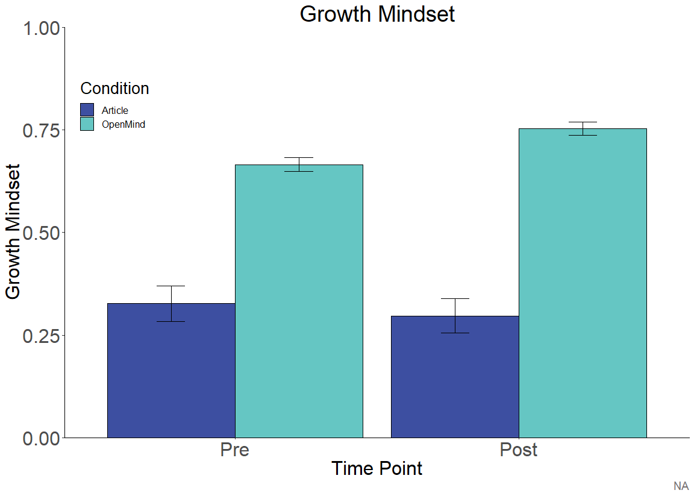
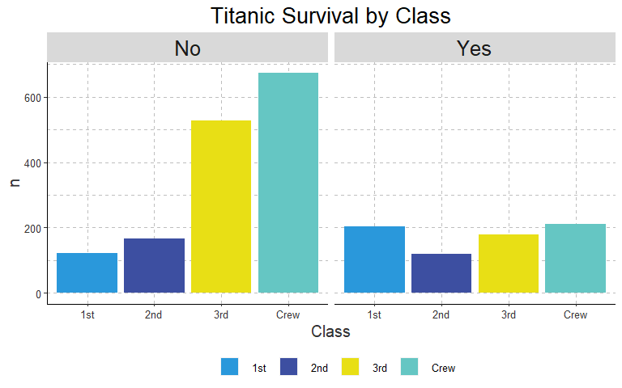

openmindR
================

**Overview**

  - [openmindR Cleaning
    Functions](https://github.com/openmindplatform/openmindR#openmindr-cleaning-functions)
  - [openmindR Analysis
    Functions](https://github.com/openmindplatform/openmindR#openmindr-analysis-functions)
  - [openmindR ggplot2
    theme](https://github.com/openmindplatform/openmindR#openmindr-ggplot2-theme)

Install package like this:

``` r
devtools::install_github("openmindplatform/openmindR")
```

Load package(s):

``` r
library(openmindR)
library(dplyr)
```

# openmindR Cleaning Functions

The following functions are meant to turn AirTable (and GuidedTrack)
data into a single clean file that can be analyzed. Along the way it
parses the data, constructs measures, removes duplicates and optionally
turns it into long format. The solid line is the suggested workflow for
a complete dataset. The dashed lines are optional (if you don’t want to
add GuidedTrack data).

  - [om\_filter\_data](https://github.com/openmindplatform/openmindR#om_filter_data)
  - [om\_clean\_par](https://github.com/openmindplatform/openmindR#om_clean_par)
  - [om\_rescale](https://github.com/openmindplatform/openmindR#om_rescale)
  - [om\_construct\_measures](https://github.com/openmindplatform/openmindR#om_construct_measures)
  - [om\_clean\_ppol](https://github.com/openmindplatform/openmindR#om_clean_ppol)
  - [remove\_dups](https://github.com/openmindplatform/openmindR#remove_dups)
  - [om\_gather](https://github.com/openmindplatform/openmindR#om_gather)


``` r
cleaned_dat <-
  ## Participant Progress Data
  dat.par %>% 
  ## calculating step scores and more
  om_clean_par(parse_feedback = T) %>% 
  ## Assessment Data
  left_join(app.dat) %>%
  ## adding actual time
  mutate(createdTime = ifelse(is.na(createdTime), at_date, createdTime)) %>% 
  ## Make variables Q1 and Q2 as well as Q3 to C3 range 0 to 1
  om_rescale() %>% 
  ## construct ppol measures
  om_clean_ppol()  %>% 
  ## construct measures such as intellectual humility
  om_construct_measures() %>% 
  ## AccessCode Data  (only keep variables specified in acc_filters)
  left_join(dat.acc %>% select(acc_filters)) %>% 
  ## remove duplicates
  remove_dups() %>% 
  ## make vars numeric
  mutate_at(vars(matches(var_strings)), as.numeric) %>% 
  mutate_at(vars(Step1:Step5_Q5), as.character) %>%  
  mutate(AssessmentsDone = as.character(AssessmentsDone)) %>% 
  ##  GuidedTrack Data
  mutate(Source = "AirTable") %>% 
  ## TODO: Should happen automatically in om_clean_par but not, whats going on
  mutate(AppRating = as.character(AppRating)) %>% 
  coalesce_join(gt_parsed_feedback %>%
                  mutate(Source = "GT") %>%
                  mutate(AppRating = as.character(AppRating)) %>%
                  mutate_at(vars(Step1:Step5_Q5), as.character) %>%
                  mutate(AssessmentsDone = as.character(AssessmentsDone)) %>%
                  mutate(createdTime = date), by = "OMID") %>%
  ## weird case where UserType is empty string
  mutate(UserType = ifelse(nchar(UserType) == 0, NA, UserType)) %>%
  drop_na(UserType) %>% 
  mutate(createdTime = as_datetime(createdTime)) %>% 
  ## Count how many steps complete
  mutate(steps_complete = str_count(StepsComplete, "1") %>% as.character) %>% 
  ## we only want AssessmentsDone 1 thru 3
  ## Problem: There are AssessmentsDone 0 in the data.. they have completed steps but no Assessment.. how is that possible?
  filter(AssessmentsDone %in% 1:3) %>% 
  ## TODO: maybe this is not needed
  mutate(AppRating = as.numeric(AppRating)) 

## Turn data into long format
gathered_dat <- om_gather(cleaned_dat, q_c_strings)
```

## `om_filter_data`

Filter down Assessment data from AirTable by `AssessmentsDone`,
`AssessmentVersion` and `AccessCodes`.

``` r
dat.ass %>% 
  # specify which number of assessment you want to have
  om_filter_data(n_assessments = 1:3,
             # assessment version?
             version = 4,
             # select Accesscode(s) to produce report for
             accesscode = "Wilkes"
             # "Wilkes" #try this out :)
  )
```

    ## # A tibble: 653 x 78
    ##    id    OMID  AccessCode AssessmentVersi~ AssessmentsDone Q1Pre Q2Pre
    ##    <chr> <chr> <chr>      <chr>                      <dbl> <chr> <chr>
    ##  1 rec0~ 5717~ TalpashWi~ 4                              3 56    54   
    ##  2 rec0~ 1101~ ThomasWil~ 4                              2 70    40   
    ##  3 rec0~ 1430~ MaykWilke~ 4                              2 50    50   
    ##  4 rec0~ 1144~ SuszkoWil~ 4                              2 31    65   
    ##  5 rec0~ 4351~ WilliamsW~ 4                              3 77    25   
    ##  6 rec0~ 2247~ PradoWilk~ 4                              2 19    100  
    ##  7 rec0~ 3909~ VosikPeka~ 4                              2 50    58   
    ##  8 rec0~ 3873~ BalesterW~ 4                              2 63    85   
    ##  9 rec1~ 7625~ BalesterW~ 4                              2 73    30   
    ## 10 rec1~ 6771~ KarimiWil~ 4                              3 90    20   
    ## # ... with 643 more rows, and 71 more variables: Q3Pre <chr>, Q4Pre <chr>,
    ## #   Q5Pre <chr>, Q6Pre <chr>, Q7Pre <chr>, Q8Pre <chr>, Q9Pre <chr>,
    ## #   Q10Pre <chr>, Q11Pre <chr>, Q12Pre <chr>, C1Pre <chr>, C2Pre <chr>,
    ## #   C3Pre <chr>, D1 <chr>, D2 <chr>, D3 <chr>, D4 <chr>, D5 <chr>,
    ## #   DatePre <chr>, Q1Post <chr>, Q2Post <chr>, Q3Post <chr>, Q4Post <chr>,
    ## #   Q5Post <chr>, Q6Post <chr>, Q7Post <chr>, Q8Post <chr>, Q9Post <chr>,
    ## #   Q10Post <chr>, Q11Post <chr>, Q12Post <chr>, DatePost <chr>,
    ## #   B1Pre <chr>, B1Post <chr>, Q1FollowUp <chr>, Q2FollowUp <chr>,
    ## #   Q3FollowUp <chr>, Q4FollowUp <chr>, Q5FollowUp <chr>,
    ## #   Q6FollowUp <chr>, Q7FollowUp <chr>, Q8FollowUp <chr>,
    ## #   Q9FollowUp <chr>, Q10FollowUp <chr>, Q11FollowUp <chr>,
    ## #   Q12FollowUp <chr>, C1FollowUp <chr>, C2FollowUp <chr>,
    ## #   C3FollowUp <chr>, DateFollowUp <chr>, W1FollowUp <chr>,
    ## #   B1FollowUp <chr>, createdTime <chr>, S1Pre <chr>, BTaskPre <chr>,
    ## #   B2Pre <chr>, B3Pre <chr>, S1Post <chr>, C1Post <chr>, C2Post <chr>,
    ## #   C3Post <chr>, BTaskPost <chr>, B2Post <chr>, B3Post <chr>,
    ## #   W1Post <chr>, W1Pre <chr>, D6 <chr>, S1FollowUp <chr>,
    ## #   BTaskFollowUp <chr>, B2FollowUp <chr>, B3FollowUp <chr>

This dataset was filtered down to only AccessCodes that include
“Wilkes”. The `accesscode` argument is not case-sensitive and can
both be used with vectors:

``` r
dat.ass %>% 
  # specify which number of assessment you want to have
  om_filter_data(n_assessments = 1:3,
             # assessment version?
             version = 4,
             # select Accesscode(s) to produce report for
             accesscode = c("SuszkoWilkesUF18", "KarimiWilkesUF18")
  )
```

    ## # A tibble: 31 x 78
    ##    id    OMID  AccessCode AssessmentVersi~ AssessmentsDone Q1Pre Q2Pre
    ##    <chr> <chr> <chr>      <chr>                      <dbl> <chr> <chr>
    ##  1 rec0~ 1144~ SuszkoWil~ 4                              2 31    65   
    ##  2 rec1~ 6771~ KarimiWil~ 4                              3 90    20   
    ##  3 rec5~ 5923~ SuszkoWil~ 4                              2 50    50   
    ##  4 rec5~ 1915~ KarimiWil~ 4                              2 35    5    
    ##  5 rec7~ 1018~ SuszkoWil~ 4                              2 30    85   
    ##  6 recA~ 1326~ KarimiWil~ 4                              2 70    45   
    ##  7 recE~ 3793~ KarimiWil~ 4                              2 100   30   
    ##  8 recH~ 2939~ SuszkoWil~ 4                              2 <NA>  <NA> 
    ##  9 recL~ 7456~ SuszkoWil~ 4                              2 25    75   
    ## 10 recT~ 3521~ KarimiWil~ 4                              2 25    67   
    ## # ... with 21 more rows, and 71 more variables: Q3Pre <chr>, Q4Pre <chr>,
    ## #   Q5Pre <chr>, Q6Pre <chr>, Q7Pre <chr>, Q8Pre <chr>, Q9Pre <chr>,
    ## #   Q10Pre <chr>, Q11Pre <chr>, Q12Pre <chr>, C1Pre <chr>, C2Pre <chr>,
    ## #   C3Pre <chr>, D1 <chr>, D2 <chr>, D3 <chr>, D4 <chr>, D5 <chr>,
    ## #   DatePre <chr>, Q1Post <chr>, Q2Post <chr>, Q3Post <chr>, Q4Post <chr>,
    ## #   Q5Post <chr>, Q6Post <chr>, Q7Post <chr>, Q8Post <chr>, Q9Post <chr>,
    ## #   Q10Post <chr>, Q11Post <chr>, Q12Post <chr>, DatePost <chr>,
    ## #   B1Pre <chr>, B1Post <chr>, Q1FollowUp <chr>, Q2FollowUp <chr>,
    ## #   Q3FollowUp <chr>, Q4FollowUp <chr>, Q5FollowUp <chr>,
    ## #   Q6FollowUp <chr>, Q7FollowUp <chr>, Q8FollowUp <chr>,
    ## #   Q9FollowUp <chr>, Q10FollowUp <chr>, Q11FollowUp <chr>,
    ## #   Q12FollowUp <chr>, C1FollowUp <chr>, C2FollowUp <chr>,
    ## #   C3FollowUp <chr>, DateFollowUp <chr>, W1FollowUp <chr>,
    ## #   B1FollowUp <chr>, createdTime <chr>, S1Pre <chr>, BTaskPre <chr>,
    ## #   B2Pre <chr>, B3Pre <chr>, S1Post <chr>, C1Post <chr>, C2Post <chr>,
    ## #   C3Post <chr>, BTaskPost <chr>, B2Post <chr>, B3Post <chr>,
    ## #   W1Post <chr>, W1Pre <chr>, D6 <chr>, S1FollowUp <chr>,
    ## #   BTaskFollowUp <chr>, B2FollowUp <chr>, B3FollowUp <chr>

And individual strings:

``` r
dat.ass %>% 
  # specify which number of assessment you want to have
  om_filter_data(n_assessments = 1:3,
             # assessment version?
             version = 4,
             # select Accesscode(s) to produce report for
             accesscode = c("suszko|karimi")
  )
```

    ## # A tibble: 31 x 78
    ##    id    OMID  AccessCode AssessmentVersi~ AssessmentsDone Q1Pre Q2Pre
    ##    <chr> <chr> <chr>      <chr>                      <dbl> <chr> <chr>
    ##  1 rec0~ 1144~ SuszkoWil~ 4                              2 31    65   
    ##  2 rec1~ 6771~ KarimiWil~ 4                              3 90    20   
    ##  3 rec5~ 5923~ SuszkoWil~ 4                              2 50    50   
    ##  4 rec5~ 1915~ KarimiWil~ 4                              2 35    5    
    ##  5 rec7~ 1018~ SuszkoWil~ 4                              2 30    85   
    ##  6 recA~ 1326~ KarimiWil~ 4                              2 70    45   
    ##  7 recE~ 3793~ KarimiWil~ 4                              2 100   30   
    ##  8 recH~ 2939~ SuszkoWil~ 4                              2 <NA>  <NA> 
    ##  9 recL~ 7456~ SuszkoWil~ 4                              2 25    75   
    ## 10 recT~ 3521~ KarimiWil~ 4                              2 25    67   
    ## # ... with 21 more rows, and 71 more variables: Q3Pre <chr>, Q4Pre <chr>,
    ## #   Q5Pre <chr>, Q6Pre <chr>, Q7Pre <chr>, Q8Pre <chr>, Q9Pre <chr>,
    ## #   Q10Pre <chr>, Q11Pre <chr>, Q12Pre <chr>, C1Pre <chr>, C2Pre <chr>,
    ## #   C3Pre <chr>, D1 <chr>, D2 <chr>, D3 <chr>, D4 <chr>, D5 <chr>,
    ## #   DatePre <chr>, Q1Post <chr>, Q2Post <chr>, Q3Post <chr>, Q4Post <chr>,
    ## #   Q5Post <chr>, Q6Post <chr>, Q7Post <chr>, Q8Post <chr>, Q9Post <chr>,
    ## #   Q10Post <chr>, Q11Post <chr>, Q12Post <chr>, DatePost <chr>,
    ## #   B1Pre <chr>, B1Post <chr>, Q1FollowUp <chr>, Q2FollowUp <chr>,
    ## #   Q3FollowUp <chr>, Q4FollowUp <chr>, Q5FollowUp <chr>,
    ## #   Q6FollowUp <chr>, Q7FollowUp <chr>, Q8FollowUp <chr>,
    ## #   Q9FollowUp <chr>, Q10FollowUp <chr>, Q11FollowUp <chr>,
    ## #   Q12FollowUp <chr>, C1FollowUp <chr>, C2FollowUp <chr>,
    ## #   C3FollowUp <chr>, DateFollowUp <chr>, W1FollowUp <chr>,
    ## #   B1FollowUp <chr>, createdTime <chr>, S1Pre <chr>, BTaskPre <chr>,
    ## #   B2Pre <chr>, B3Pre <chr>, S1Post <chr>, C1Post <chr>, C2Post <chr>,
    ## #   C3Post <chr>, BTaskPost <chr>, B2Post <chr>, B3Post <chr>,
    ## #   W1Post <chr>, W1Pre <chr>, D6 <chr>, S1FollowUp <chr>,
    ## #   BTaskFollowUp <chr>, B2FollowUp <chr>, B3FollowUp <chr>

## `om_clean_par`

Cleans up ParticipantProgress data and creates several measures:

  - **StepTimes1 to StepTimes5:** Duration in minutes to complete a step

  - **StepCorrect1 to StepCorrect5:** Percentage of correct answers for
    each step

  - **FeedbackAnswers:** Q1 to Q5 for each individual step

Takes the following arguments:

  - **dat.par:** ParticipantProgress data from AirTable

  - **parse\_feedback:** Parse Feedback answers (Q1 to Q5 for Step 1 to
    5). Default is `FALSE`.

  - **…** Arguments for select to get additional variables from
    ParticipantProgress

<!-- end list -->

``` r
dat.par %>% 
  om_clean_par(parse_feedback = T) 
```

    ## # A tibble: 17,139 x 36
    ##    OMID  StepTimes StepsComplete StepCorrect1 StepCorrect2 StepCorrect3
    ##    <chr> <chr>     <chr>                <dbl>        <dbl>        <dbl>
    ##  1 7806~ <NA>      1, 1, 1, 1, 1        0.667        0.625        0.667
    ##  2 1000~ <NA>      1, 1, 1, 1, 1        0.75         1            0.833
    ##  3 1945~ <NA>      1, 1, 1, 1, 1        0.667        1            0.667
    ##  4 7858~ <NA>      1, 0, 0, 0, 0        0.833       NA           NA    
    ##  5 9277~ <NA>      1, 1, 1, 1, 1        1            1            1    
    ##  6 6750~ <NA>      1, 1, 1, 1, 1        1            1            1    
    ##  7 4023~ <NA>      1, 1, 1, 1, 1        0.833        1            0.667
    ##  8 1000~ <NA>      1, 1, 1, 1, 1        0.625        1            0.667
    ##  9 2458~ <NA>      1, 1, 1, 1, 0        1            1            1    
    ## 10 9406~ <NA>      1, 1, 0, 0, 0        1            1           NA    
    ## # ... with 17,129 more rows, and 30 more variables: StepCorrect4 <dbl>,
    ## #   StepCorrect5 <dbl>, StepTimes1 <dbl>, StepTimes2 <dbl>,
    ## #   StepTimes3 <dbl>, StepTimes4 <dbl>, StepTimes5 <dbl>, Step1 <chr>,
    ## #   Step1_Q1 <chr>, Step1_Q2 <chr>, Step1_Q3 <chr>, Step1_Q4 <chr>,
    ## #   Step1_Q5 <chr>, Step2 <chr>, Step2_Q1 <chr>, Step2_Q2 <chr>,
    ## #   Step2_Q3 <chr>, Step2_Q4 <chr>, Step2_Q5 <chr>, Step5 <chr>,
    ## #   Step5_Q1 <chr>, Step5_Q2 <chr>, Step5_Q3 <chr>, Step5_Q4 <chr>,
    ## #   Step5_Q5 <chr>, FeedbackAnswers <chr>,
    ## #   FeedbackAnswersVariableNames <chr>, AppRating <dbl>,
    ## #   AppRecommend <chr>, at_date <chr>

## `om_rescale`

This function rescales variables from 0 to 1.

Q1 and Q2 is divided by 100 and Q3 - Q12 and C1 - C3 is divided by 6.

**Should be run before any measures are constructed so that they are all
on the same scale.**

``` r
dat.ass %>% 
  om_rescale()
```

    ## # A tibble: 17,040 x 78
    ##    id    OMID  AccessCode AssessmentVersi~ AssessmentsDone Q1Pre Q2Pre
    ##    <chr> <chr> <chr>      <chr>            <chr>           <dbl> <dbl>
    ##  1 rec0~ 4616~ GottlickU~ 4                2                0.4   0.6 
    ##  2 rec0~ 4001~ PotterYCI~ 4                1               NA    NA   
    ##  3 rec0~ 3465~ LittleUGA~ 4                2                0.3   0.36
    ##  4 rec0~ 8406~ Jayawickr~ 4                2                0.5   0.5 
    ##  5 rec0~ 8721~ BurmanCha~ 4                2               NA    NA   
    ##  6 rec0~ 7194~ Jayawickr~ 4                2                0.8   0.45
    ##  7 rec0~ 5743~ ZipayUOre~ 4                2                0.78  0.34
    ##  8 rec0~ 5717~ TalpashWi~ 4                3                0.56  0.54
    ##  9 rec0~ 5370~ Individua~ 4                2                0.5   0.37
    ## 10 rec0~ 6459~ BursonInd~ 4                2                0.5   0.5 
    ## # ... with 17,030 more rows, and 71 more variables: Q3Pre <dbl>,
    ## #   Q4Pre <dbl>, Q5Pre <dbl>, Q6Pre <dbl>, Q7Pre <dbl>, Q8Pre <dbl>,
    ## #   Q9Pre <dbl>, Q10Pre <dbl>, Q11Pre <dbl>, Q12Pre <dbl>, C1Pre <dbl>,
    ## #   C2Pre <dbl>, C3Pre <dbl>, D1 <dbl>, D2 <chr>, D3 <chr>, D4 <chr>,
    ## #   D5 <chr>, DatePre <chr>, Q1Post <dbl>, Q2Post <dbl>, Q3Post <dbl>,
    ## #   Q4Post <dbl>, Q5Post <dbl>, Q6Post <dbl>, Q7Post <dbl>, Q8Post <dbl>,
    ## #   Q9Post <dbl>, Q10Post <dbl>, Q11Post <dbl>, Q12Post <dbl>,
    ## #   DatePost <chr>, B1Pre <chr>, B1Post <chr>, Q1FollowUp <dbl>,
    ## #   Q2FollowUp <dbl>, Q3FollowUp <dbl>, Q4FollowUp <dbl>,
    ## #   Q5FollowUp <dbl>, Q6FollowUp <dbl>, Q7FollowUp <dbl>,
    ## #   Q8FollowUp <dbl>, Q9FollowUp <dbl>, Q10FollowUp <dbl>,
    ## #   Q11FollowUp <dbl>, Q12FollowUp <dbl>, C1FollowUp <dbl>,
    ## #   C2FollowUp <dbl>, C3FollowUp <dbl>, DateFollowUp <chr>,
    ## #   W1FollowUp <chr>, B1FollowUp <chr>, createdTime <chr>, S1Pre <chr>,
    ## #   BTaskPre <chr>, B2Pre <chr>, B3Pre <chr>, S1Post <chr>, C1Post <dbl>,
    ## #   C2Post <dbl>, C3Post <dbl>, BTaskPost <chr>, B2Post <chr>,
    ## #   B3Post <chr>, W1Post <chr>, W1Pre <chr>, D6 <chr>, S1FollowUp <chr>,
    ## #   BTaskFollowUp <chr>, B2FollowUp <chr>, B3FollowUp <chr>

## `om_construct_measures`

This is a higher-level function that uses both `polar_measures` and
`calc_ih` to constuct various measures.

Creates the following variables:

  - **Q14:** Affective Polarization
  - **Q15:** Ingroup
  - **Q16:** Outgroup
  - **Q17:** Ingroup vs. Outgroup Affective Polarization
  - **Q18:** Intellectual Humility

Function automatically accounts for Assessment Version 4 and 5/5.1.

``` r
dat.ass %>% 
  om_construct_measures()
```

> Error in polar\_measures(., Q1Pre, Q2Pre) : Input data is missing
> column `ppol_cat`. Please make sure to run om\_clean\_ppol before you
> run om\_construct\_measures.

Uh oh\! That didn’t work\! `om_construct_measures` needs the column
`ppol_cat` to run which can be created with the function
`om_clean_ppol`.

## `om_clean_ppol`

Creates the following measures of Political Orientation

  - **ppol\_raw:** a variable that merges Assessment V4 and V5.1
    spelling of Political Orientation (D4)
  - **ppol:** a factor variable ordered from “Very Progressive/left” to
    “Very Conservative/right”. Excludes all other categories as NA
    (classical liberal etc.)
  - **ppol\_num:** numeric variable ranging from 1 “Very
    Progressive/left” to 7 “Very Conservative/right”
  - **ppol\_cat:** a factor variable which has two categories
    “Progressive” and “Conservative”. The rest is NA.

<!-- end list -->

``` r
dat.ass <- dat.ass %>% 
  om_clean_ppol()

dat.ass
```

    ## # A tibble: 17,040 x 82
    ##    id    OMID  AccessCode AssessmentVersi~ AssessmentsDone Q1Pre Q2Pre
    ##    <chr> <chr> <chr>      <chr>            <chr>           <dbl> <dbl>
    ##  1 rec0~ 4616~ GottlickU~ 4                2                  40    60
    ##  2 rec0~ 4001~ PotterYCI~ 4                1                  NA    NA
    ##  3 rec0~ 3465~ LittleUGA~ 4                2                  30    36
    ##  4 rec0~ 8406~ Jayawickr~ 4                2                  50    50
    ##  5 rec0~ 8721~ BurmanCha~ 4                2                  NA    NA
    ##  6 rec0~ 7194~ Jayawickr~ 4                2                  80    45
    ##  7 rec0~ 5743~ ZipayUOre~ 4                2                  78    34
    ##  8 rec0~ 5717~ TalpashWi~ 4                3                  56    54
    ##  9 rec0~ 5370~ Individua~ 4                2                  50    37
    ## 10 rec0~ 6459~ BursonInd~ 4                2                  50    50
    ## # ... with 17,030 more rows, and 75 more variables: Q3Pre <dbl>,
    ## #   Q4Pre <dbl>, Q5Pre <dbl>, Q6Pre <dbl>, Q7Pre <dbl>, Q8Pre <dbl>,
    ## #   Q9Pre <dbl>, Q10Pre <dbl>, Q11Pre <dbl>, Q12Pre <dbl>, C1Pre <dbl>,
    ## #   C2Pre <dbl>, C3Pre <dbl>, D1 <dbl>, D2 <chr>, D3 <chr>, D4 <chr>,
    ## #   D5 <chr>, DatePre <chr>, Q1Post <dbl>, Q2Post <dbl>, Q3Post <dbl>,
    ## #   Q4Post <dbl>, Q5Post <dbl>, Q6Post <dbl>, Q7Post <dbl>, Q8Post <dbl>,
    ## #   Q9Post <dbl>, Q10Post <dbl>, Q11Post <dbl>, Q12Post <dbl>,
    ## #   DatePost <chr>, B1Pre <chr>, B1Post <chr>, Q1FollowUp <dbl>,
    ## #   Q2FollowUp <dbl>, Q3FollowUp <dbl>, Q4FollowUp <dbl>,
    ## #   Q5FollowUp <dbl>, Q6FollowUp <dbl>, Q7FollowUp <dbl>,
    ## #   Q8FollowUp <dbl>, Q9FollowUp <dbl>, Q10FollowUp <dbl>,
    ## #   Q11FollowUp <dbl>, Q12FollowUp <dbl>, C1FollowUp <dbl>,
    ## #   C2FollowUp <dbl>, C3FollowUp <dbl>, DateFollowUp <chr>,
    ## #   W1FollowUp <chr>, B1FollowUp <chr>, createdTime <chr>, S1Pre <chr>,
    ## #   BTaskPre <chr>, B2Pre <chr>, B3Pre <chr>, S1Post <chr>, C1Post <dbl>,
    ## #   C2Post <dbl>, C3Post <dbl>, BTaskPost <chr>, B2Post <chr>,
    ## #   B3Post <chr>, W1Post <chr>, W1Pre <chr>, D6 <chr>, S1FollowUp <chr>,
    ## #   BTaskFollowUp <chr>, B2FollowUp <chr>, B3FollowUp <chr>,
    ## #   ppol_raw <chr>, ppol <fct>, ppol_num <dbl>, ppol_cat <fct>

Now `om_construct_measures` will work\!

``` r
dat.ass %>% 
  om_construct_measures()
```

    ## # A tibble: 17,040 x 97
    ##    id    OMID  AccessCode AssessmentVersi~ AssessmentsDone Q1Pre Q2Pre
    ##    <chr> <chr> <chr>                 <dbl> <chr>           <dbl> <dbl>
    ##  1 rec0~ 4616~ GottlickU~                4 2                  40    60
    ##  2 rec0~ 4001~ PotterYCI~                4 1                  NA    NA
    ##  3 rec0~ 3465~ LittleUGA~                4 2                  30    36
    ##  4 rec0~ 8406~ Jayawickr~                4 2                  50    50
    ##  5 rec0~ 8721~ BurmanCha~                4 2                  NA    NA
    ##  6 rec0~ 7194~ Jayawickr~                4 2                  80    45
    ##  7 rec0~ 5743~ ZipayUOre~                4 2                  78    34
    ##  8 rec0~ 5717~ TalpashWi~                4 3                  56    54
    ##  9 rec0~ 5370~ Individua~                4 2                  50    37
    ## 10 rec0~ 6459~ BursonInd~                4 2                  50    50
    ## # ... with 17,030 more rows, and 90 more variables: Q3Pre <dbl>,
    ## #   Q4Pre <dbl>, Q5Pre <dbl>, Q6Pre <dbl>, Q7Pre <dbl>, Q8Pre <dbl>,
    ## #   Q9Pre <dbl>, Q10Pre <dbl>, Q11Pre <dbl>, Q12Pre <dbl>, C1Pre <dbl>,
    ## #   C2Pre <dbl>, C3Pre <dbl>, D1 <dbl>, D2 <chr>, D3 <chr>, D4 <chr>,
    ## #   D5 <chr>, DatePre <chr>, Q1Post <dbl>, Q2Post <dbl>, Q3Post <dbl>,
    ## #   Q4Post <dbl>, Q5Post <dbl>, Q6Post <dbl>, Q7Post <dbl>, Q8Post <dbl>,
    ## #   Q9Post <dbl>, Q10Post <dbl>, Q11Post <dbl>, Q12Post <dbl>,
    ## #   DatePost <chr>, B1Pre <chr>, B1Post <chr>, Q1FollowUp <dbl>,
    ## #   Q2FollowUp <dbl>, Q3FollowUp <dbl>, Q4FollowUp <dbl>,
    ## #   Q5FollowUp <dbl>, Q6FollowUp <dbl>, Q7FollowUp <dbl>,
    ## #   Q8FollowUp <dbl>, Q9FollowUp <dbl>, Q10FollowUp <dbl>,
    ## #   Q11FollowUp <dbl>, Q12FollowUp <dbl>, C1FollowUp <dbl>,
    ## #   C2FollowUp <dbl>, C3FollowUp <dbl>, DateFollowUp <chr>,
    ## #   W1FollowUp <chr>, B1FollowUp <chr>, createdTime <chr>, S1Pre <chr>,
    ## #   BTaskPre <chr>, B2Pre <chr>, B3Pre <chr>, S1Post <chr>, C1Post <dbl>,
    ## #   C2Post <dbl>, C3Post <dbl>, BTaskPost <chr>, B2Post <chr>,
    ## #   B3Post <chr>, W1Post <chr>, W1Pre <chr>, D6 <chr>, S1FollowUp <chr>,
    ## #   BTaskFollowUp <chr>, B2FollowUp <chr>, B3FollowUp <chr>,
    ## #   ppol_raw <chr>, ppol <fct>, ppol_num <dbl>, ppol_cat <fct>,
    ## #   Q14Pre <dbl>, Q15Pre <dbl>, Q16Pre <dbl>, Q17Pre <dbl>, Q18Pre <dbl>,
    ## #   Q14Post <dbl>, Q15Post <dbl>, Q16Post <dbl>, Q17Post <dbl>,
    ## #   Q18Post <dbl>, Q14FollowUp <dbl>, Q15FollowUp <dbl>,
    ## #   Q16FollowUp <dbl>, Q17FollowUp <dbl>, Q18FollowUp <dbl>

## `remove_dups`

This function is really important to clean up duplicated OMIDs that
occasionally occur within AirTable.

``` r
dat.ass %>% 
  remove_dups()
```

    ## Joining, by = c("OMID", "createdTime", "AssessmentVersion", "AssessmentsDone", "id", "AccessCode", "Q1Pre", "Q2Pre", "Q3Pre", "Q4Pre", "Q5Pre", "Q6Pre", "Q7Pre", "Q8Pre", "Q9Pre", "Q10Pre", "Q11Pre", "Q12Pre", "C1Pre", "C2Pre", "C3Pre", "D1", "D2", "D3", "D4", "D5", "DatePre", "Q1Post", "Q2Post", "Q3Post", "Q4Post", "Q5Post", "Q6Post", "Q7Post", "Q8Post", "Q9Post", "Q10Post", "Q11Post", "Q12Post", "DatePost", "B1Pre", "B1Post", "Q1FollowUp", "Q2FollowUp", "Q3FollowUp", "Q4FollowUp", "Q5FollowUp", "Q6FollowUp", "Q7FollowUp", "Q8FollowUp", "Q9FollowUp", "Q10FollowUp", "Q11FollowUp", "Q12FollowUp", "C1FollowUp", "C2FollowUp", "C3FollowUp", "DateFollowUp", "W1FollowUp", "B1FollowUp", "S1Pre", "BTaskPre", "B2Pre", "B3Pre", "S1Post", "C1Post", "C2Post", "C3Post", "BTaskPost", "B2Post", "B3Post", "W1Post", "W1Pre", "D6", "S1FollowUp", "BTaskFollowUp", "B2FollowUp", "B3FollowUp", "ppol_raw", "ppol", "ppol_num", "ppol_cat")

    ## Removing 515 duplicates...

    ## # A tibble: 16,525 x 83
    ##    id    OMID  AccessCode AssessmentVersi~ AssessmentsDone Q1Pre Q2Pre
    ##    <chr> <chr> <chr>                 <dbl> <chr>           <dbl> <dbl>
    ##  1 rec0~ 4616~ GottlickU~                4 2                  40    60
    ##  2 rec0~ 4001~ PotterYCI~                4 1                  NA    NA
    ##  3 rec0~ 3465~ LittleUGA~                4 2                  30    36
    ##  4 rec0~ 8406~ Jayawickr~                4 2                  50    50
    ##  5 rec0~ 8721~ BurmanCha~                4 2                  NA    NA
    ##  6 rec0~ 7194~ Jayawickr~                4 2                  80    45
    ##  7 rec0~ 5743~ ZipayUOre~                4 2                  78    34
    ##  8 rec0~ 5717~ TalpashWi~                4 3                  56    54
    ##  9 rec0~ 5370~ Individua~                4 2                  50    37
    ## 10 rec0~ 6459~ BursonInd~                4 2                  50    50
    ## # ... with 16,515 more rows, and 76 more variables: Q3Pre <dbl>,
    ## #   Q4Pre <dbl>, Q5Pre <dbl>, Q6Pre <dbl>, Q7Pre <dbl>, Q8Pre <dbl>,
    ## #   Q9Pre <dbl>, Q10Pre <dbl>, Q11Pre <dbl>, Q12Pre <dbl>, C1Pre <dbl>,
    ## #   C2Pre <dbl>, C3Pre <dbl>, D1 <dbl>, D2 <chr>, D3 <chr>, D4 <chr>,
    ## #   D5 <chr>, DatePre <chr>, Q1Post <dbl>, Q2Post <dbl>, Q3Post <dbl>,
    ## #   Q4Post <dbl>, Q5Post <dbl>, Q6Post <dbl>, Q7Post <dbl>, Q8Post <dbl>,
    ## #   Q9Post <dbl>, Q10Post <dbl>, Q11Post <dbl>, Q12Post <dbl>,
    ## #   DatePost <chr>, B1Pre <chr>, B1Post <chr>, Q1FollowUp <dbl>,
    ## #   Q2FollowUp <dbl>, Q3FollowUp <dbl>, Q4FollowUp <dbl>,
    ## #   Q5FollowUp <dbl>, Q6FollowUp <dbl>, Q7FollowUp <dbl>,
    ## #   Q8FollowUp <dbl>, Q9FollowUp <dbl>, Q10FollowUp <dbl>,
    ## #   Q11FollowUp <dbl>, Q12FollowUp <dbl>, C1FollowUp <dbl>,
    ## #   C2FollowUp <dbl>, C3FollowUp <dbl>, DateFollowUp <chr>,
    ## #   W1FollowUp <chr>, B1FollowUp <chr>, createdTime <dttm>, S1Pre <chr>,
    ## #   BTaskPre <chr>, B2Pre <chr>, B3Pre <chr>, S1Post <chr>, C1Post <dbl>,
    ## #   C2Post <dbl>, C3Post <dbl>, BTaskPost <chr>, B2Post <chr>,
    ## #   B3Post <chr>, W1Post <chr>, W1Pre <chr>, D6 <chr>, S1FollowUp <chr>,
    ## #   BTaskFollowUp <chr>, B2FollowUp <chr>, B3FollowUp <chr>,
    ## #   ppol_raw <chr>, ppol <fct>, ppol_num <dbl>, ppol_cat <fct>,
    ## #   count_na <dbl>

## `om_gather`

This function will turn Assessment data into long format.

Creates the following variables:

  - **Question:** Q1Pre, Q2Pre, Q3Pre etc.
  - **Type:** Pre, Post, or FollowUp
  - **Response:** Values of the Question
  - **variable\_code:** Q1, Q2, Q3 etc.

Takes the following arguments:

  - **.data** Assessment data
  - **which\_strings** a string indicating which variables should be
    parsed out (`q_c_strings` indicates all Q and C questions)

<!-- end list -->

``` r
dat.ass %>% 
  om_gather(q_c_strings) %>% 
  ## select just the relevant vars as showcase
  select(Question, Response, Type, variable_code)
```

    ## # A tibble: 766,800 x 4
    ##    Question Response Type  variable_code
    ##    <chr>       <dbl> <chr> <chr>        
    ##  1 Q1Pre          40 Pre   Q1           
    ##  2 Q1Pre          NA Pre   Q1           
    ##  3 Q1Pre          30 Pre   Q1           
    ##  4 Q1Pre          50 Pre   Q1           
    ##  5 Q1Pre          NA Pre   Q1           
    ##  6 Q1Pre          80 Pre   Q1           
    ##  7 Q1Pre          78 Pre   Q1           
    ##  8 Q1Pre          56 Pre   Q1           
    ##  9 Q1Pre          50 Pre   Q1           
    ## 10 Q1Pre          50 Pre   Q1           
    ## # ... with 766,790 more rows

# openmindR Analysis Functions

This section introduces the openmindR analysis functions.

  - [om\_summarize\_comparisons](https://github.com/openmindplatform/openmindR#om_summarize_comparisons)
  - [om\_label\_stats](https://github.com/openmindplatform/openmindR#om_label_stats)
  - [om\_mix\_models](https://github.com/openmindplatform/openmindR#om_mix_models)
  - [om\_mix\_plot](https://github.com/openmindplatform/openmindR#om_mix_plot)
  - [om\_mix\_complete](https://github.com/openmindplatform/openmindR#om_mix_complete)

## `om_summarize_comparisons`

TODO; CLEANED LONG DATASET

This is a higher-level function that uses “om\_compare”,
“bind\_questions” and “summarize\_comparison” to calculate t-tests and
Cohen’s d using long-format Assessment data.

The `aversion` argument specifies which Assessment version you want to
perform models for. Should be one of `"V4"`, `"V5/V5.1"` or `"All"`

With the `compare` argument you can specify either `"PrePost"`,
`"PreFollow"` or both `c("PrePost", "PreFollow")` comparisons (the
latter is the default).

``` r
## Prepare gathered_dat
gathered_dat <- dat.ass %>% 
  om_construct_measures() %>%
  remove_dups() %>%  
  om_gather(q_c_strings) 

gathered_dat %>% 
  om_summarize_comparisons(aversion = "V4",
                           compare = c("PrePost", "PreFollow")) %>% 
  arrange(desc(percentimproved))
```

    ## # A tibble: 37 x 11
    ##    Outcome Question_txt cohend tstat    pvalue    df percentimproved
    ##    <chr>   <chr>         <dbl> <dbl>     <dbl> <dbl>           <dbl>
    ##  1 Ingrou~ Ingroup-Out~  0.510 27.5  1.74e-148  2917           0.639
    ##  2 Ingrou~ Ingroup-Out~  0.483  6.77 1.51e- 10   195           0.622
    ##  3 Liking~ Liking for ~  0.452 24.4  3.64e-120  2917           0.607
    ##  4 Intell~ Intellectua~  0.366 25.4  7.59e-134  4818           0.587
    ##  5 Liking~ Liking for ~  0.358  5.01 1.24e-  6   195           0.571
    ##  6 Affect~ Affective P~  0.397 27.5  3.98e-155  4814           0.552
    ##  7 Intell~ Intellectua~  0.249  6.20 1.02e-  9   618           0.544
    ##  8 Affect~ Affective P~  0.278  5.08 6.34e-  7   332           0.520
    ##  9 Affect~ How do you ~  0.218 15.1  1.95e- 50  4814           0.484
    ## 10 Affect~ How do you ~  0.179  3.26 1.23e-  3   332           0.468
    ## # ... with 27 more rows, and 4 more variables: variable_code <chr>,
    ## #   Comparison <chr>, moderates <chr>, Variant <chr>

## `om_label_stats`

Prepare paired data for plot with within subject error term.

The `aversion` argument specifies which Assessment version you want to
perform models for. Should be one of `"V4"`, `"V5/V5.1"` or `"All"`

``` r
om_label_stats(gathered_dat, aversion = "V4")
```

    ## # A tibble: 60 x 8
    ##    Type         N Response     sd      se     ci variable_code Variant
    ##    <fct>    <dbl>    <dbl>  <dbl>   <dbl>  <dbl> <chr>         <chr>  
    ##  1 FollowUp   337    62.3  12.2   0.664   1.31   Q1            V4     
    ##  2 Post      4937    61.6  10.9   0.156   0.305  Q1            V4     
    ##  3 Pre       8031    61.7   8.73  0.0974  0.191  Q1            V4     
    ##  4 FollowUp   337    50.9  11.6   0.632   1.24   Q2            V4     
    ##  5 Post      4937    51.6  10.6   0.151   0.297  Q2            V4     
    ##  6 Pre       8031    48.6   8.50  0.0948  0.186  Q2            V4     
    ##  7 FollowUp   622     3.60  1.18  0.0473  0.0928 Q3            V4     
    ##  8 Post      4820     3.61  1.08  0.0155  0.0304 Q3            V4     
    ##  9 Pre       8672     3.42  0.838 0.00899 0.0176 Q3            V4     
    ## 10 FollowUp   622     4.00  1.19  0.0478  0.0939 Q4            V4     
    ## # ... with 50 more rows

# Analyzing mixed effects

Example workflow for Ann Miller experimental data

``` r
load("../om_parser/data/ann_miller_merged.Rdata")

cleaned_data <- ann_miller_merged %>% 
  ## make unique OMID
  mutate(OMID = ifelse(is.na(OMID), ResearchID, OMID)) %>% 
  ## rescale vars
  om_rescale() %>% 
  ## make D4 to standard PoliticalAffil
  mutate(D4 = ifelse(is.na(D4), PoliticalAffil, D4)) %>% 
  ## create ppols
  om_clean_ppol() %>%
  ## om_construct measures needs a complete AV4
  mutate(AssessmentVersion = 4) %>% 
  ## construct measures
  om_construct_measures() %>%
  ## remove duplicates
  remove_dups()  
  

gathered_dat <- cleaned_data %>% 
  om_gather(q_c_strings)
```

Now that we have the Ann Miller data in long format we can use our
analysis functions to perform mixed models. All mixed models functions
follow the same pattern `om_mix_*`

## `om_mix_models`

This function performs mixed models (Currently only works on Ann Miller
experimental data).

Takes the following arguments:

  - **gathered\_dat** Assessment data as long format

  - **question** Specify question that you want to perform analysis for
    (ex: `"Q18"`)

  - **plot\_model** logical. Show a coefficient plot of the model.
    Default is `FALSE`

  - **get\_effects** logical. Get marginal effects. Default is `FALSE`

  - **get\_tidy** logical. Get a tidy dataframe with estimates. Also
    calculates pseudo cohen’s d effect sizes. Default is `FALSE`

Lets perform a model on `Q11` with all arguments turned on.

``` r
Q11_dat <- om_mix_models(gathered_dat, 
              question = "Q11", 
              plot_model = T, 
              get_effects = T, 
              get_tidy = T)
```

`om_mixed_models` outputs the results of mixed effects in several ways.

For instance, the argument `plot_model = T` will give us a coefficient
plot of the model:

``` r
Q11_dat$ggmod
```

<!-- -->

The argument `get_effects = T` will give us marginal effects of the
model:

``` r
Q11_dat$effects_dat %>% 
  knitr::kable()
```

| x        | predicted | std.error |  conf.low | conf.high | group | Condition | Type |
| :------- | --------: | --------: | --------: | --------: | :---- | :-------- | :--- |
| Article  | 0.3266667 | 0.0432821 | 0.2416908 | 0.4116425 | Pre   | Article   | Pre  |
| OpenMind | 0.6655844 | 0.0167022 | 0.6327930 | 0.6983759 | Pre   | OpenMind  | Pre  |
| Article  | 0.2966667 | 0.0418379 | 0.2145263 | 0.3788070 | Post  | Article   | Post |
| OpenMind | 0.7537879 | 0.0160937 | 0.7221911 | 0.7853846 | Post  | OpenMind  | Post |

The argument `get_tidy = T` will give us coefficients and pseudo cohen’s
d values of the model as a tidy dataframe:

``` r
Q11_dat$tidy_dat %>% 
  knitr::kable()
```

| term                       |    estimate | std.error |   statistic | group | n\_coef | n\_dat |         d |
| :------------------------- | ----------: | --------: | ----------: | :---- | ------: | -----: | --------: |
| (Intercept)                |   0.3266667 | 0.0432821 |   7.5473825 | fixed |       4 |    358 | 0.4011389 |
| ConditionOpenMind          |   0.3389177 | 0.0463929 |   7.3053734 | fixed |       4 |    358 | 0.3882762 |
| TypePost                   | \-0.0300000 | 0.0407868 | \-0.7355312 | fixed |       4 |    358 | 0.0390930 |
| ConditionOpenMind:TypePost |   0.1182035 | 0.0439730 |   2.6880905 | fixed |       4 |    358 | 0.1428704 |

Finally, by default `om_mixed_models` produces the raw `lme4` object
containing the model:

``` r
Q11_dat$lme_dat
```

    ## Linear mixed model fit by maximum likelihood  ['lmerMod']
    ## Formula: 
    ## Response ~ Condition * Type + (1 + Condition | OMID) + (1 + Type |  
    ##     OMID)
    ##    Data: .TeMpVaR
    ##      AIC      BIC   logLik deviance df.resid 
    ## 173.7359 224.0464 -75.8679 151.7359      705 
    ## Random effects:
    ##  Groups   Name              Std.Dev. Corr 
    ##  OMID     (Intercept)       0.1972        
    ##           ConditionOpenMind 0.1247   -0.47
    ##  OMID.1   (Intercept)       0.1809        
    ##           TypePost          0.1976   -0.63
    ##  Residual                   0.1485        
    ## Number of obs: 716, groups:  OMID, 358
    ## Fixed Effects:
    ##                (Intercept)           ConditionOpenMind  
    ##                     0.3267                      0.3389  
    ##                   TypePost  ConditionOpenMind:TypePost  
    ##                    -0.0300                      0.1182  
    ## convergence code 0; 2 optimizer warnings; 0 lme4 warnings

## `om_mix_plot`

This function plots the results of mixed models (currently only works on
Ann Miller experimental data).

Takes the following arguments:

  - **effects\_dat** is a dataset produced by `om_mix_models` and
    supplies the marginal effects of the model
  - **tidy\_dat** is a dataset produced by `om_mix_models` and supplies
    the pseudo cohen’s d for plotting
  - **var\_label** supply a character that is plotted as title and
    y-axis
  - **show\_stats** Show statistics on the bottom right. Only possible
    if you supply `tidy_dat`

<!-- end list -->

``` r
om_mix_plot(effects_dat = Q11_dat$effects_dat, 
            tidy_dat = Q11_dat$tidy_dat, 
            var_label = "Growth Mindset",
            show_stats = T)
```

<!-- -->

## `om_mix_complete`

This function allows to run **and** plot a mixed model. It makes use of
both `om_mix_models` and `om_plot_mix` (currently only works on Ann
Miller experimental data).

Just specify data and title where the latter needs to be one of the
following (at the moment):

  - `"Growth Mindset"`
  - `"Intellectual Humility"`
  - `"Affective Polarization"`
  - `"Social Closeness"`
  - `"Perspective-Taking"`

<!-- end list -->

``` r
om_mix_complete(gathered_dat, "Growth Mindset")
```

<!-- -->

# openmindR ggplot2 theme

There are three functions for the ggplot2 theme:

  - `theme_om`
  - `scale_fill_om`
  - `scale_color_om`

Make sure you have the Poppins font installed\!

``` r
extrafont::font_import()
```

``` r
windowsFonts(`Poppins` = windowsFont("Poppins"))
```

[Good tutorial on how to install custom fonts in
R](https://www.andrewheiss.com/blog/2017/09/27/working-with-r-cairo-graphics-custom-fonts-and-ggplot/)

**Example**

``` r
## Load tidyverse
library(tidyverse)

titanic_dat <- Titanic %>% as_tibble()

titanic_dat %>% 
  ggplot(aes(Sex, n)) +
  geom_col(aes(fill = Class), position = position_dodge()) +
  theme_om(legend_position = c(0.9, 0.75)) +
  scale_fill_om("Class") +
  facet_wrap(~Survived) +
  labs(title = "Titanic Survival by Age and Class") 
```

<!-- -->

**Adapt `theme_om`**

  - `legend_position`
  - `axis_text_size`
  - `axis_title_size`
  - `legend_text_size`
  - `title_size`

<!-- end list -->

``` r
titanic_dat %>% 
  ggplot(aes(Class, n, fill = Class)) +
  geom_col() +
  theme_om(legend_position = "bottom",
           axis_text_size = 10,
           axis_title_size = 15, 
           legend_text_size = 10,
           title_size = 20) +
  scale_fill_om() +
  facet_wrap(~Survived) +
  labs(title = "Titanic Survival by Class") 
```

<!-- -->

Or all text sizes at once

  - `overall_text_size`

<!-- end list -->

``` r
titanic_dat %>% 
  ggplot(aes(Class, n, fill = Class)) +
  geom_col() +
  theme_om(legend_position = "top",
           overall_text_size = 15) +
  scale_fill_om() +
  facet_wrap(~Survived) +
  labs(title = "Titanic Survival by Class") 
```

<!-- -->
