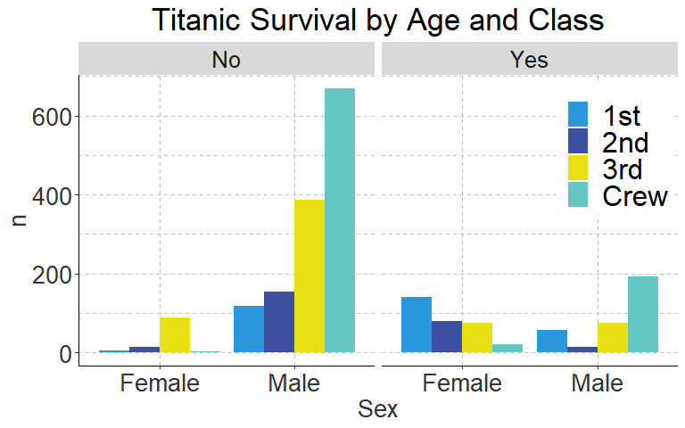
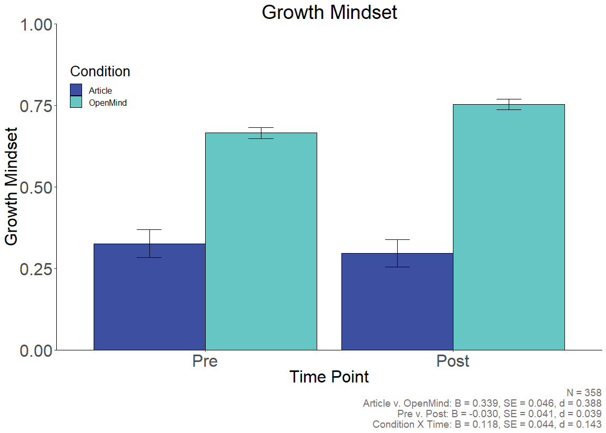

openmindR
================

**Overview**

  - [openmindR Cleaning
    Functions](https://github.com/openmindplatform/openmindR#openmindr-cleaning-functions)
  - [openmindR Analysis
    Functions](https://github.com/openmindplatform/openmindR#openmindr-analysis-functions)
  - [openmindR ggplot2
    theme](https://github.com/openmindplatform/openmindR#openmindr-ggplot2-theme)

Install package like this:

``` r
devtools::install_github("openmindplatform/openmindR")
```

Load package(s):

``` r
library(openmindR)
library(tidyverse)
```

# openmindR Cleaning Functions

The following functions are meant to turn AirTable data into a single
clean file that can be analyzed.

  - [om\_download\_at](https://github.com/openmindplatform/openmindR#om_download_at)

  - [om\_filter\_data](https://github.com/openmindplatform/openmindR#om_filter_data)

  - [om\_clean\_ppol](https://github.com/openmindplatform/openmindR#om_clean_ppol)

  - [om\_gather](https://github.com/openmindplatform/openmindR#om_gather)

  - [om\_parse\_lifehacks](https://github.com/openmindplatform/openmindR#om_parse_lifehacks)

  - [merge\_assessments](https://github.com/openmindplatform/openmindR#merge_assessments)

## `om_download_at`

`openmindR` can download and clean data directly from Airtable.

  - `clean`: Whether to return “clean” data (i.e. numeric data is
    numeric and minors or opt-outs are `NA`. Also constructs measures.
    (`TRUE`/`FALSE`)
  - `file`: give a file path to where the downloaded data should be
    stored
  - `v6.1`: filter down the dataset to only include Assessment V6.1
    (`TRUE/FALSE`)

Here is a code example that will download Assessment V6, clean it, save
it into a folder called “Data” under Research and filter down to only
include V6.1 data.

``` r
key <- readr::read_lines("../../Research/Projects/Keys/airtabler.txt")

assessmentv6 <- om_download_at(key, 
                            tables = "AssessmentV6", 
                            clean = TRUE, 
                            file = "../../../Data/assessmentv6.1.csv",
                            v6.1 = TRUE)
```

Here is another example code for downloading a clean version of
Assessment v7:

``` r
assessmentv7 <- om_download_at(key, 
                            tables = "AssessmentV7", 
                            clean = TRUE)
```

    ## Seting up key
    ## Download AssessmentV7 Data
    ## Done. AssessmentV7 Data has 208 rows

## `om_filter_data`

Filter down Assessment data from AirTable by `AssessmentsDone`,
`AssessmentVersion` and `AccessCodes`.

``` r
assessmentv7 %>% 
  # specify which number of assessment you want to have
  om_filter_data(n_assessments = 1:2,
             # assessment version?
             version = 7,
             # select Accesscode(s) 
             accesscode = "TuttlePen"
             # "TuttlePen" #try this out :)
  )
```

This dataset was filtered down to only AccessCodes that include
“Wilkes”. The `accesscode` argument is not case-sensitive and can
both be used with vectors:

``` r
assessmentv7 %>% 
  # specify which number of assessment you want to have
  om_filter_data(n_assessments = 1:2,
             # assessment version?
             version = 7,
             # select Accesscode(s) 
             accesscode = c("TuttlePennStateS20", "SpriggsBTHS201S20")
  )
```

And individual strings:

``` r
assessmentv7 %>% 
  # specify which number of assessment you want to have
  om_filter_data(n_assessments = 1:2,
             # assessment version?
             version = 7,
             # select Accesscode(s) to produce report for
             accesscode = c("tuttle|spriggs")
  )
```

## `om_clean_ppol`

Creates the following measures of Political Orientation

  - **ppol\_raw:** a variable that merges Assessment V4 and V5.1
    spelling of Political Orientation (D4)
  - **ppol:** a factor variable ordered from “Very Progressive/left” to
    “Very Conservative/right”. Excludes all other categories as NA
    (classical liberal etc.)
  - **ppol\_num:** numeric variable ranging from 1 “Very
    Progressive/left” to 7 “Very Conservative/right”
  - **ppol\_cat:** a factor variable which has two categories
    “Progressive” and “Conservative”. The rest is NA.
  - **ppol\_catmod:** a factor variable which has three categories
    “Progressive”, “Conservative” and “Moderates”. The rest is NA.

<!-- end list -->

``` r
assessmentv7 %>% 
  om_clean_ppol()
```

## `om_gather`

This function will turn Assessment data into long format.

Creates the following variables:

  - **Question:** Q1Pre, Q2Pre, Q3Pre etc.
  - **Type:** Pre, Post, or FollowUp
  - **Response:** Values of the Question
  - **variable\_code:** Q1, Q2, Q3 etc.

Takes the following arguments:

  - **.data** Assessment data
  - **which\_strings** a string indicating which variables should be
    parsed out (`v7_var_strings` has all variables for v7). The format
    looks as follows: “AffPol1|AffPol2|GM1” (so each variable without
    the “Pre”, “Post” or “FollowUp” suffix)

<!-- end list -->

``` r
assessmentv7 %>% 
  om_gather(v7_var_strings) %>% 
  ## select just the relevant vars as showcase
  select(Question, Response, Type, variable_code)
```

## `om_parse_lifehacks`

This function parses and cleans the list variables that contain the
lifehack data. The input dataset needs to have the four following
columns: `LifeHacksChosen`, `LifeHacksComplete`, `LifeHacksUseful` and
`LifeHacksReason`. You can find them in the ParticipantProgress table in
Airtable. The function will parse these four columns into 4 x 5 Steps
variables (so 20 in total):

  - `LifeHack1` - `LifeHack5`: Which Lifehack was chosen
  - `LifeHacksComplete1` - `LifeHacksComplete5`: Did the user complete
    the lifehack
  - `LifeHacksUseful1` - `LifeHacksUseful5`: Did the user find
    completing the lifehack useful
  - `LifeHacksReason1` - `LifeHacksReason5`: Why didn’t the user
    complete the lifehack

<!-- end list -->

``` r
## get key
key <- read_lines("../../Keys/airtabler.txt")

## download participant progress data
pp_dat <- om_download_at(key, tables = "ParticipantProgress")


## this parses all Lifehack data so far
parsed_lh <-  om_parse_lifehacks(pp_dat)


## if you just want the newest life hack data you can filter by OpenMind version
parsed_lh <-  pp_dat %>%
  ## making sure OpenMindVersion is numeric
  mutate(OpenMindVersion = as.numeric(OpenMindVersion)) %>% 
  ## Only include OM Version 3 and above
  filter(OpenMindVersion >= 3) %>% 
  ## parse Life hacks
  om_parse_lifehacks()

## just select the OMID and all LifeHack data (remove all other PP variables)
parsed_lh %>% 
  select(OMID, LifeHack1:LifeHacksReason5)
```

## `merge_assessments`

This function merges assessment v4, v5 and v6 data and only keeps common
variables.

``` r
## get previous assessment dat
v4 <- read.csv("../../../Data/2019-10-29_assessmentv4.csv") 
v5 <- read.csv("../../../Data/2019-10-29_assessmentv5.csv") 

## get key
key <- readr::read_lines("../../Keys/airtabler.txt")

## get (clean) assessment v6 data
v6 <- om_download_at(key = key, tables = "AssessmentV6", clean = T)


## merge all three datasets and only keep common variables
merge_assessments(v4, v5, v6)
```

# openmindR Analysis Functions

This section introduces the openmindR analysis functions.

  - [om\_ttest](https://github.com/openmindplatform/openmindR#om_ttest)

## `om_ttest`

This function performs t-tests on long format data and returns stats on
the model (including p-values, t-statistics and Cohen’s D effect size).

`om_ttest` takes two arguments:

  - `gathered_dat` OpenMind data in long format (must be created with
    [om\_gather](https://github.com/openmindplatform/openmindR#om_gather))
  - `comparison` Three possible comparisons “PrePost”, “PreFollowUpT1T2”
    or “PreFollowUpT1T3”

First we download v7 data:

``` r
## Get Key (may differ in your code)
key <- readr::read_lines("../../Research/Projects/Keys/airtabler.txt")

## get v7 data
assessmentv7 <- om_download_at(key,
                            tables = "AssessmentV7",
                            clean = TRUE)
```

You can perform t-tests on a single variable by *only* gathering one
variable and specifying the comparison (here: `"PrePost"`).

``` r
## Perform t-test on a single variable
assessmentv7 %>% 
  om_gather("AffPol1") %>% 
  om_ttest(comparison = "PrePost")
```

However, this is not how `om_ttest` is intended to work. Rather it
should be used on a dataset in long format with all variables that you
want to perform analysis on. The next lines of code show that process.

``` r
## get results for all variables
assessmentv7  %>%
  ## select only relevant variables and composite scores
  select(OMID, AffPol1Pre:IHCultureSub3FollowUp) %>% 
  ## turn data into long format
  om_gather(which_strings = v7_var_strings)  %>%
  ## perform t-test on each variable (for Pre and Post)
  om_ttest("PrePost") %>% 
  ## arrange by cohens D
  arrange(desc(cohend)) 
```

### `perc_improved`

`om_ttest` uses a helper function to determine the percentage of people
who improved: `perc_improved` from T1 to T2 (or T3). For this, we need
to decide which variables are coded so that “improvement” means higher
values and which ones coded so that improving means lower values on the
respective scales.

Here is the list of variables that should have **higher values** to show
improvement:

    ##  [1] "GrowthMindset"        "CIHS_LIO"             "OutgroupLiking"      
    ##  [4] "OutgroupMotivation"   "Preparedness"         "C1"                  
    ##  [7] "C6"                   "IntellectualHumility" "GM"                  
    ## [10] "IHSub1"               "IHSub2"               "IHSub3"              
    ## [13] "IHCultureSub1"        "IHCultureSub2"        "IHCultureSub3"       
    ## [16] "SE"                   "Belong"               "Dissent"             
    ## [19] "Tolerance"            "IngroupLiking"        "IngroupMotivation"   
    ## [22] "OutgroupLiking"       "OutgroupMotivation"   "MotivationCon"       
    ## [25] "MotivationProg"

Here is the list of variables that should have **lower values** to show
improvement:

    ##  [1] "AffPol1"        "AffPol2"        "GBSS"           "MAA"           
    ##  [5] "C5"             "Anxiety"        "Attribution"    "IntAnx"        
    ##  [9] "SocialDistance" "Avoidance"

## `om_reverse_code`

Reverse codes items and adds them at the end of the dataset with a
“`*_Rev`” at the end.

``` r
assessmentv7 %>% 
  om_reverse_code()
```

# openmindR ggplot2 theme

There are three functions for the ggplot2 theme:

  - `theme_om`
  - `scale_fill_om`
  - `scale_color_om`

Make sure you have the Poppins font installed\!

``` r
extrafont::font_import()
```

``` r
windowsFonts(`Poppins` = windowsFont("Poppins"))
```

[Good tutorial on how to install custom fonts in
R](https://www.andrewheiss.com/blog/2017/09/27/working-with-r-cairo-graphics-custom-fonts-and-ggplot/)

**Example**

``` r
## Load tidyverse
library(tidyverse)

titanic_dat <- Titanic %>% as_tibble()

titanic_dat %>% 
  ggplot(aes(Sex, n)) +
  geom_col(aes(fill = Class), position = position_dodge()) +
  theme_om(legend_position = c(0.9, 0.75)) +
  scale_fill_om("Class") +
  facet_wrap(~Survived) +
  labs(title = "Titanic Survival by Age and Class") 
```

<!-- -->

**Adapt `theme_om`**

  - `legend_position`
  - `axis_text_size`
  - `axis_title_size`
  - `legend_text_size`
  - `title_size`

<!-- end list -->

``` r
titanic_dat %>% 
  ggplot(aes(Class, n, fill = Class)) +
  geom_col() +
  theme_om(legend_position = "bottom",
           axis_text_size = 10,
           axis_title_size = 15, 
           legend_text_size = 10,
           title_size = 20) +
  scale_fill_om() +
  facet_wrap(~Survived) +
  labs(title = "Titanic Survival by Class") 
```

<!-- -->

Or all text sizes at once

  - `overall_text_size`

<!-- end list -->

``` r
titanic_dat %>% 
  ggplot(aes(Class, n, fill = Class)) +
  geom_col() +
  theme_om(legend_position = "top",
           overall_text_size = 15) +
  scale_fill_om() +
  facet_wrap(~Survived) +
  labs(title = "Titanic Survival by Class") 
```

<!-- -->

In case your pandoc is having problems check out this very neat fix:
<https://github.com/rstudio/rstudio/issues/3661#issuecomment-475705806>
