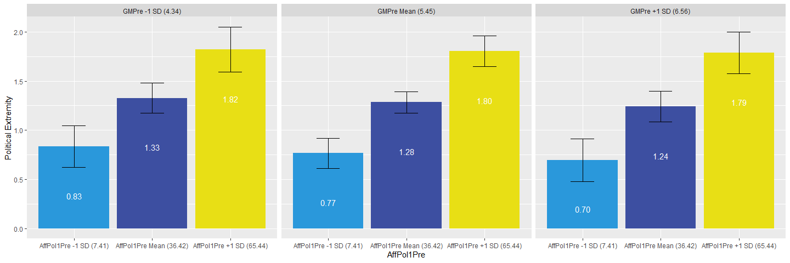
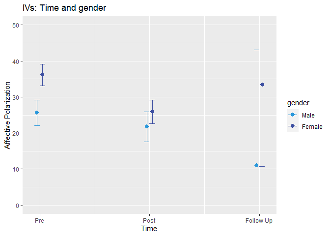

openmindR
================

**Overview**

  - [openmindR Cleaning
    Functions](https://github.com/openmindplatform/openmindR#openmindr-cleaning-functions)
  - [openmindR Analysis
    Functions](https://github.com/openmindplatform/openmindR#openmindr-analysis-functions)
  - [openmindR ggplot2
    theme](https://github.com/openmindplatform/openmindR#openmindr-ggplot2-theme)

Install package like this:

``` r
devtools::install_github("openmindplatform/openmindR")
```

Load package(s):

``` r
library(openmindR)
library(tidyverse)
```

# Create Master dataset

This code merges Assessment data with Participant Progress and Access
Codes tables (to add UserType, OpenMindVersion and other variables).

``` r
pacman::p_load(tidyverse, openmindR)


assessmentv6 <- om_download_at(tables = "AssessmentV6",
                               clean = T, v6.1 = T)

## ParticipantProgress1
pp1 <- om_download_at(tables = "ParticipantProgress") %>% 
  select(OMID, AccessCode, OpenMindVersion, Country, 
         Research, DateStarted, DateFinished)

## ParticipantProgress2
pp2 <- om_download_at(tables = "ParticipantProgress2") %>% 
  select(OMID, AccessCode, OpenMindVersion, Country, 
         Research, DateStarted, DateFinished)

## AccessCodes
acs <- om_download_at(tables = "AccessCodes") %>%
  select(AccessCode, UserType, GroupName)

## bring it all together
cleaned_dat <- pp1  %>%
  bind_rows(pp2) %>%
  ## turn dates into date format
  mutate(DateFinished = lubridate::as_date(DateFinished)) %>%
  mutate(DateStarted = lubridate::as_date(DateStarted)) %>%
  ## compute WithinADay
  mutate(WithinADay = as.numeric(DateStarted==DateFinished)) %>%
  ## join in Assessment data
  coalesce_join(assessmentv6, join = dplyr::right_join) %>% 
  ## join in Access Code Data
  coalesce_join(acs, join = dplyr::left_join) %>%
  ## if AccessCode is IndividualUser, then UserType is IndividualUser
  mutate(UserType = ifelse(AccessCode == "IndividualUser",
                           "IndividualUser", UserType)) %>%
  drop_na(UserType) %>%
  drop_na(DateStarted)
```

# openmindR Cleaning Functions

The following functions are meant to turn AirTable data into a single
clean file that can be analyzed.

  - [om\_download\_at](https://github.com/openmindplatform/openmindR#om_download_at)

  - [om\_filter\_data](https://github.com/openmindplatform/openmindR#om_filter_data)

  - [om\_clean\_ppol](https://github.com/openmindplatform/openmindR#om_clean_ppol)

  - [om\_dummy\_nonwhite](https://github.com/openmindplatform/openmindR#om_dummy_nonwhite)

  - [om\_dummy\_nonstraight](https://github.com/openmindplatform/openmindR#om_dummy_nonstraight)

  - [om\_gather](https://github.com/openmindplatform/openmindR#om_gather)

  - [om\_parse\_lifehacks](https://github.com/openmindplatform/openmindR#om_parse_lifehacks)

  - [merge\_assessments](https://github.com/openmindplatform/openmindR#merge_assessments)

## `om_download_at`

`openmindR` can download and clean data directly from Airtable.

  - `clean`: Whether to return “clean” data (i.e. numeric data is
    numeric and minors or opt-outs are `NA`. Also constructs measures
    and computes dummy variables. (`TRUE`/`FALSE`)
  - `file`: give a file path to where the downloaded data should be
    stored
  - `v6.1`: filter down the dataset to only include Assessment V6.1
    (`TRUE/FALSE`)

Here is a code example that will download Assessment V6, clean it, save
it into a folder called “Data” under Research and filter down to only
include V6.1 data.

``` r
assessmentv6 <- om_download_at(
                            tables = "AssessmentV6", 
                            clean = TRUE, 
                            file = "../../../Data/assessmentv6.1.csv",
                            v6.1 = TRUE)
```

Here is another example code for downloading a clean version of
Assessment v7:

``` r
assessmentv7 <- om_download_at(
                            tables = "AssessmentV7", 
                            clean = TRUE)
```

    ## Seting up OM key
    ## Seting up key
    ## Download AssessmentV7 Data
    ## Done. AssessmentV7 Data has 1585 rows

## Get Assessment V7.2 data and merge it with P2P data

``` r
assessmentv72 <- assessmentv7 %>% 
  dplyr::filter(AssessmentVersion == 7.2) %>%
  dplyr::select_if(~!all(is.na(.))) 

assessmentv72 %>% 
  select(Contempt1Pre, Contempt2Pre) %>% 
  mutate(Contempt1Pre = 8-Contempt1Pre) %>% 
  ggplot(aes(Contempt1Pre, Contempt2Pre)) +
  geom_jitter() +
  geom_smooth()

p2p_dat <- om_download_at(tables = "P2P", 
                          clean = TRUE)


assessmentv72 %>% 
  left_join(p2p_dat)
```

## `om_filter_data`

Filter down Assessment data from AirTable by `AssessmentsDone`,
`AssessmentVersion` and `AccessCodes`.

``` r
assessmentv7 %>% 
  # specify which number of assessment you want to have
  om_filter_data(n_assessments = 1:2,
             # assessment version?
             version = 7,
             # select Accesscode(s) 
             accesscode = "TuttlePen"
             # "TuttlePen" #try this out :)
  )
```

The `accesscode` argument is not case-sensitive and can both be used
with vectors:

``` r
assessmentv7 %>% 
  # specify which number of assessment you want to have
  om_filter_data(n_assessments = 1:2,
             # assessment version?
             version = 7,
             # select Accesscode(s) 
             accesscode = c("TuttlePennStateS20", "SpriggsBTHS201S20")
  )
```

And individual strings:

``` r
assessmentv7 %>% 
  # specify which number of assessment you want to have
  om_filter_data(n_assessments = 1:2,
             # assessment version?
             version = 7,
             # select Accesscode(s) to produce report for
             accesscode = c("tuttle|spriggs")
  )
```

## `om_clean_ppol`

Creates the following measures of Political Orientation

  - **ppol\_raw:** a variable that has all political orientation
    variables across all Assessment Versions (corresponds to `D4`)
  - **ppol:** a factor variable ordered from “Very Progressive/left” to
    “Very Conservative/right”. Excludes all other categories as NA
    (classical liberal etc.)
  - **ppol\_num:** numeric variable ranging from 1 “Very
    Progressive/left” to 7 “Very Conservative/right”
  - **ppol\_extreme:** numeric variable ranging from 0
    “Moderate/Middle-of-the-road” to 3 “Very Conservative/right” or
    “Very Progressive/left”
  - **ppol\_cat:** a factor variable which has two categories
    “Progressive” and “Conservative”. The rest is NA.
  - **ppol\_catmod:** a factor variable which has three categories
    “Progressive”, “Conservative” and “Moderates”. The rest is NA.

<!-- end list -->

``` r
assessmentv7 %>% 
  om_clean_ppol()
```

## `om_dummy_nonwhite`

This function creates a dummy variable from D3 (Race) called
`race_nonwhite` and codes people who identify **only** as white as 0 and
everyone else as 1.

``` r
assessmentv7 %>% 
  om_dummy_nonwhite()
```

## `om_dummy_nonstraight`

This function creates a dummy variable from D5 (Sexuality) called
`sex_nonstraight` and codes people who identify as heterosexual as 0 and
everyone else as 1.

``` r
assessmentv7 %>% 
  om_dummy_nonstraight()
```

## `om_dummy_ut`

This function creates the dummy variables from UserType

  - `ut_college_individ`: College student (0) v. individual user (1)
  - `ut_corp_individ`: Corp (0) v. individual user (1)
  - `ut_college_corp`: College student (0) v. corp (1)

<!-- end list -->

``` r
assessmentv7 %>% 
  om_dummy_ut()
```

## `om_gather`

This function will turn Assessment data into long format.

Creates the following variables:

  - **Question:** Q1Pre, Q2Pre, Q3Pre etc.
  - **Type:** Pre, Post, or FollowUp
  - **Response:** Values of the Question
  - **variable\_code:** Q1, Q2, Q3 etc.

Takes the following arguments:

  - **.data** Assessment data
  - **which\_strings** a string indicating which variables should be
    parsed out (`v7_var_strings` has all variables for v7). The format
    looks as follows: “AffPol1|AffPol2|GM1” (so each variable without
    the “Pre”, “Post” or “FollowUp” suffix)

<!-- end list -->

``` r
assessmentv7 %>% 
  om_gather(v7_var_strings) %>% 
  ## select just the relevant vars as showcase
  select(Question, Response, Type, variable_code)
```

## `om_parse_lifehacks`

This function parses and cleans the list variables that contain the
lifehack data. The input dataset needs to have the four following
columns: `LifeHacksChosen`, `LifeHacksComplete`, `LifeHacksUseful` and
`LifeHacksReason`. You can find them in the ParticipantProgress table in
Airtable. The function will parse these four columns into 4 x 5 Steps
variables (so 20 in total):

  - `LifeHack1` - `LifeHack5`: Which Lifehack was chosen
  - `LifeHacksComplete1` - `LifeHacksComplete5`: Did the user complete
    the lifehack
  - `LifeHacksUseful1` - `LifeHacksUseful5`: Did the user find
    completing the lifehack useful
  - `LifeHacksReason1` - `LifeHacksReason5`: Why didn’t the user
    complete the lifehack

<!-- end list -->

``` r
## get key
key <- read_lines("../../Keys/airtabler.txt")

## download participant progress data
pp_dat <- om_download_at(tables = "ParticipantProgress")


## this parses all Lifehack data so far
parsed_lh <-  om_parse_lifehacks(pp_dat)


## if you just want the newest life hack data you can filter by OpenMind version
parsed_lh <-  pp_dat %>%
  ## making sure OpenMindVersion is numeric
  mutate(OpenMindVersion = as.numeric(OpenMindVersion)) %>% 
  ## Only include OM Version 3 and above
  filter(OpenMindVersion >= 3) %>% 
  ## parse Life hacks
  om_parse_lifehacks()

## just select the OMID and all LifeHack data (remove all other PP variables)
parsed_lh %>% 
  select(OMID, LifeHack1:LifeHacksReason5)
```

## `merge_assessments`

This function merges assessment v4, v5 and v6 data and only keeps common
variables.

``` r
## get previous assessment dat
v4 <- read.csv("../../../Data/2019-10-29_assessmentv4.csv") 
v5 <- read.csv("../../../Data/2019-10-29_assessmentv5.csv") 


## get (clean) assessment v6 data
v6 <- om_download_at(tables = "AssessmentV6", clean = T)


## merge all three datasets and only keep common variables
merge_assessments(v4, v5, v6)
```

## `om_reverse_code`

Reverse codes items and adds them at the end of the dataset with a
“`*_Rev`” at the end.

``` r
assessmentv7 %>% 
  om_reverse_code()
```

# openmindR Analysis Functions

This section introduces the openmindR analysis functions.

  - [om\_ttest](https://github.com/openmindplatform/openmindR#om_ttest)
  - [om\_lm](https://github.com/openmindplatform/openmindR#om_lm)
  - [om\_lmer](https://github.com/openmindplatform/openmindR#om_lmer)
  - [om\_textscore](https://github.com/openmindplatform/openmindR#om_textscore)

## `om_ttest`

This function performs paired t-tests on long format Pre-Post-FollowUp
data and returns stats on the model (including p-values, t-statistics
and Cohen’s D effect size).

`om_ttest` takes two arguments:

  - `gathered_dat` OpenMind data in long format (must be created with
    [om\_gather](https://github.com/openmindplatform/openmindR#om_gather))
  - `comparison` Three possible comparisons “PrePost”, “PreFollowUpT1T2”
    or “PreFollowUpT1T3”

PreFollowUpT1T2 performs Pre-Post comparison only for people who
completed the FollowUp. PreFollowUpT1T3 is the same sample of people
(only those who completed the FollowUp) but compares them Pre-FollowUp.

First we download v7 data:

``` r
## Get Key (may differ in your code)


## get v7 data
assessmentv7 <- om_download_at(key,
                            tables = "AssessmentV7",
                            clean = TRUE)
```

You can perform t-tests on a single variable by *only* gathering one
variable and specifying the comparison (here: `"PrePost"`).

``` r
## Perform t-test on a single variable
assessmentv7 %>% 
  om_gather("AffPol1") %>% 
  om_ttest(comparison = "PrePost")
```

However, this is not how `om_ttest` is intended to work. Rather it
should be used on a dataset in long format with all variables that you
want to perform analysis on. The next lines of code show that process.

``` r
## get results for all variables
assessmentv7  %>%
  ## select only relevant variables and composite scores
  select(OMID, AffPol1Pre:IHCultureSub3FollowUp) %>% 
  ## turn data into long format
  om_gather(which_strings = v7_var_strings)  %>%
  ## perform t-test on each variable (for Pre and Post)
  om_ttest("PrePost") %>% 
  ## arrange by cohens D
  arrange(desc(cohend)) 
```

Same process for Assessment v6:

``` r
## get results for all variables
assessmentv6  %>%
  ## select only relevant variables and composite scores
  select(OMID, AffPol1Pre:IntellectualHumilityFollowUp, 
         GrowthMindsetPre, GrowthMindsetPost, GrowthMindsetFollowUp,
         C1Pre, C5Pre, C6Pre, 
         C1Post, C5Post, C6Post,
         C1FollowUp, C5FollowUp, C6FollowUp,
         -contains("Preparedness3")) %>% 
  ## turn data into long format
  om_gather(which_strings = v6_var_strings)  %>%
  ## perform t-test on each variable (for Pre and Post)
  om_ttest("PrePost") %>% 
  ## arrange by cohens D
  arrange(desc(cohend)) 
```

### `perc_improved`

`om_ttest` uses a helper function to determine the percentage of people
who improved: `perc_improved` from T1 to T2 (or T3). For this, we need
to decide which variables are coded so that “improvement” means higher
values and which ones coded so that improving means lower values on the
respective scales.

Here is the list of variables that should have **higher values** to show
improvement:

    ##  [1] "GrowthMindset"        "CIHS_LIO"             "OutgroupLiking"      
    ##  [4] "OutgroupMotivation"   "Preparedness"         "C1"                  
    ##  [7] "C6"                   "IntellectualHumility" "GM"                  
    ## [10] "IHSub1"               "IHSub2"               "IHSub3"              
    ## [13] "IHCultureSub1"        "IHCultureSub2"        "IHCultureSub3"       
    ## [16] "SE"                   "Belong"               "Dissent"             
    ## [19] "Tolerance"            "IngroupLiking"        "IngroupMotivation"   
    ## [22] "OutgroupLiking"       "OutgroupMotivation"   "MotivationCon"       
    ## [25] "MotivationProg"

Here is the list of variables that should have **lower values** to show
improvement:

    ##  [1] "AffPol1"        "AffPol2"        "GBSS"           "MAA"           
    ##  [5] "C5"             "Anxiety"        "Attribution"    "IntAnx"        
    ##  [9] "SocialDistance" "Avoidance"

## `om_lm`

Run linear regression model (with interactions)

This function performs linear regression and gives back some neat info

Four inputs:

  - *.data* data that was used to fit the model

  - *lin\_mod* a fitted model

  - *type* what kind of model (currently only accepts `"int"` for
    interactions)

  - *switch* logical. Switch variables in interaction plot. Default is
    `FALSE`

<!-- end list -->

``` r
mod1 <- lm(ppol_extreme ~ ppol_cat*gender, 
           data = assessmentv7)


results <- assessmentv7 %>% 
  om_lm(lin_mod = mod1, 
        type = "int",
        switch = T)
```

The function returns 5 outputs (in list format).

``` r
results$model
results$table
results$estimated_means
results$plot
results$report
```

### Show the model

``` r
results$model
```

    ## 
    ## Call:
    ## lm(formula = ppol_extreme ~ ppol_cat * gender, data = assessmentv7)
    ## 
    ## Coefficients:
    ##                        (Intercept)               ppol_catConservatives  
    ##                            1.74286                             0.05360  
    ##                       genderFemale  ppol_catConservatives:genderFemale  
    ##                            0.06101                            -0.17747

### Show a regression table

``` r
results$table
```

    ## 
    ## ==============================================
    ##                                     Model 1   
    ## ----------------------------------------------
    ## (Intercept)                           1.74 ***
    ##                                      (0.05)   
    ## ppol_catConservatives                 0.05    
    ##                                      (0.08)   
    ## genderFemale                          0.06    
    ##                                      (0.06)   
    ## ppol_catConservatives:genderFemale   -0.18    
    ##                                      (0.11)   
    ## ----------------------------------------------
    ## R^2                                   0.00    
    ## Adj. R^2                              0.00    
    ## Num. obs.                           750       
    ## RMSE                                  0.69    
    ## ==============================================
    ## *** p < 0.001, ** p < 0.01, * p < 0.05

### Show an interpretation of the model

``` r
results$report %>% 
  cat()
```

We fitted a linear model (estimated using OLS) to predict ppol\_extreme
with ppol\_cat and gender (formula = ppol\_extreme \~ ppol\_cat \*
gender). Standardized parameters were obtained by fitting the model on a
standardized version of the dataset. Effect sizes were labelled
following Funder’s (2019) recommendations.

The model explains a not significant and very weak proportion of
variance (R2 = 0.00, F(3, 746) = 1.01, p = 0.388, adj. R2 = 0.00). The
model’s intercept, corresponding to ppol\_extreme = 0, ppol\_cat =
Progressives and gender = Male, is at 1.74 (SE = 0.05, 95% CI \[1.64,
1.84\], p \< .001). Within this model:

  - The effect of ppol\_catConservatives is positive and can be
    considered as tiny and not significant (beta = 0.05, SE = 0.08, 95%
    CI \[-0.11, 0.22\], std. beta = 0.08, p = 0.518).
  - The effect of genderFemale is positive and can be considered as tiny
    and not significant (beta = 0.06, SE = 0.06, 95% CI \[-0.06, 0.19\],
    std. beta = 0.09, p = 0.335).
  - The effect of ppol\_catConservatives:genderFemale is negative and
    can be considered as small and not significant (beta = -0.18, SE =
    0.11, 95% CI \[-0.40, 0.05\], std. beta = -0.26, p = 0.119).

### Show estimated means

``` r
results$estimated_means %>% 
  knitr::kable()
```

| gender | ppol\_cat     |     Mean |        SE |  CI\_low | CI\_high |
| :----- | :------------ | -------: | --------: | -------: | -------: |
| Male   | Progressives  | 1.742857 | 0.0519687 | 1.640835 | 1.844879 |
| Male   | Conservatives | 1.796460 | 0.0646727 | 1.669498 | 1.923422 |
| Female | Progressives  | 1.803867 | 0.0361332 | 1.732933 | 1.874802 |
| Female | Conservatives | 1.680000 | 0.0687481 | 1.545037 | 1.814963 |

### Show a plot of the means

``` r
results$plot  +
  ylab("Political Extremity")
```

<!-- -->

### Interaction with Numeric variables

When interacting a numeric with a factor variable, the function will
return the mean as well as one SD below/above the numeric response.

``` r
mod1 <- lm(ppol_extreme ~ ppol_cat*AffPol1Pre, 
           data = assessmentv7)


results <- assessmentv7 %>% 
  om_lm(lin_mod = mod1, 
        type = "int",
        switch = F)

results$plot +
  ylab("Political Extremity")
```

<!-- -->

When both interaction variables are numeric, the function will return
the mean as well as one SD below/above for both numeric responsse.

``` r
mod1 <- lm(ppol_extreme ~ GMPre*AffPol1Pre, 
           data = assessmentv7)


results <- assessmentv7 %>% 
  om_lm(lin_mod = mod1, 
        type = "int",
        switch = T)

results$plot +
  ylab("Political Extremity")
```

<!-- -->

## `om_lmer`

Run mixed models (with interactions)

This function performs a mixed model and gives back some neat info

Three inputs:

  - *mod* a fitted model

  - *type* what kind of model (currently only accepts `"int"` for
    interactions)

  - *mod\_transform* Indicates which values of the moderator variable
    should be used when plotting interaction terms (i.e. `type =
    "int"`).
    
      - `"minmax"` (default) minimum and maximum values (lower and upper
        bounds) of the moderator are used to plot the interaction
        between independent variable and moderator(s).}
      - `"meansd"` uses the mean value of the moderator as well as one
        standard deviation below and above mean value to plot the effect
        of the moderator on the independent variable (following the
        convention suggested by Cohen and Cohen and popularized by Aiken
        and West (1991), i.e. using the mean, the value one standard
        deviation above, and the value one standard deviation below the
        mean as values of the moderator.
      - `"zeromax"` is similar to the `"minmax"` option, however, `0` is
        always used as minimum value for the moderator. This may be
        useful for predictors that don’t have an empirical zero-value,
        but absence of moderation should be simulated by using 0 as
        minimum. `"quart"` calculates and uses the quartiles (lower,
        median and upper) of the moderator value.
      - `"all"` uses all values of the moderator variable.

First you need to fit to bring the data into long format and fit the
model.

``` r
cleaned_dat_long <- openmindR::om_gather(assessmentv7, which_strings = "AffPol1")

mixed <- lme4::lmer(Response~Time * gender + (1|OMID), data = cleaned_dat_long)
```

Next you can use `om_lmer`.

``` r
results <- om_lmer(mixed,
                   type = "int")
```

### Show the model

``` r
results$model
```

    ## Linear mixed model fit by REML ['lmerMod']
    ## Formula: Response ~ Time * gender + (1 | OMID)
    ##    Data: cleaned_dat_long
    ## REML criterion at convergence: 8643.785
    ## Random effects:
    ##  Groups   Name        Std.Dev.
    ##  OMID     (Intercept) 24.79   
    ##  Residual             13.57   
    ## Number of obs: 945, groups:  OMID, 586
    ## Fixed Effects:
    ##               (Intercept)                   TimePost  
    ##                    25.642                     -3.873  
    ##              TimeFollowUp               genderFemale  
    ##                   -14.608                     10.507  
    ##     TimePost:genderFemale  TimeFollowUp:genderFemale  
    ##                    -6.358                     11.857

### Show a regression table

``` r
results$table
```

    ## 
    ## =======================================
    ##                            Model 1     
    ## ---------------------------------------
    ## (Intercept)                   25.64 ***
    ##                               (1.83)   
    ## TimePost                      -3.87 *  
    ##                               (1.66)   
    ## TimeFollowUp                 -14.61    
    ##                              (16.27)   
    ## genderFemale                  10.51 ***
    ##                               (2.38)   
    ## TimePost:genderFemale         -6.36 ** 
    ##                               (2.07)   
    ## TimeFollowUp:genderFemale     11.86    
    ##                              (19.93)   
    ## ---------------------------------------
    ## AIC                         8659.79    
    ## BIC                         8698.59    
    ## Log Likelihood             -4321.89    
    ## Num. obs.                    945       
    ## Num. groups: OMID            586       
    ## Var: OMID (Intercept)        614.79    
    ## Var: Residual                184.03    
    ## =======================================
    ## *** p < 0.001, ** p < 0.01, * p < 0.05

### Show an interpretation of the model

``` r
results$report %>% 
  cat()
```

We fitted a linear mixed model (estimated using REML and nloptwrap
optimizer) to predict Response with Time and gender (formula = Response
\~ Time \* gender). The model included OMID as random effects (formula =
\~1 | OMID). Standardized parameters were obtained by fitting the model
on a standardized version of the dataset. Effect sizes were labelled
following Funder’s (2019) recommendations.The model’s total explanatory
power is substantial (conditional R2 = 0.78) and the part related to the
fixed effects alone (marginal R2) is of 0.04. The model’s intercept,
corresponding to Response = 0, Time = Pre, gender = Male and OMID =
1002059522913, is at 25.64 (SE = 1.83, 95% CI \[22.05, 29.23\], p \<
.001). Within this model:

  - The effect of TimePost is negative and can be considered as very
    small and significant (beta = -3.87, SE = 1.66, 95% CI \[-7.12,
    -0.63\], std. beta = -0.13, p \< .05).
  - The effect of TimeFollowUp is negative and can be considered as
    medium and not significant (beta = -14.61, SE = 16.27, 95% CI
    \[-46.50, 17.28\], std. beta = -0.51, p = 0.369).
  - The effect of genderFemale is positive and can be considered as
    small and significant (beta = 10.51, SE = 2.38, 95% CI \[5.85,
    15.17\], std. beta = 0.36, p \< .001).
  - The effect of TimePost:genderFemale is negative and can be
    considered as small and significant (beta = -6.36, SE = 2.07, 95% CI
    \[-10.42, -2.30\], std. beta = -0.22, p \< .01).
  - The effect of TimeFollowUp:genderFemale is positive and can be
    considered as medium and not significant (beta = 11.86, SE = 19.93,
    95% CI \[-27.20, 50.92\], std. beta = 0.41, p = 0.552).

### Show estimated means

``` r
results$estimated_means %>% 
  knitr::kable()
```

| Time | predicted | std.error |   conf.low | conf.high | group  | group\_col |
| ---: | --------: | --------: | ---------: | --------: | :----- | :--------- |
|    1 |  25.64231 |  1.831546 |   22.05254 |  29.23207 | Male   | Male       |
|    1 |  36.14943 |  1.515080 |   33.17992 |  39.11893 | Female | Female     |
|    2 |  21.76919 |  2.133368 |   17.58786 |  25.95051 | Male   | Male       |
|    2 |  25.91874 |  1.669731 |   22.64613 |  29.19136 | Female | Female     |
|    3 |  11.03439 | 16.326028 | \-20.96403 |  43.03282 | Male   | Male       |
|    3 |  33.39802 | 11.561290 |   10.73831 |  56.05773 | Female | Female     |

### Show a plot of the means

``` r
results$plot  +
  ggplot2::ylab("Affective Polarization") +
  ggplot2::ylim(0, 50)
```

<!-- -->

## `om_textscore`

This function performs sentiment analysis and other methods from
different text tools on any dataset with a text colum that you supply.

Note: `openmindR` will not automatically install all the packages
necessary for each text tool because it is quite a lot and there are
many dependencies. Instead, it will check whether the specified method
is installed on your computer before it executes the code. If it’s not,
it asks you to install the relevant package. That way you only need to
install what you actually use.

Arguments:

  - **`.data`** dataset including text and a personal identifier (must
    be named `OMID`)
  - **`method`** which method(s) should be applied? Currently supports:
    `"nrc"`, `"bing"`, `"afinn"`, `"textblob"`, `"vader"`,
    `"sentiment_stanford"`, `"sentimentr_polarity"`, `"affect3d"`,
    `"receptiveness"`, and `"toxicity"`.
  - **`text`** specify the text variable which should be scored

Here an example code that scores the free text from v7 with `bing`,
`nrc` and `afinn` sentiment dictionaries.

``` r
assessmentv7 %>% 
 om_textscore(method = c("bing", "nrc", "afinn"), 
              text = IssueFreeTextPre) 
```

# openmindR ggplot2 theme

There are three functions for the ggplot2 theme:

  - `theme_om`
  - `scale_fill_om`
  - `scale_color_om`

Make sure you have the Poppins font installed\!

``` r
extrafont::font_import()
```

``` r
windowsFonts(`Poppins` = windowsFont("Poppins"))
```

[Good tutorial on how to install custom fonts in
R](https://www.andrewheiss.com/blog/2017/09/27/working-with-r-cairo-graphics-custom-fonts-and-ggplot/)

**Example**

``` r
## Load tidyverse
library(tidyverse)

titanic_dat <- Titanic %>% as_tibble()

titanic_dat %>% 
  ggplot(aes(Sex, n)) +
  geom_col(aes(fill = Class), position = position_dodge()) +
  theme_om(legend_position = c(0.9, 0.75)) +
  scale_fill_om("Class") +
  facet_wrap(~Survived) +
  labs(title = "Titanic Survival by Age and Class") 
```

<!-- -->

**Adapt `theme_om`**

  - `legend_position`
  - `axis_text_size`
  - `axis_title_size`
  - `legend_text_size`
  - `title_size`

<!-- end list -->

``` r
titanic_dat %>% 
  ggplot(aes(Class, n, fill = Class)) +
  geom_col() +
  theme_om(legend_position = "bottom",
           axis_text_size = 10,
           axis_title_size = 15, 
           legend_text_size = 10,
           title_size = 20) +
  scale_fill_om() +
  facet_wrap(~Survived) +
  labs(title = "Titanic Survival by Class") 
```

<!-- -->

Or all text sizes at once

  - `overall_text_size`

<!-- end list -->

``` r
titanic_dat %>% 
  ggplot(aes(Class, n, fill = Class)) +
  geom_col() +
  theme_om(legend_position = "top",
           overall_text_size = 15) +
  scale_fill_om() +
  facet_wrap(~Survived) +
  labs(title = "Titanic Survival by Class") 
```

<!-- -->

In case your pandoc is having problems check out this very neat fix:
<https://github.com/rstudio/rstudio/issues/3661#issuecomment-475705806>
