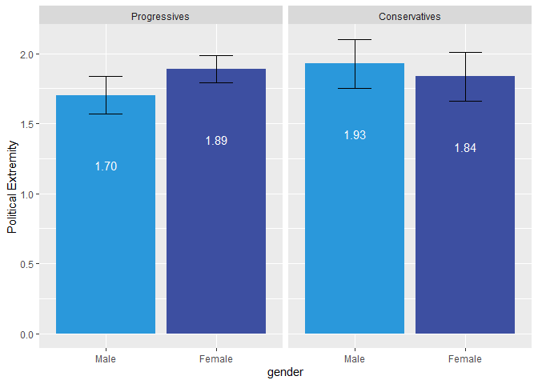
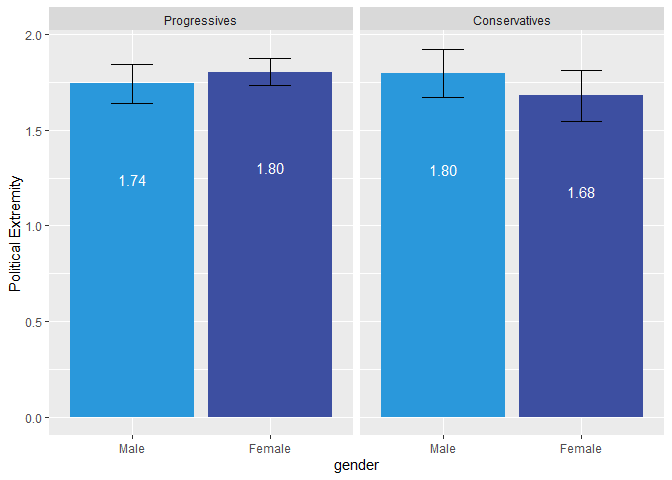

openmindR
================

**Overview**

  - [openmindR Cleaning
    Functions](https://github.com/openmindplatform/openmindR#openmindr-cleaning-functions)
  - [openmindR Analysis
    Functions](https://github.com/openmindplatform/openmindR#openmindr-analysis-functions)
  - [openmindR ggplot2
    theme](https://github.com/openmindplatform/openmindR#openmindr-ggplot2-theme)

Install package like this:

``` r
devtools::install_github("openmindplatform/openmindR")
```

Load package(s):

``` r
library(openmindR)
library(dplyr)
```

# New Functions

  - [om\_parse\_lifehacks](https://github.com/openmindplatform/openmindR#om_parse_lifehacks)
  - [merge\_assessments](https://github.com/openmindplatform/openmindR#merge_assessments)
  - [om\_download\_at](https://github.com/openmindplatform/openmindR#om_download_at)

## `om_parse_lifehacks`

This function The input dataset needs to have the four following
columns: `LifeHacksChosen`, `LifeHacksComplete`, `LifeHacksUseful` and
`LifeHacksReason`. You can find them in the ParticipantProgress table in
Airtable. The function will parse these four columns into 4 x 5 Steps
variables (so 20 in total):

  - `LifeHack1` - `LifeHack5`: Which Lifehack was chosen
  - `LifeHacksComplete1` - `LifeHacksComplete5`: Did the user complete
    the lifehack
  - `LifeHacksUseful1` - `LifeHacksUseful5`: Did the user find
    completing the lifehack useful
  - `LifeHacksReason1` - `LifeHacksReason5`: Why didn’t the user
    complete the lifehack

<!-- end list -->

``` r
## get key
key <- read_lines("../../Keys/airtabler.txt")

## download participant progress data
pp_dat <- om_download_at(key, tables = "ParticipantProgress")


## this parses all Lifehack data so far
parsed_lh <-  om_parse_lifehacks(pp_dat)


## if you want just the newest life hack data you can filter by OpenMind version
parsed_lh <-  pp_dat %>%
  ## making sure OpenMindVersion is numeric
  mutate(OpenMindVersion = as.numeric(OpenMindVersion)) %>% 
  ## Only include OM Version 3 and above
  filter(OpenMindVersion >= 3) %>% 
  ## parse Life hacks
  om_parse_lifehacks()

## just select the OMID and all LifeHack data (remove all other PP variables)
parsed_lh %>% 
  select(OMID, LifeHack1:LifeHacksReason5)
```

## `merge_assessments`

This function merges assessment v4, v5 and v6 data and only keeps common
variables.

``` r
## get previous assessment dat
v4 <- read.csv("../../../Data/2019-10-29_assessmentv4.csv") 
v5 <- read.csv("../../../Data/2019-10-29_assessmentv5.csv") 

## get key
key <- readr::read_lines("../../Keys/airtabler.txt")

## get (clean) assessment v6 data
v6 <- om_download_at(key = key, tables = "AssessmentV6", clean = T)


## merge all three datasets and only keep comman variables
merge_assessments(v4, v5, v6)
```

## `om_download_at`

`openmindR` can download and clean data directly from Airtable. There
are three new arguments for Assessment v6:

  - `clean`: Whether to return “clean” data (i.e. numeric data is
    numeric and minors or opt-outs are `NA` (`TRUE`/`FALSE`)
  - `file`: give a file path to where the downloaded data should be
    stored
  - `v6.1`: filter down the dataset to only include Assessment V6.1
    (`TRUE/FALSE`)

Here is a code example that will download Assessment V6, clean it, save
it into a folder called “Data” under Research and filter down to only
include V6.1 data.

``` r
key <- readr::read_lines("../../Keys/airtabler.txt")

assessmentv6 <- om_download_at(key, 
                            tables = "AssessmentV6", 
                            clean = TRUE, 
                            file = "../../../Data/assessmentv6.1.csv",
                            v6.1 = TRUE)
```

# openmindR Cleaning Functions

The following functions are meant to turn AirTable (and GuidedTrack)
data into a single clean file that can be analyzed. Along the way it
parses the data, constructs measures, removes duplicates and optionally
turns it into long format. The solid line is the suggested workflow for
a complete dataset. The dashed lines are optional (if you don’t want to
add GuidedTrack data).

  - [om\_filter\_data](https://github.com/openmindplatform/openmindR#om_filter_data)
  - [om\_clean\_par](https://github.com/openmindplatform/openmindR#om_clean_par)
  - [om\_rescale](https://github.com/openmindplatform/openmindR#om_rescale)
  - [om\_construct\_measures](https://github.com/openmindplatform/openmindR#om_construct_measures)
  - [om\_clean\_ppol](https://github.com/openmindplatform/openmindR#om_clean_ppol)
  - [remove\_dups](https://github.com/openmindplatform/openmindR#remove_dups)
  - [om\_gather](https://github.com/openmindplatform/openmindR#om_gather)


``` r
cleaned_dat <-
  ## Participant Progress Data
  dat.par %>% 
  ## calculating step scores and more
  om_clean_par(parse_feedback = T) %>% 
  ## Assessment Data
  left_join(app.dat) %>%
  ## adding actual time
  mutate(createdTime = ifelse(is.na(createdTime), at_date, createdTime)) %>% 
  ## Make variables Q1 and Q2 as well as Q3 to C3 range 0 to 1
  om_rescale() %>% 
  ## construct ppol measures
  om_clean_ppol()  %>% 
  ## construct measures such as intellectual humility
  om_construct_measures() %>% 
  ## AccessCode Data  (only keep variables specified in acc_filters)
  left_join(dat.acc %>% select(acc_filters)) %>% 
  ## remove duplicates
  remove_dups() %>% 
  ## make vars numeric
  mutate_at(vars(matches(var_strings)), as.numeric) %>% 
  mutate_at(vars(Step1:Step5_Q5), as.character) %>%  
  mutate(AssessmentsDone = as.character(AssessmentsDone)) %>% 
  ##  GuidedTrack Data
  mutate(Source = "AirTable") %>% 
  ## TODO: Should happen automatically in om_clean_par but not, whats going on
  mutate(AppRating = as.character(AppRating)) %>% 
  coalesce_join(gt_parsed_feedback %>%
                  mutate(Source = "GT") %>%
                  mutate(AppRating = as.character(AppRating)) %>%
                  mutate_at(vars(Step1:Step5_Q5), as.character) %>%
                  mutate(AssessmentsDone = as.character(AssessmentsDone)) %>%
                  mutate(createdTime = date), by = "OMID") %>%
  ## weird case where UserType is empty string
  mutate(UserType = ifelse(nchar(UserType) == 0, NA, UserType)) %>%
  drop_na(UserType) %>% 
  mutate(createdTime = as_datetime(createdTime)) %>% 
  ## Count how many steps complete
  mutate(steps_complete = str_count(StepsComplete, "1") %>% as.character) %>% 
  ## we only want AssessmentsDone 1 thru 3
  ## Problem: There are AssessmentsDone 0 in the data.. they have completed steps but no Assessment.. how is that possible?
  filter(AssessmentsDone %in% 1:3) %>% 
  ## TODO: maybe this is not needed
  mutate(AppRating = as.numeric(AppRating)) 

## Turn data into long format
gathered_dat <- om_gather(cleaned_dat, q_c_strings)
```

## `om_filter_data`

Filter down Assessment data from AirTable by `AssessmentsDone`,
`AssessmentVersion` and `AccessCodes`.

``` r
dat.ass %>% 
  # specify which number of assessment you want to have
  om_filter_data(n_assessments = 1:3,
             # assessment version?
             version = 4,
             # select Accesscode(s) to produce report for
             accesscode = "Wilkes"
             # "Wilkes" #try this out :)
  )
```

    ## # A tibble: 654 x 111
    ##       OMID UserType AccessCode AssessmentVersi… AssessmentsDone Q1Pre Q2Pre
    ##      <dbl> <chr>    <chr>                 <dbl>           <dbl> <dbl> <dbl>
    ##  1 2.53e12 college  PradoWilk…                4               2  0.5   0.5 
    ##  2 9.56e12 college  TalpashWi…                4               3  0.54  0.53
    ##  3 3.88e12 college  PradoWilk…                4               2  0.8   0.2 
    ##  4 9.94e12 college  TalpashWi…                4               2  0.5   0.5 
    ##  5 4.59e12 college  TalpashWi…                4               1  0.7   0.33
    ##  6 2.35e12 college  PradoWilk…                4               2 NA    NA   
    ##  7 1.38e12 college  TalpashWi…                4               2  0.5   0.5 
    ##  8 6.60e12 college  KarimiWil…                4               2  0.86  0.15
    ##  9 2.98e12 college  HudsonWil…                4               3  0.5   0.5 
    ## 10 1.10e12 college  HudsonWil…                4               2  0.5   0.5 
    ## # … with 644 more rows, and 104 more variables: Q3Pre <dbl>, Q4Pre <dbl>,
    ## #   Q5Pre <dbl>, Q6Pre <dbl>, Q7Pre <dbl>, Q8Pre <dbl>, Q9Pre <dbl>,
    ## #   Q10Pre <dbl>, Q11Pre <dbl>, Q12Pre <dbl>, C1Pre <dbl>, C2Pre <dbl>,
    ## #   C3Pre <dbl>, D1 <dbl>, D2 <chr>, D3 <chr>, D4 <chr>, D5 <chr>,
    ## #   B1Pre <chr>, DatePre <chr>, Q1Post <dbl>, Q2Post <dbl>, Q3Post <dbl>,
    ## #   Q4Post <dbl>, Q5Post <dbl>, Q6Post <dbl>, Q7Post <dbl>, Q8Post <dbl>,
    ## #   Q9Post <dbl>, Q10Post <dbl>, Q11Post <dbl>, Q12Post <dbl>,
    ## #   B1Post <chr>, DatePost <chr>, Q1FollowUp <dbl>, Q2FollowUp <dbl>,
    ## #   Q3FollowUp <dbl>, Q4FollowUp <dbl>, Q5FollowUp <dbl>,
    ## #   Q6FollowUp <dbl>, Q7FollowUp <dbl>, Q8FollowUp <dbl>,
    ## #   Q9FollowUp <dbl>, Q10FollowUp <dbl>, Q11FollowUp <dbl>,
    ## #   Q12FollowUp <dbl>, C1FollowUp <dbl>, C2FollowUp <dbl>,
    ## #   C3FollowUp <dbl>, B1FollowUp <chr>, DateFollowUp <chr>,
    ## #   W1FollowUp <chr>, createdTime <dbl>, ppol_raw <chr>, ppol <chr>,
    ## #   ppol_num <dbl>, ppol_cat <chr>, Q14Pre <dbl>, Q15Pre <dbl>,
    ## #   Q16Pre <dbl>, Q17Pre <dbl>, Q20Pre <dbl>, Q18Pre <dbl>, Q19Pre <dbl>,
    ## #   Q14Post <dbl>, Q15Post <dbl>, Q16Post <dbl>, Q17Post <dbl>,
    ## #   Q20Post <dbl>, Q18Post <dbl>, Q19Post <dbl>, Q14FollowUp <dbl>,
    ## #   Q15FollowUp <dbl>, Q16FollowUp <dbl>, Q17FollowUp <dbl>,
    ## #   Q20FollowUp <dbl>, Q18FollowUp <dbl>, Q19FollowUp <dbl>, gender <dbl>,
    ## #   ethnic <chr>, ethnic_num <dbl>, id <chr>, S1Pre <chr>, BTaskPre <chr>,
    ## #   B2Pre <chr>, B3Pre <chr>, S1Post <chr>, C1Post <lgl>, C2Post <lgl>,
    ## #   C3Post <lgl>, BTaskPost <chr>, B2Post <chr>, B3Post <chr>, D6 <chr>,
    ## #   S1FollowUp <chr>, BTaskFollowUp <chr>, B2FollowUp <chr>,
    ## #   B3FollowUp <chr>, DistanceInPre <dbl>, DistanceOutPre <dbl>, …

This dataset was filtered down to only AccessCodes that include
“Wilkes”. The `accesscode` argument is not case-sensitive and can
both be used with vectors:

``` r
dat.ass %>% 
  # specify which number of assessment you want to have
  om_filter_data(n_assessments = 1:3,
             # assessment version?
             version = 4,
             # select Accesscode(s) to produce report for
             accesscode = c("SuszkoWilkesUF18", "KarimiWilkesUF18")
  )
```

    ## # A tibble: 31 x 111
    ##       OMID UserType AccessCode AssessmentVersi… AssessmentsDone Q1Pre Q2Pre
    ##      <dbl> <chr>    <chr>                 <dbl>           <dbl> <dbl> <dbl>
    ##  1 6.60e12 college  KarimiWil…                4               2  0.86  0.15
    ##  2 2.52e12 college  KarimiWil…                4               2 NA    NA   
    ##  3 6.77e12 college  KarimiWil…                4               3  0.9   0.2 
    ##  4 9.14e12 college  KarimiWil…                4               2  0.5   0.5 
    ##  5 7.56e12 college  KarimiWil…                4               2 NA    NA   
    ##  6 3.79e11 college  KarimiWil…                4               2  1     0.3 
    ##  7 6.09e12 college  KarimiWil…                4               2  0.5   0.5 
    ##  8 8.15e12 college  KarimiWil…                4               2  0.54  0.55
    ##  9 1.92e11 college  KarimiWil…                4               2  0.35  0.05
    ## 10 4.26e12 college  KarimiWil…                4               3  1     0.3 
    ## # … with 21 more rows, and 104 more variables: Q3Pre <dbl>, Q4Pre <dbl>,
    ## #   Q5Pre <dbl>, Q6Pre <dbl>, Q7Pre <dbl>, Q8Pre <dbl>, Q9Pre <dbl>,
    ## #   Q10Pre <dbl>, Q11Pre <dbl>, Q12Pre <dbl>, C1Pre <dbl>, C2Pre <dbl>,
    ## #   C3Pre <dbl>, D1 <dbl>, D2 <chr>, D3 <chr>, D4 <chr>, D5 <chr>,
    ## #   B1Pre <chr>, DatePre <chr>, Q1Post <dbl>, Q2Post <dbl>, Q3Post <dbl>,
    ## #   Q4Post <dbl>, Q5Post <dbl>, Q6Post <dbl>, Q7Post <dbl>, Q8Post <dbl>,
    ## #   Q9Post <dbl>, Q10Post <dbl>, Q11Post <dbl>, Q12Post <dbl>,
    ## #   B1Post <chr>, DatePost <chr>, Q1FollowUp <dbl>, Q2FollowUp <dbl>,
    ## #   Q3FollowUp <dbl>, Q4FollowUp <dbl>, Q5FollowUp <dbl>,
    ## #   Q6FollowUp <dbl>, Q7FollowUp <dbl>, Q8FollowUp <dbl>,
    ## #   Q9FollowUp <dbl>, Q10FollowUp <dbl>, Q11FollowUp <dbl>,
    ## #   Q12FollowUp <dbl>, C1FollowUp <dbl>, C2FollowUp <dbl>,
    ## #   C3FollowUp <dbl>, B1FollowUp <chr>, DateFollowUp <chr>,
    ## #   W1FollowUp <chr>, createdTime <dbl>, ppol_raw <chr>, ppol <chr>,
    ## #   ppol_num <dbl>, ppol_cat <chr>, Q14Pre <dbl>, Q15Pre <dbl>,
    ## #   Q16Pre <dbl>, Q17Pre <dbl>, Q20Pre <dbl>, Q18Pre <dbl>, Q19Pre <dbl>,
    ## #   Q14Post <dbl>, Q15Post <dbl>, Q16Post <dbl>, Q17Post <dbl>,
    ## #   Q20Post <dbl>, Q18Post <dbl>, Q19Post <dbl>, Q14FollowUp <dbl>,
    ## #   Q15FollowUp <dbl>, Q16FollowUp <dbl>, Q17FollowUp <dbl>,
    ## #   Q20FollowUp <dbl>, Q18FollowUp <dbl>, Q19FollowUp <dbl>, gender <dbl>,
    ## #   ethnic <chr>, ethnic_num <dbl>, id <chr>, S1Pre <chr>, BTaskPre <chr>,
    ## #   B2Pre <chr>, B3Pre <chr>, S1Post <chr>, C1Post <lgl>, C2Post <lgl>,
    ## #   C3Post <lgl>, BTaskPost <chr>, B2Post <chr>, B3Post <chr>, D6 <chr>,
    ## #   S1FollowUp <chr>, BTaskFollowUp <chr>, B2FollowUp <chr>,
    ## #   B3FollowUp <chr>, DistanceInPre <dbl>, DistanceOutPre <dbl>, …

And individual strings:

``` r
dat.ass %>% 
  # specify which number of assessment you want to have
  om_filter_data(n_assessments = 1:3,
             # assessment version?
             version = 4,
             # select Accesscode(s) to produce report for
             accesscode = c("suszko|karimi")
  )
```

    ## # A tibble: 31 x 111
    ##       OMID UserType AccessCode AssessmentVersi… AssessmentsDone Q1Pre Q2Pre
    ##      <dbl> <chr>    <chr>                 <dbl>           <dbl> <dbl> <dbl>
    ##  1 6.60e12 college  KarimiWil…                4               2  0.86  0.15
    ##  2 2.52e12 college  KarimiWil…                4               2 NA    NA   
    ##  3 6.77e12 college  KarimiWil…                4               3  0.9   0.2 
    ##  4 9.14e12 college  KarimiWil…                4               2  0.5   0.5 
    ##  5 7.56e12 college  KarimiWil…                4               2 NA    NA   
    ##  6 3.79e11 college  KarimiWil…                4               2  1     0.3 
    ##  7 6.09e12 college  KarimiWil…                4               2  0.5   0.5 
    ##  8 8.15e12 college  KarimiWil…                4               2  0.54  0.55
    ##  9 1.92e11 college  KarimiWil…                4               2  0.35  0.05
    ## 10 4.26e12 college  KarimiWil…                4               3  1     0.3 
    ## # … with 21 more rows, and 104 more variables: Q3Pre <dbl>, Q4Pre <dbl>,
    ## #   Q5Pre <dbl>, Q6Pre <dbl>, Q7Pre <dbl>, Q8Pre <dbl>, Q9Pre <dbl>,
    ## #   Q10Pre <dbl>, Q11Pre <dbl>, Q12Pre <dbl>, C1Pre <dbl>, C2Pre <dbl>,
    ## #   C3Pre <dbl>, D1 <dbl>, D2 <chr>, D3 <chr>, D4 <chr>, D5 <chr>,
    ## #   B1Pre <chr>, DatePre <chr>, Q1Post <dbl>, Q2Post <dbl>, Q3Post <dbl>,
    ## #   Q4Post <dbl>, Q5Post <dbl>, Q6Post <dbl>, Q7Post <dbl>, Q8Post <dbl>,
    ## #   Q9Post <dbl>, Q10Post <dbl>, Q11Post <dbl>, Q12Post <dbl>,
    ## #   B1Post <chr>, DatePost <chr>, Q1FollowUp <dbl>, Q2FollowUp <dbl>,
    ## #   Q3FollowUp <dbl>, Q4FollowUp <dbl>, Q5FollowUp <dbl>,
    ## #   Q6FollowUp <dbl>, Q7FollowUp <dbl>, Q8FollowUp <dbl>,
    ## #   Q9FollowUp <dbl>, Q10FollowUp <dbl>, Q11FollowUp <dbl>,
    ## #   Q12FollowUp <dbl>, C1FollowUp <dbl>, C2FollowUp <dbl>,
    ## #   C3FollowUp <dbl>, B1FollowUp <chr>, DateFollowUp <chr>,
    ## #   W1FollowUp <chr>, createdTime <dbl>, ppol_raw <chr>, ppol <chr>,
    ## #   ppol_num <dbl>, ppol_cat <chr>, Q14Pre <dbl>, Q15Pre <dbl>,
    ## #   Q16Pre <dbl>, Q17Pre <dbl>, Q20Pre <dbl>, Q18Pre <dbl>, Q19Pre <dbl>,
    ## #   Q14Post <dbl>, Q15Post <dbl>, Q16Post <dbl>, Q17Post <dbl>,
    ## #   Q20Post <dbl>, Q18Post <dbl>, Q19Post <dbl>, Q14FollowUp <dbl>,
    ## #   Q15FollowUp <dbl>, Q16FollowUp <dbl>, Q17FollowUp <dbl>,
    ## #   Q20FollowUp <dbl>, Q18FollowUp <dbl>, Q19FollowUp <dbl>, gender <dbl>,
    ## #   ethnic <chr>, ethnic_num <dbl>, id <chr>, S1Pre <chr>, BTaskPre <chr>,
    ## #   B2Pre <chr>, B3Pre <chr>, S1Post <chr>, C1Post <lgl>, C2Post <lgl>,
    ## #   C3Post <lgl>, BTaskPost <chr>, B2Post <chr>, B3Post <chr>, D6 <chr>,
    ## #   S1FollowUp <chr>, BTaskFollowUp <chr>, B2FollowUp <chr>,
    ## #   B3FollowUp <chr>, DistanceInPre <dbl>, DistanceOutPre <dbl>, …

## `om_clean_par`

Cleans up ParticipantProgress data and creates several measures:

  - **StepTimes1 to StepTimes5:** Duration in minutes to complete a step

  - **StepCorrect1 to StepCorrect5:** Percentage of correct answers for
    each step

  - **FeedbackAnswers:** Q1 to Q5 for each individual step

Takes the following arguments:

  - **dat.par:** ParticipantProgress data from AirTable

  - **parse\_feedback:** Parse Feedback answers (Q1 to Q5 for Step 1 to
    5). Default is `FALSE`.

  - **…** Arguments for select to get additional variables from
    ParticipantProgress

<!-- end list -->

``` r
dat.par %>% 
  om_clean_par(parse_feedback = T) 
```

    ## # A tibble: 23,723 x 52
    ##    OMID  StepTimes StepsComplete StepCorrect1 StepCorrect2 StepCorrect3
    ##    <chr> <chr>     <chr>                <dbl>        <dbl>        <dbl>
    ##  1 7806… <NA>      1, 1, 1, 1, 1        0.667        0.625        0.667
    ##  2 1000… <NA>      1, 1, 1, 1, 1        0.75         1            0.833
    ##  3 1945… <NA>      1, 1, 1, 1, 1        0.667        1            0.667
    ##  4 5803… 27.7 min… 1, 1, 1, 1, 1        0.833        1            0.667
    ##  5 3646… 10.07 mi… 1, 1, 1, 0, 0        0.667        1            0.833
    ##  6 7858… <NA>      1, 0, 0, 0, 0        0.833       NA           NA    
    ##  7 9277… <NA>      1, 1, 1, 1, 1        1            1            1    
    ##  8 4988… 47.5 min… 1, 1, 1, 1, 1        1            1            1    
    ##  9 6750… <NA>      1, 1, 1, 1, 1        1            1            1    
    ## 10 4023… <NA>      1, 1, 1, 1, 1        0.833        1            0.667
    ## # … with 23,713 more rows, and 46 more variables: StepCorrect4 <dbl>,
    ## #   StepCorrect5 <dbl>, StepTimes1 <dbl>, StepTimes2 <dbl>,
    ## #   StepTimes3 <dbl>, StepTimes4 <dbl>, StepTimes5 <dbl>, Step1 <chr>,
    ## #   Step1_Q1 <chr>, Step1_Q2 <chr>, Step1_Q3 <chr>, Step1_Q4 <chr>,
    ## #   Step1_Q5 <chr>, Step2 <chr>, Step2_Q1 <chr>, Step2_Q2 <chr>,
    ## #   Step2_Q3 <chr>, Step2_Q4 <chr>, Step2_Q5 <chr>, Step3 <chr>,
    ## #   Step3_Q1 <chr>, Step3_Q2 <chr>, Step3_Q3 <chr>, Step3_Q4 <chr>,
    ## #   Step3_Q5 <chr>, Step4 <chr>, Step4_Q1 <chr>, Step4_Q2 <chr>,
    ## #   Step4_Q3 <chr>, Step4_Q4 <chr>, Step4_Q5 <chr>, Step5 <chr>,
    ## #   Step5_Q1 <chr>, Step5_Q2 <chr>, Step5_Q3 <chr>, Step5_Q4 <chr>,
    ## #   Step5_Q5 <chr>, FeedbackAnswers <chr>,
    ## #   FeedbackAnswersVariableNames <chr>, AppRating <dbl>,
    ## #   AppRecommend <chr>, LifeHacksChosen <chr>, LifeHacksComplete <chr>,
    ## #   LifeHacksUseful <chr>, LifeHacksReason <chr>, at_date <chr>

## `om_rescale`

This function rescales variables from 0 to 1.

Q1 and Q2 is divided by 100 and Q3 - Q12 and C1 - C3 is divided by 6.

**Should be run before any measures are constructed so that they are all
on the same scale.**

``` r
dat.ass %>% 
  om_rescale()
```

## `om_construct_measures`

This is a higher-level function that uses both `polar_measures` and
`calc_ih` to constuct various measures.

Creates the following variables:

  - **Q14:** Affective Polarization
  - **Q15:** Ingroup
  - **Q16:** Outgroup
  - **Q17:** Ingroup vs. Outgroup Affective Polarization
  - **Q18:** Intellectual Humility

Function automatically accounts for Assessment Version 4 and 5/5.1.

``` r
dat.ass %>% 
  om_construct_measures()
```

> Error in polar\_measures(., Q1Pre, Q2Pre) : Input data is missing
> column `ppol_cat`. Please make sure to run om\_clean\_ppol before you
> run om\_construct\_measures.

Uh oh\! That didn’t work\! `om_construct_measures` needs the column
`ppol_cat` to run which can be created with the function
`om_clean_ppol`.

## `om_clean_ppol`

Creates the following measures of Political Orientation

  - **ppol\_raw:** a variable that merges Assessment V4 and V5.1
    spelling of Political Orientation (D4)
  - **ppol:** a factor variable ordered from “Very Progressive/left” to
    “Very Conservative/right”. Excludes all other categories as NA
    (classical liberal etc.)
  - **ppol\_num:** numeric variable ranging from 1 “Very
    Progressive/left” to 7 “Very Conservative/right”
  - **ppol\_cat:** a factor variable which has two categories
    “Progressive” and “Conservative”. The rest is NA.

<!-- end list -->

``` r
dat.ass <- dat.ass %>% 
  om_clean_ppol()
```

Now `om_construct_measures` will work\!

``` r
dat.ass %>% 
  om_construct_measures()
```

## `remove_dups`

This function is really important to clean up duplicated OMIDs that
occasionally occur within AirTable.

``` r
dat.ass %>% 
  remove_dups()
```

    ## Joining, by = c("OMID", "createdTime", "AssessmentVersion", "AssessmentsDone", "UserType", "AccessCode", "Q1Pre", "Q2Pre", "Q3Pre", "Q4Pre", "Q5Pre", "Q6Pre", "Q7Pre", "Q8Pre", "Q9Pre", "Q10Pre", "Q11Pre", "Q12Pre", "C1Pre", "C2Pre", "C3Pre", "D1", "D2", "D3", "D4", "D5", "B1Pre", "DatePre", "Q1Post", "Q2Post", "Q3Post", "Q4Post", "Q5Post", "Q6Post", "Q7Post", "Q8Post", "Q9Post", "Q10Post", "Q11Post", "Q12Post", "B1Post", "DatePost", "Q1FollowUp", "Q2FollowUp", "Q3FollowUp", "Q4FollowUp", "Q5FollowUp", "Q6FollowUp", "Q7FollowUp", "Q8FollowUp", "Q9FollowUp", "Q10FollowUp", "Q11FollowUp", "Q12FollowUp", "C1FollowUp", "C2FollowUp", "C3FollowUp", "B1FollowUp", "DateFollowUp", "W1FollowUp", "ppol_raw", "ppol", "ppol_num", "ppol_cat", "Q14Pre", "Q15Pre", "Q16Pre", "Q17Pre", "Q20Pre", "Q18Pre", "Q19Pre", "Q14Post", "Q15Post", "Q16Post", "Q17Post", "Q20Post", "Q18Post", "Q19Post", "Q14FollowUp", "Q15FollowUp", "Q16FollowUp", "Q17FollowUp", "Q20FollowUp", "Q18FollowUp", "Q19FollowUp", "gender", "ethnic", "ethnic_num", "id", "S1Pre", "BTaskPre", "B2Pre", "B3Pre", "S1Post", "C1Post", "C2Post", "C3Post", "BTaskPost", "B2Post", "B3Post", "D6", "S1FollowUp", "BTaskFollowUp", "B2FollowUp", "B3FollowUp", "DistanceInPre", "DistanceOutPre", "DistanceInPost", "DistanceOutPost", "DistanceInFollowUp", "DistanceOutFollowUp")

    ## Removing 0 duplicates...

    ## # A tibble: 21,058 x 112
    ##       OMID UserType AccessCode AssessmentVersi… AssessmentsDone Q1Pre Q2Pre
    ##      <dbl> <chr>    <chr>                 <dbl>           <dbl> <dbl> <dbl>
    ##  1 6.20e12 orgadult Individua…                4               1 0.83  0.9  
    ##  2 9.05e12 college  LangeAriz…                4               2 0.75  0.75 
    ##  3 2.47e12 orgstud… Rhodos2018                4               2 0.8   0.3  
    ##  4 5.44e12 college  Individua…                4               1 0.580 0.580
    ##  5 8.82e12 college  Individua…                4               1 0.5   0.52 
    ##  6 6.18e12 college  Individua…                4               1 0.4   0.7  
    ##  7 9.17e12 orgadult Individua…                4               1 0.8   0.4  
    ##  8 6.16e12 orgadult Individua…                4               3 0.83  0.3  
    ##  9 6.84e12 orgadult Individua…                4               1 0.81  0.9  
    ## 10 5.52e11 orgadult Individua…                4               1 0.8   0.290
    ## # … with 21,048 more rows, and 105 more variables: Q3Pre <dbl>,
    ## #   Q4Pre <dbl>, Q5Pre <dbl>, Q6Pre <dbl>, Q7Pre <dbl>, Q8Pre <dbl>,
    ## #   Q9Pre <dbl>, Q10Pre <dbl>, Q11Pre <dbl>, Q12Pre <dbl>, C1Pre <dbl>,
    ## #   C2Pre <dbl>, C3Pre <dbl>, D1 <dbl>, D2 <chr>, D3 <chr>, D4 <chr>,
    ## #   D5 <chr>, B1Pre <chr>, DatePre <chr>, Q1Post <dbl>, Q2Post <dbl>,
    ## #   Q3Post <dbl>, Q4Post <dbl>, Q5Post <dbl>, Q6Post <dbl>, Q7Post <dbl>,
    ## #   Q8Post <dbl>, Q9Post <dbl>, Q10Post <dbl>, Q11Post <dbl>,
    ## #   Q12Post <dbl>, B1Post <chr>, DatePost <chr>, Q1FollowUp <dbl>,
    ## #   Q2FollowUp <dbl>, Q3FollowUp <dbl>, Q4FollowUp <dbl>,
    ## #   Q5FollowUp <dbl>, Q6FollowUp <dbl>, Q7FollowUp <dbl>,
    ## #   Q8FollowUp <dbl>, Q9FollowUp <dbl>, Q10FollowUp <dbl>,
    ## #   Q11FollowUp <dbl>, Q12FollowUp <dbl>, C1FollowUp <dbl>,
    ## #   C2FollowUp <dbl>, C3FollowUp <dbl>, B1FollowUp <chr>,
    ## #   DateFollowUp <chr>, W1FollowUp <chr>, createdTime <dttm>,
    ## #   ppol_raw <chr>, ppol <chr>, ppol_num <dbl>, ppol_cat <chr>,
    ## #   Q14Pre <dbl>, Q15Pre <dbl>, Q16Pre <dbl>, Q17Pre <dbl>, Q20Pre <dbl>,
    ## #   Q18Pre <dbl>, Q19Pre <dbl>, Q14Post <dbl>, Q15Post <dbl>,
    ## #   Q16Post <dbl>, Q17Post <dbl>, Q20Post <dbl>, Q18Post <dbl>,
    ## #   Q19Post <dbl>, Q14FollowUp <dbl>, Q15FollowUp <dbl>,
    ## #   Q16FollowUp <dbl>, Q17FollowUp <dbl>, Q20FollowUp <dbl>,
    ## #   Q18FollowUp <dbl>, Q19FollowUp <dbl>, gender <dbl>, ethnic <chr>,
    ## #   ethnic_num <dbl>, id <chr>, S1Pre <chr>, BTaskPre <chr>, B2Pre <chr>,
    ## #   B3Pre <chr>, S1Post <chr>, C1Post <lgl>, C2Post <lgl>, C3Post <lgl>,
    ## #   BTaskPost <chr>, B2Post <chr>, B3Post <chr>, D6 <chr>,
    ## #   S1FollowUp <chr>, BTaskFollowUp <chr>, B2FollowUp <chr>,
    ## #   B3FollowUp <chr>, DistanceInPre <dbl>, DistanceOutPre <dbl>, …

## `om_gather`

This function will turn Assessment data into long format.

Creates the following variables:

  - **Question:** Q1Pre, Q2Pre, Q3Pre etc.
  - **Type:** Pre, Post, or FollowUp
  - **Response:** Values of the Question
  - **variable\_code:** Q1, Q2, Q3 etc.

Takes the following arguments:

  - **.data** Assessment data
  - **which\_strings** a string indicating which variables should be
    parsed out (`q_c_strings` indicates all Q and C questions)

<!-- end list -->

``` r
dat.ass %>% 
  om_gather(q_c_strings) %>% 
  ## select just the relevant vars as showcase
  select(Question, Response, Type, variable_code)
```

# openmindR Analysis Functions

This section introduces the openmindR analysis functions.

  - [om\_summarize\_comparisons](https://github.com/openmindplatform/openmindR#om_summarize_comparisons)
  - [om\_label\_stats](https://github.com/openmindplatform/openmindR#om_label_stats)
  - [om\_mix\_models](https://github.com/openmindplatform/openmindR#om_mix_models)
  - [om\_mix\_plot](https://github.com/openmindplatform/openmindR#om_mix_plot)
  - [om\_mix\_complete](https://github.com/openmindplatform/openmindR#om_mix_complete)

## `om_summarize_comparisons`

This is a higher-level function that uses “om\_compare”,
“bind\_questions” and “summarize\_comparison” to calculate t-tests and
Cohen’s d using long-format Assessment data.

The `aversion` argument specifies which Assessment version you want to
perform models for. Should be one of `"V4"`, `"V5/V5.1"` or `"All"`

With the `compare` argument you can specify either `"PrePost"`,
`"PreFollow"` or both `c("PrePost", "PreFollow")` comparisons (the
latter is the default).

``` r
## Prepare gathered_dat
gathered_dat <- dat.ass %>% 
  om_rescale() %>% 
  om_construct_measures() %>%
  remove_dups() %>%  
  om_gather(q_c_strings)

gathered_dat %>% 
  om_summarize_comparisons(aversion = "V4",
                           compare = c("PrePost", "PreFollow")) %>% 
  arrange(desc(percentimproved))
```

## `om_label_stats`

Prepare paired data for plot with within subject error term.

The `aversion` argument specifies which Assessment version you want to
perform models for. Should be one of `"V4"`, `"V5/V5.1"` or `"All"`

``` r
om_label_stats(gathered_dat, aversion = "V4")
```

# Analyzing mixed effects

Example workflow for Ann Miller experimental data

``` r
load("../om_parser/data/ann_miller_merged.Rdata")

cleaned_data <- ann_miller_merged %>% 
  ## make unique OMID
  mutate(OMID = ifelse(is.na(OMID), ResearchID, OMID)) %>% 
  ## rescale vars
  om_rescale() %>% 
  ## make D4 to standard PoliticalAffil
  mutate(D4 = ifelse(is.na(D4), PoliticalAffil, D4)) %>% 
  ## create ppols
  om_clean_ppol() %>%
  ## om_construct measures needs a complete AV4
  mutate(AssessmentVersion = 4) %>% 
  ## construct measures
  om_construct_measures() %>%
  ## remove duplicates
  remove_dups()  
  

gathered_dat <- cleaned_data %>% 
  om_gather(q_c_strings)
```

Now that we have the Ann Miller data in long format we can use our
analysis functions to perform mixed models. All mixed models functions
follow the same pattern `om_mix_*`

## `om_mix_models`

This function performs mixed models (Currently only works on Ann Miller
experimental data).

Takes the following arguments:

  - **gathered\_dat** Assessment data as long format

  - **question** Specify question that you want to perform analysis for
    (ex: `"Q18"`)

  - **plot\_model** logical. Show a coefficient plot of the model.
    Default is `FALSE`

  - **get\_effects** logical. Get marginal effects. Default is `FALSE`

  - **get\_tidy** logical. Get a tidy dataframe with estimates. Also
    calculates pseudo cohen’s d effect sizes. Default is `FALSE`

Lets perform a model on `Q11` with all arguments turned on.

``` r
Q11_dat <- om_mix_models(gathered_dat, 
              question = "Q11", 
              plot_model = T, 
              get_effects = T, 
              get_tidy = T)
```

`om_mixed_models` outputs the results of mixed effects in several ways.

For instance, the argument `plot_model = T` will give us a coefficient
plot of the model:

``` r
Q11_dat$ggmod
```

The argument `get_effects = T` will give us marginal effects of the
model:

``` r
Q11_dat$effects_dat %>% 
  knitr::kable()
```

The argument `get_tidy = T` will give us coefficients and pseudo cohen’s
d values of the model as a tidy dataframe:

``` r
Q11_dat$tidy_dat %>% 
  knitr::kable()
```

Finally, by default `om_mixed_models` produces the raw `lme4` object
containing the model:

``` r
Q11_dat$lme_dat
```

## `om_mix_plot`

This function plots the results of mixed models (currently only works on
Ann Miller experimental data).

Takes the following arguments:

  - **effects\_dat** is a dataset produced by `om_mix_models` and
    supplies the marginal effects of the model
  - **tidy\_dat** is a dataset produced by `om_mix_models` and supplies
    the pseudo cohen’s d for plotting
  - **var\_label** supply a character that is plotted as title and
    y-axis
  - **show\_stats** Show statistics on the bottom right. Only possible
    if you supply `tidy_dat`

<!-- end list -->

``` r
om_mix_plot(effects_dat = Q11_dat$effects_dat, 
            tidy_dat = Q11_dat$tidy_dat, 
            var_label = "Growth Mindset",
            show_stats = T)
```

## `om_mix_complete`

This function allows to run **and** plot a mixed model. It makes use of
both `om_mix_models` and `om_plot_mix` (currently only works on Ann
Miller experimental data).

Just specify data and title where the latter needs to be one of the
following (at the moment):

  - `"Growth Mindset"`
  - `"Intellectual Humility"`
  - `"Affective Polarization"`
  - `"Social Closeness"`
  - `"Perspective-Taking"`

<!-- end list -->

``` r
om_mix_complete(gathered_dat, "Growth Mindset")
```

# openmindR ggplot2 theme

There are three functions for the ggplot2 theme:

  - `theme_om`
  - `scale_fill_om`
  - `scale_color_om`

Make sure you have the Poppins font installed\!

``` r
extrafont::font_import()
```

``` r
windowsFonts(`Poppins` = windowsFont("Poppins"))
```

[Good tutorial on how to install custom fonts in
R](https://www.andrewheiss.com/blog/2017/09/27/working-with-r-cairo-graphics-custom-fonts-and-ggplot/)

**Example**

``` r
## Load tidyverse
library(tidyverse)

titanic_dat <- Titanic %>% as_tibble()

titanic_dat %>% 
  ggplot(aes(Sex, n)) +
  geom_col(aes(fill = Class), position = position_dodge()) +
  theme_om(legend_position = c(0.9, 0.75)) +
  scale_fill_om("Class") +
  facet_wrap(~Survived) +
  labs(title = "Titanic Survival by Age and Class") 
```

<!-- -->

**Adapt `theme_om`**

  - `legend_position`
  - `axis_text_size`
  - `axis_title_size`
  - `legend_text_size`
  - `title_size`

<!-- end list -->

``` r
titanic_dat %>% 
  ggplot(aes(Class, n, fill = Class)) +
  geom_col() +
  theme_om(legend_position = "bottom",
           axis_text_size = 10,
           axis_title_size = 15, 
           legend_text_size = 10,
           title_size = 20) +
  scale_fill_om() +
  facet_wrap(~Survived) +
  labs(title = "Titanic Survival by Class") 
```

<!-- -->

Or all text sizes at once

  - `overall_text_size`

<!-- end list -->

``` r
titanic_dat %>% 
  ggplot(aes(Class, n, fill = Class)) +
  geom_col() +
  theme_om(legend_position = "top",
           overall_text_size = 15) +
  scale_fill_om() +
  facet_wrap(~Survived) +
  labs(title = "Titanic Survival by Class") 
```

<!-- -->

In case your pandoc is having problems check out this very neat fix:
<https://github.com/rstudio/rstudio/issues/3661#issuecomment-475705806>
