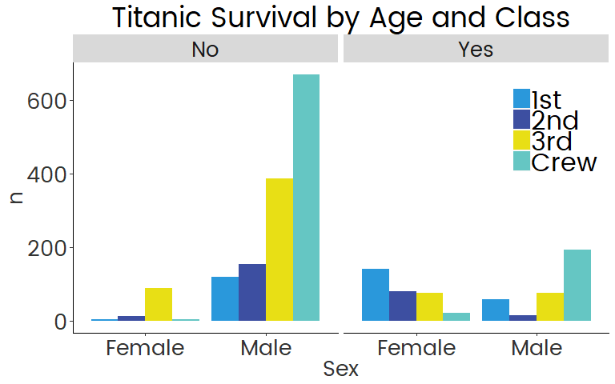

openmindR
================

**Overview**

  - [openmindR Cleaning
    Functions](https://github.com/openmindplatform/openmindR#openmindr-cleaning-functions)
  - [openmindR Analysis
    Functions](https://github.com/openmindplatform/openmindR#openmindr-analysis-functions)
  - [openmindR ggplot2
    theme](https://github.com/openmindplatform/openmindR#openmindr-ggplot2-theme)

Install package like this:

``` r
devtools::install_github("openmindplatform/openmindR")
```

Load package(s):

``` r
library(openmindR)
library(dplyr)
```

## openmindR Cleaning Functions

The following functions are meant to turn AirTable (and GuidedTrack)
data into a single clean file that can be analyzed. Along the way it
parses the data, constructs measures, removes duplicates and optionally
turns it into long format. The solid line is the suggested workflow for
a complete dataset. The dashed lines are optional (if you don’t want to
add GuidedTrack
    data).

  - [om\_filter\_data](https://github.com/openmindplatform/openmindR#om_filter_data)
  - [om\_clean\_par](https://github.com/openmindplatform/openmindR#om_clean_par)
  - [om\_rescale](https://github.com/openmindplatform/openmindR#om_rescale)
  - [om\_construct\_measures](https://github.com/openmindplatform/openmindR#om_construct_measures)
  - [om\_clean\_ppol](https://github.com/openmindplatform/openmindR#om_clean_ppol)
  - [remove\_dups](https://github.com/openmindplatform/openmindR#remove_dups)
  - [om\_gather](https://github.com/openmindplatform/openmindR#om_gather)


``` r
cleaned_dat <-
  ## Participant Progress Data
  dat.par %>% 
  ## calculating step scores and more
  om_clean_par() %>% 
  ## Assessment Data
  left_join(app.dat) %>%
  ## adding actual time
  mutate(createdTime = ifelse(is.na(createdTime), at_date, createdTime)) %>% 
  ## Make variables Q1 and Q2 as well as Q3 to C3 range 0 to 1
  om_rescale() %>% 
  ## construct ppol measures
  om_clean_ppol()  %>% 
  ## construct measures such as intellectual humility
  om_construct_measures() %>% 
  ## AccessCode Data  (only keep variables specified in acc_filters)
  left_join(dat.acc %>% select(acc_filters)) %>% 
  ## remove duplicates
  remove_dups() %>% 
  ## make vars numeric
  mutate_at(vars(matches(var_strings)), as.numeric) %>% 
  mutate_at(vars(Step1:Step5_Q5), as.character) %>%  
  mutate(AssessmentsDone = as.character(AssessmentsDone)) %>% 
  ##  GuidedTrack Data
  mutate(Source = "AirTable") %>% 
  ## TODO: Should happen automatically in om_clean_par but not, whats going on
  mutate(AppRating = as.character(AppRating)) %>% 
  coalesce_join(gt_parsed_feedback %>%
                  mutate(Source = "GT") %>%
                  mutate(AppRating = as.character(AppRating)) %>%
                  mutate_at(vars(Step1:Step5_Q5), as.character) %>%
                  mutate(AssessmentsDone = as.character(AssessmentsDone)) %>%
                  mutate(createdTime = date), by = "OMID") %>%
  ## weird case where UserType is empty string
  mutate(UserType = ifelse(nchar(UserType) == 0, NA, UserType)) %>%
  drop_na(UserType) %>% 
  mutate(createdTime = as_datetime(createdTime)) %>% 
  ## Count how many steps complete
  mutate(steps_complete = str_count(StepsComplete, "1") %>% as.character) %>% 
  ## we only want AssessmentsDone 1 thru 3
  ## Problem: There are AssessmentsDone 0 in the data.. they have completed steps but no Assessment.. how is that possible?
  filter(AssessmentsDone %in% 1:3) %>% 
  ## TODO: maybe this is not needed
  mutate(AppRating = as.numeric(AppRating)) 

## Turn data into long format
gathered_dat <- om_gather(cleaned_dat, q_c_strings)
```

## `om_filter_data`

Filter down Assessment data from AirTable by `AssessmentsDone`,
`AssessmentVersion` and `AccessCodes`.

``` r
dat.ass %>% 
  # specify which number of assessment you want to have
  om_filter_data(n_assessments = 1:3,
             # assessment version?
             version = 4,
             # select Accesscode(s) to produce report for
             accesscode = "Wilkes"
             # "Wilkes" #try this out :)
  )
```

    ## # A tibble: 653 x 78
    ##    id    OMID  AccessCode AssessmentVersi~ AssessmentsDone Q1Pre Q2Pre
    ##    <chr> <chr> <chr>      <chr>                      <dbl> <chr> <chr>
    ##  1 rec0~ 5717~ TalpashWi~ 4                              3 56    54   
    ##  2 rec0~ 1101~ ThomasWil~ 4                              2 70    40   
    ##  3 rec0~ 1430~ MaykWilke~ 4                              2 50    50   
    ##  4 rec0~ 1144~ SuszkoWil~ 4                              2 31    65   
    ##  5 rec0~ 4351~ WilliamsW~ 4                              3 77    25   
    ##  6 rec0~ 2247~ PradoWilk~ 4                              2 19    100  
    ##  7 rec0~ 3909~ VosikPeka~ 4                              2 50    58   
    ##  8 rec0~ 3873~ BalesterW~ 4                              2 63    85   
    ##  9 rec1~ 7625~ BalesterW~ 4                              2 73    30   
    ## 10 rec1~ 6771~ KarimiWil~ 4                              3 90    20   
    ## # ... with 643 more rows, and 71 more variables: Q3Pre <chr>, Q4Pre <chr>,
    ## #   Q5Pre <chr>, Q6Pre <chr>, Q7Pre <chr>, Q8Pre <chr>, Q9Pre <chr>,
    ## #   Q10Pre <chr>, Q11Pre <chr>, Q12Pre <chr>, C1Pre <chr>, C2Pre <chr>,
    ## #   C3Pre <chr>, D1 <chr>, D2 <chr>, D3 <chr>, D4 <chr>, D5 <chr>,
    ## #   DatePre <chr>, Q1Post <chr>, Q2Post <chr>, Q3Post <chr>, Q4Post <chr>,
    ## #   Q5Post <chr>, Q6Post <chr>, Q7Post <chr>, Q8Post <chr>, Q9Post <chr>,
    ## #   Q10Post <chr>, Q11Post <chr>, Q12Post <chr>, DatePost <chr>,
    ## #   B1Pre <chr>, B1Post <chr>, Q1FollowUp <chr>, Q2FollowUp <chr>,
    ## #   Q3FollowUp <chr>, Q4FollowUp <chr>, Q5FollowUp <chr>,
    ## #   Q6FollowUp <chr>, Q7FollowUp <chr>, Q8FollowUp <chr>,
    ## #   Q9FollowUp <chr>, Q10FollowUp <chr>, Q11FollowUp <chr>,
    ## #   Q12FollowUp <chr>, C1FollowUp <chr>, C2FollowUp <chr>,
    ## #   C3FollowUp <chr>, DateFollowUp <chr>, W1FollowUp <chr>,
    ## #   B1FollowUp <chr>, createdTime <chr>, S1Pre <chr>, BTaskPre <chr>,
    ## #   B2Pre <chr>, B3Pre <chr>, S1Post <chr>, C1Post <chr>, C2Post <chr>,
    ## #   C3Post <chr>, BTaskPost <chr>, B2Post <chr>, B3Post <chr>,
    ## #   W1Post <chr>, W1Pre <chr>, D6 <chr>, S1FollowUp <chr>,
    ## #   BTaskFollowUp <chr>, B2FollowUp <chr>, B3FollowUp <chr>

This dataset was filtered down to only AccessCodes that include
“Wilkes”. The `accesscode` argument is not case-sensitive and can
both be used with vectors:

``` r
dat.ass %>% 
  # specify which number of assessment you want to have
  om_filter_data(n_assessments = 1:3,
             # assessment version?
             version = 4,
             # select Accesscode(s) to produce report for
             accesscode = c("SuszkoWilkesUF18", "KarimiWilkesUF18")
  )
```

    ## # A tibble: 31 x 78
    ##    id    OMID  AccessCode AssessmentVersi~ AssessmentsDone Q1Pre Q2Pre
    ##    <chr> <chr> <chr>      <chr>                      <dbl> <chr> <chr>
    ##  1 rec0~ 1144~ SuszkoWil~ 4                              2 31    65   
    ##  2 rec1~ 6771~ KarimiWil~ 4                              3 90    20   
    ##  3 rec5~ 5923~ SuszkoWil~ 4                              2 50    50   
    ##  4 rec5~ 1915~ KarimiWil~ 4                              2 35    5    
    ##  5 rec7~ 1018~ SuszkoWil~ 4                              2 30    85   
    ##  6 recA~ 1326~ KarimiWil~ 4                              2 70    45   
    ##  7 recE~ 3793~ KarimiWil~ 4                              2 100   30   
    ##  8 recH~ 2939~ SuszkoWil~ 4                              2 <NA>  <NA> 
    ##  9 recL~ 7456~ SuszkoWil~ 4                              2 25    75   
    ## 10 recT~ 3521~ KarimiWil~ 4                              2 25    67   
    ## # ... with 21 more rows, and 71 more variables: Q3Pre <chr>, Q4Pre <chr>,
    ## #   Q5Pre <chr>, Q6Pre <chr>, Q7Pre <chr>, Q8Pre <chr>, Q9Pre <chr>,
    ## #   Q10Pre <chr>, Q11Pre <chr>, Q12Pre <chr>, C1Pre <chr>, C2Pre <chr>,
    ## #   C3Pre <chr>, D1 <chr>, D2 <chr>, D3 <chr>, D4 <chr>, D5 <chr>,
    ## #   DatePre <chr>, Q1Post <chr>, Q2Post <chr>, Q3Post <chr>, Q4Post <chr>,
    ## #   Q5Post <chr>, Q6Post <chr>, Q7Post <chr>, Q8Post <chr>, Q9Post <chr>,
    ## #   Q10Post <chr>, Q11Post <chr>, Q12Post <chr>, DatePost <chr>,
    ## #   B1Pre <chr>, B1Post <chr>, Q1FollowUp <chr>, Q2FollowUp <chr>,
    ## #   Q3FollowUp <chr>, Q4FollowUp <chr>, Q5FollowUp <chr>,
    ## #   Q6FollowUp <chr>, Q7FollowUp <chr>, Q8FollowUp <chr>,
    ## #   Q9FollowUp <chr>, Q10FollowUp <chr>, Q11FollowUp <chr>,
    ## #   Q12FollowUp <chr>, C1FollowUp <chr>, C2FollowUp <chr>,
    ## #   C3FollowUp <chr>, DateFollowUp <chr>, W1FollowUp <chr>,
    ## #   B1FollowUp <chr>, createdTime <chr>, S1Pre <chr>, BTaskPre <chr>,
    ## #   B2Pre <chr>, B3Pre <chr>, S1Post <chr>, C1Post <chr>, C2Post <chr>,
    ## #   C3Post <chr>, BTaskPost <chr>, B2Post <chr>, B3Post <chr>,
    ## #   W1Post <chr>, W1Pre <chr>, D6 <chr>, S1FollowUp <chr>,
    ## #   BTaskFollowUp <chr>, B2FollowUp <chr>, B3FollowUp <chr>

And individual strings:

``` r
dat.ass %>% 
  # specify which number of assessment you want to have
  om_filter_data(n_assessments = 1:3,
             # assessment version?
             version = 4,
             # select Accesscode(s) to produce report for
             accesscode = c("suszko|karimi")
  )
```

    ## # A tibble: 31 x 78
    ##    id    OMID  AccessCode AssessmentVersi~ AssessmentsDone Q1Pre Q2Pre
    ##    <chr> <chr> <chr>      <chr>                      <dbl> <chr> <chr>
    ##  1 rec0~ 1144~ SuszkoWil~ 4                              2 31    65   
    ##  2 rec1~ 6771~ KarimiWil~ 4                              3 90    20   
    ##  3 rec5~ 5923~ SuszkoWil~ 4                              2 50    50   
    ##  4 rec5~ 1915~ KarimiWil~ 4                              2 35    5    
    ##  5 rec7~ 1018~ SuszkoWil~ 4                              2 30    85   
    ##  6 recA~ 1326~ KarimiWil~ 4                              2 70    45   
    ##  7 recE~ 3793~ KarimiWil~ 4                              2 100   30   
    ##  8 recH~ 2939~ SuszkoWil~ 4                              2 <NA>  <NA> 
    ##  9 recL~ 7456~ SuszkoWil~ 4                              2 25    75   
    ## 10 recT~ 3521~ KarimiWil~ 4                              2 25    67   
    ## # ... with 21 more rows, and 71 more variables: Q3Pre <chr>, Q4Pre <chr>,
    ## #   Q5Pre <chr>, Q6Pre <chr>, Q7Pre <chr>, Q8Pre <chr>, Q9Pre <chr>,
    ## #   Q10Pre <chr>, Q11Pre <chr>, Q12Pre <chr>, C1Pre <chr>, C2Pre <chr>,
    ## #   C3Pre <chr>, D1 <chr>, D2 <chr>, D3 <chr>, D4 <chr>, D5 <chr>,
    ## #   DatePre <chr>, Q1Post <chr>, Q2Post <chr>, Q3Post <chr>, Q4Post <chr>,
    ## #   Q5Post <chr>, Q6Post <chr>, Q7Post <chr>, Q8Post <chr>, Q9Post <chr>,
    ## #   Q10Post <chr>, Q11Post <chr>, Q12Post <chr>, DatePost <chr>,
    ## #   B1Pre <chr>, B1Post <chr>, Q1FollowUp <chr>, Q2FollowUp <chr>,
    ## #   Q3FollowUp <chr>, Q4FollowUp <chr>, Q5FollowUp <chr>,
    ## #   Q6FollowUp <chr>, Q7FollowUp <chr>, Q8FollowUp <chr>,
    ## #   Q9FollowUp <chr>, Q10FollowUp <chr>, Q11FollowUp <chr>,
    ## #   Q12FollowUp <chr>, C1FollowUp <chr>, C2FollowUp <chr>,
    ## #   C3FollowUp <chr>, DateFollowUp <chr>, W1FollowUp <chr>,
    ## #   B1FollowUp <chr>, createdTime <chr>, S1Pre <chr>, BTaskPre <chr>,
    ## #   B2Pre <chr>, B3Pre <chr>, S1Post <chr>, C1Post <chr>, C2Post <chr>,
    ## #   C3Post <chr>, BTaskPost <chr>, B2Post <chr>, B3Post <chr>,
    ## #   W1Post <chr>, W1Pre <chr>, D6 <chr>, S1FollowUp <chr>,
    ## #   BTaskFollowUp <chr>, B2FollowUp <chr>, B3FollowUp <chr>

## `om_clean_par`

Cleans up ParticipantProgress data and creates several measures:

  - **StepTimes1 to StepTimes5:** Duration in minutes to complete a step

  - **StepCorrect1 to StepCorrect5:** Percentage of correct answers for
    each step

  - **FeedbackAnswers:** Q1 to Q5 for each individual step

Takes the following arguments:

  - **dat.par:** ParticipantProgress data from AirTable

  - **parse\_feedback:** Parse Feedback answers (Q1 to Q5 for Step 1 to
    5). Default is `FALSE`.

  - **…** Arguments for select to get additional variables from
    ParticipantProgress

<!-- end list -->

``` r
dat.par %>% 
  om_clean_par(parse_feedback = T) 
```

    ## # A tibble: 16,976 x 36
    ##    OMID  StepTimes StepsComplete StepCorrect1 StepCorrect2 StepCorrect3
    ##    <chr> <chr>     <chr>                <dbl>        <dbl>        <dbl>
    ##  1 7806~ <NA>      1, 1, 1, 1, 1        0.667        0.625        0.667
    ##  2 1000~ <NA>      1, 1, 1, 1, 1        0.75         1            0.833
    ##  3 1945~ <NA>      1, 1, 1, 1, 1        0.667        1            0.667
    ##  4 7858~ <NA>      1, 0, 0, 0, 0        0.833       NA           NA    
    ##  5 9277~ <NA>      1, 1, 1, 1, 1        1            1            1    
    ##  6 6750~ <NA>      1, 1, 1, 1, 1        1            1            1    
    ##  7 4023~ <NA>      1, 1, 1, 1, 1        0.833        1            0.667
    ##  8 1000~ <NA>      1, 1, 1, 1, 1        0.625        1            0.667
    ##  9 2458~ <NA>      1, 1, 1, 1, 0        1            1            1    
    ## 10 9406~ <NA>      1, 1, 0, 0, 0        1            1           NA    
    ## # ... with 16,966 more rows, and 30 more variables: StepCorrect4 <dbl>,
    ## #   StepCorrect5 <dbl>, StepTimes1 <dbl>, StepTimes2 <dbl>,
    ## #   StepTimes3 <dbl>, StepTimes4 <dbl>, StepTimes5 <dbl>, Step1 <chr>,
    ## #   Step1_Q1 <chr>, Step1_Q2 <chr>, Step1_Q3 <chr>, Step1_Q4 <chr>,
    ## #   Step1_Q5 <chr>, Step2 <chr>, Step2_Q1 <chr>, Step2_Q2 <chr>,
    ## #   Step2_Q3 <chr>, Step2_Q4 <chr>, Step2_Q5 <chr>, Step5 <chr>,
    ## #   Step5_Q1 <chr>, Step5_Q2 <chr>, Step5_Q3 <chr>, Step5_Q4 <chr>,
    ## #   Step5_Q5 <chr>, FeedbackAnswers <chr>,
    ## #   FeedbackAnswersVariableNames <chr>, AppRating <dbl>,
    ## #   AppRecommend <chr>, at_date <chr>

## `om_rescale`

This function rescales variables from 0 to 1.

Q1 and Q2 is divided by 100 and Q3 - Q12 and C1 - C3 is divided by 6.

**Should be run before any measures are constructed so that they are all
on the same scale.**

``` r
dat.ass %>% 
  om_rescale()
```

    ## # A tibble: 16,896 x 78
    ##    id    OMID  AccessCode AssessmentVersi~ AssessmentsDone Q1Pre Q2Pre
    ##    <chr> <chr> <chr>      <chr>            <chr>           <dbl> <dbl>
    ##  1 rec0~ 4616~ GottlickU~ 4                2                0.4   0.6 
    ##  2 rec0~ 4001~ PotterYCI~ 4                1               NA    NA   
    ##  3 rec0~ 3465~ LittleUGA~ 4                2                0.3   0.36
    ##  4 rec0~ 8406~ Jayawickr~ 4                2                0.5   0.5 
    ##  5 rec0~ 8721~ BurmanCha~ 4                2               NA    NA   
    ##  6 rec0~ 7194~ Jayawickr~ 4                2                0.8   0.45
    ##  7 rec0~ 5743~ ZipayUOre~ 4                2                0.78  0.34
    ##  8 rec0~ 5717~ TalpashWi~ 4                3                0.56  0.54
    ##  9 rec0~ 5370~ Individua~ 4                2                0.5   0.37
    ## 10 rec0~ 6459~ BursonInd~ 4                2                0.5   0.5 
    ## # ... with 16,886 more rows, and 71 more variables: Q3Pre <dbl>,
    ## #   Q4Pre <dbl>, Q5Pre <dbl>, Q6Pre <dbl>, Q7Pre <dbl>, Q8Pre <dbl>,
    ## #   Q9Pre <dbl>, Q10Pre <dbl>, Q11Pre <dbl>, Q12Pre <dbl>, C1Pre <dbl>,
    ## #   C2Pre <dbl>, C3Pre <dbl>, D1 <dbl>, D2 <chr>, D3 <chr>, D4 <chr>,
    ## #   D5 <chr>, DatePre <chr>, Q1Post <dbl>, Q2Post <dbl>, Q3Post <dbl>,
    ## #   Q4Post <dbl>, Q5Post <dbl>, Q6Post <dbl>, Q7Post <dbl>, Q8Post <dbl>,
    ## #   Q9Post <dbl>, Q10Post <dbl>, Q11Post <dbl>, Q12Post <dbl>,
    ## #   DatePost <chr>, B1Pre <chr>, B1Post <chr>, Q1FollowUp <dbl>,
    ## #   Q2FollowUp <dbl>, Q3FollowUp <dbl>, Q4FollowUp <dbl>,
    ## #   Q5FollowUp <dbl>, Q6FollowUp <dbl>, Q7FollowUp <dbl>,
    ## #   Q8FollowUp <dbl>, Q9FollowUp <dbl>, Q10FollowUp <dbl>,
    ## #   Q11FollowUp <dbl>, Q12FollowUp <dbl>, C1FollowUp <dbl>,
    ## #   C2FollowUp <dbl>, C3FollowUp <dbl>, DateFollowUp <chr>,
    ## #   W1FollowUp <chr>, B1FollowUp <chr>, createdTime <chr>, S1Pre <chr>,
    ## #   BTaskPre <chr>, B2Pre <chr>, B3Pre <chr>, S1Post <chr>, C1Post <dbl>,
    ## #   C2Post <dbl>, C3Post <dbl>, BTaskPost <chr>, B2Post <chr>,
    ## #   B3Post <chr>, W1Post <chr>, W1Pre <chr>, D6 <chr>, S1FollowUp <chr>,
    ## #   BTaskFollowUp <chr>, B2FollowUp <chr>, B3FollowUp <chr>

## `om_construct_measures`

This is a higher-level function that uses both `polar_measures` and
`calc_ih` to constuct various measures.

Creates the following variables:

  - **Q14:** Affective Polarization
  - **Q15:** Ingroup
  - **Q16:** Outgroup
  - **Q17:** Ingroup vs. Outgroup Affective Polarization
  - **Q18:** Intellectual Humility

Function automatically accounts for Assessment Version 4 and 5/5.1.

``` r
dat.ass %>% 
  om_construct_measures()
```

> Error in polar\_measures(., Q1Pre, Q2Pre) : Input data is missing
> column `ppol_cat`. Please make sure to run om\_clean\_ppol before you
> run om\_construct\_measures.

Uh oh\! That didn’t work\! `om_construct_measures` needs the column
`ppol_cat` to run which can be created with the function
`om_clean_ppol`.

## `om_clean_ppol`

Creates the following measures of Political Orientation

  - **ppol\_raw:** a variable that merges Assessment V4 and V5.1
    spelling of Political Orientation (D4)
  - **ppol:** a factor variable ordered from “Very Progressive/left” to
    “Very Conservative/right”. Excludes all other categories as NA
    (classical liberal etc.)
  - **ppol\_num:** numeric variable ranging from 1 “Very
    Progressive/left” to 7 “Very Conservative/right”
  - **ppol\_cat:** a factor variable which has two categories
    “Progressive” and “Conservative”. The rest is NA.

<!-- end list -->

``` r
dat.ass <- dat.ass %>% 
  om_clean_ppol()

dat.ass
```

    ## # A tibble: 16,896 x 82
    ##    id    OMID  AccessCode AssessmentVersi~ AssessmentsDone Q1Pre Q2Pre
    ##    <chr> <chr> <chr>      <chr>            <chr>           <dbl> <dbl>
    ##  1 rec0~ 4616~ GottlickU~ 4                2                  40    60
    ##  2 rec0~ 4001~ PotterYCI~ 4                1                  NA    NA
    ##  3 rec0~ 3465~ LittleUGA~ 4                2                  30    36
    ##  4 rec0~ 8406~ Jayawickr~ 4                2                  50    50
    ##  5 rec0~ 8721~ BurmanCha~ 4                2                  NA    NA
    ##  6 rec0~ 7194~ Jayawickr~ 4                2                  80    45
    ##  7 rec0~ 5743~ ZipayUOre~ 4                2                  78    34
    ##  8 rec0~ 5717~ TalpashWi~ 4                3                  56    54
    ##  9 rec0~ 5370~ Individua~ 4                2                  50    37
    ## 10 rec0~ 6459~ BursonInd~ 4                2                  50    50
    ## # ... with 16,886 more rows, and 75 more variables: Q3Pre <dbl>,
    ## #   Q4Pre <dbl>, Q5Pre <dbl>, Q6Pre <dbl>, Q7Pre <dbl>, Q8Pre <dbl>,
    ## #   Q9Pre <dbl>, Q10Pre <dbl>, Q11Pre <dbl>, Q12Pre <dbl>, C1Pre <dbl>,
    ## #   C2Pre <dbl>, C3Pre <dbl>, D1 <dbl>, D2 <chr>, D3 <chr>, D4 <chr>,
    ## #   D5 <chr>, DatePre <chr>, Q1Post <dbl>, Q2Post <dbl>, Q3Post <dbl>,
    ## #   Q4Post <dbl>, Q5Post <dbl>, Q6Post <dbl>, Q7Post <dbl>, Q8Post <dbl>,
    ## #   Q9Post <dbl>, Q10Post <dbl>, Q11Post <dbl>, Q12Post <dbl>,
    ## #   DatePost <chr>, B1Pre <chr>, B1Post <chr>, Q1FollowUp <dbl>,
    ## #   Q2FollowUp <dbl>, Q3FollowUp <dbl>, Q4FollowUp <dbl>,
    ## #   Q5FollowUp <dbl>, Q6FollowUp <dbl>, Q7FollowUp <dbl>,
    ## #   Q8FollowUp <dbl>, Q9FollowUp <dbl>, Q10FollowUp <dbl>,
    ## #   Q11FollowUp <dbl>, Q12FollowUp <dbl>, C1FollowUp <dbl>,
    ## #   C2FollowUp <dbl>, C3FollowUp <dbl>, DateFollowUp <chr>,
    ## #   W1FollowUp <chr>, B1FollowUp <chr>, createdTime <chr>, S1Pre <chr>,
    ## #   BTaskPre <chr>, B2Pre <chr>, B3Pre <chr>, S1Post <chr>, C1Post <dbl>,
    ## #   C2Post <dbl>, C3Post <dbl>, BTaskPost <chr>, B2Post <chr>,
    ## #   B3Post <chr>, W1Post <chr>, W1Pre <chr>, D6 <chr>, S1FollowUp <chr>,
    ## #   BTaskFollowUp <chr>, B2FollowUp <chr>, B3FollowUp <chr>,
    ## #   ppol_raw <chr>, ppol <fct>, ppol_num <dbl>, ppol_cat <fct>

Now `om_construct_measures` will work\!

``` r
dat.ass %>% 
  om_construct_measures()
```

    ## # A tibble: 16,896 x 97
    ##    id    OMID  AccessCode AssessmentVersi~ AssessmentsDone Q1Pre Q2Pre
    ##    <chr> <chr> <chr>                 <dbl> <chr>           <dbl> <dbl>
    ##  1 rec0~ 4616~ GottlickU~                4 2                  40    60
    ##  2 rec0~ 4001~ PotterYCI~                4 1                  NA    NA
    ##  3 rec0~ 3465~ LittleUGA~                4 2                  30    36
    ##  4 rec0~ 8406~ Jayawickr~                4 2                  50    50
    ##  5 rec0~ 8721~ BurmanCha~                4 2                  NA    NA
    ##  6 rec0~ 7194~ Jayawickr~                4 2                  80    45
    ##  7 rec0~ 5743~ ZipayUOre~                4 2                  78    34
    ##  8 rec0~ 5717~ TalpashWi~                4 3                  56    54
    ##  9 rec0~ 5370~ Individua~                4 2                  50    37
    ## 10 rec0~ 6459~ BursonInd~                4 2                  50    50
    ## # ... with 16,886 more rows, and 90 more variables: Q3Pre <dbl>,
    ## #   Q4Pre <dbl>, Q5Pre <dbl>, Q6Pre <dbl>, Q7Pre <dbl>, Q8Pre <dbl>,
    ## #   Q9Pre <dbl>, Q10Pre <dbl>, Q11Pre <dbl>, Q12Pre <dbl>, C1Pre <dbl>,
    ## #   C2Pre <dbl>, C3Pre <dbl>, D1 <dbl>, D2 <chr>, D3 <chr>, D4 <chr>,
    ## #   D5 <chr>, DatePre <chr>, Q1Post <dbl>, Q2Post <dbl>, Q3Post <dbl>,
    ## #   Q4Post <dbl>, Q5Post <dbl>, Q6Post <dbl>, Q7Post <dbl>, Q8Post <dbl>,
    ## #   Q9Post <dbl>, Q10Post <dbl>, Q11Post <dbl>, Q12Post <dbl>,
    ## #   DatePost <chr>, B1Pre <chr>, B1Post <chr>, Q1FollowUp <dbl>,
    ## #   Q2FollowUp <dbl>, Q3FollowUp <dbl>, Q4FollowUp <dbl>,
    ## #   Q5FollowUp <dbl>, Q6FollowUp <dbl>, Q7FollowUp <dbl>,
    ## #   Q8FollowUp <dbl>, Q9FollowUp <dbl>, Q10FollowUp <dbl>,
    ## #   Q11FollowUp <dbl>, Q12FollowUp <dbl>, C1FollowUp <dbl>,
    ## #   C2FollowUp <dbl>, C3FollowUp <dbl>, DateFollowUp <chr>,
    ## #   W1FollowUp <chr>, B1FollowUp <chr>, createdTime <chr>, S1Pre <chr>,
    ## #   BTaskPre <chr>, B2Pre <chr>, B3Pre <chr>, S1Post <chr>, C1Post <dbl>,
    ## #   C2Post <dbl>, C3Post <dbl>, BTaskPost <chr>, B2Post <chr>,
    ## #   B3Post <chr>, W1Post <chr>, W1Pre <chr>, D6 <chr>, S1FollowUp <chr>,
    ## #   BTaskFollowUp <chr>, B2FollowUp <chr>, B3FollowUp <chr>,
    ## #   ppol_raw <chr>, ppol <fct>, ppol_num <dbl>, ppol_cat <fct>,
    ## #   Q14Pre <dbl>, Q15Pre <dbl>, Q16Pre <dbl>, Q17Pre <dbl>, Q18Pre <dbl>,
    ## #   Q14Post <dbl>, Q15Post <dbl>, Q16Post <dbl>, Q17Post <dbl>,
    ## #   Q18Post <dbl>, Q14FollowUp <dbl>, Q15FollowUp <dbl>,
    ## #   Q16FollowUp <dbl>, Q17FollowUp <dbl>, Q18FollowUp <dbl>

## `remove_dups`

This function is really important to clean up duplicated OMIDs that
occasionally occur within AirTable.

``` r
dat.ass %>% 
  remove_dups()
```

    ## Removing 257 duplicates...

    ## # A tibble: 16,382 x 83
    ##    id    OMID  AccessCode AssessmentVersi~ AssessmentsDone Q1Pre Q2Pre
    ##    <chr> <chr> <chr>                 <dbl> <chr>           <dbl> <dbl>
    ##  1 rec0~ 4616~ GottlickU~                4 2                  40    60
    ##  2 rec0~ 4001~ PotterYCI~                4 1                  NA    NA
    ##  3 rec0~ 3465~ LittleUGA~                4 2                  30    36
    ##  4 rec0~ 8406~ Jayawickr~                4 2                  50    50
    ##  5 rec0~ 8721~ BurmanCha~                4 2                  NA    NA
    ##  6 rec0~ 7194~ Jayawickr~                4 2                  80    45
    ##  7 rec0~ 5743~ ZipayUOre~                4 2                  78    34
    ##  8 rec0~ 5717~ TalpashWi~                4 3                  56    54
    ##  9 rec0~ 5370~ Individua~                4 2                  50    37
    ## 10 rec0~ 6459~ BursonInd~                4 2                  50    50
    ## # ... with 16,372 more rows, and 76 more variables: Q3Pre <dbl>,
    ## #   Q4Pre <dbl>, Q5Pre <dbl>, Q6Pre <dbl>, Q7Pre <dbl>, Q8Pre <dbl>,
    ## #   Q9Pre <dbl>, Q10Pre <dbl>, Q11Pre <dbl>, Q12Pre <dbl>, C1Pre <dbl>,
    ## #   C2Pre <dbl>, C3Pre <dbl>, D1 <dbl>, D2 <chr>, D3 <chr>, D4 <chr>,
    ## #   D5 <chr>, DatePre <chr>, Q1Post <dbl>, Q2Post <dbl>, Q3Post <dbl>,
    ## #   Q4Post <dbl>, Q5Post <dbl>, Q6Post <dbl>, Q7Post <dbl>, Q8Post <dbl>,
    ## #   Q9Post <dbl>, Q10Post <dbl>, Q11Post <dbl>, Q12Post <dbl>,
    ## #   DatePost <chr>, B1Pre <chr>, B1Post <chr>, Q1FollowUp <dbl>,
    ## #   Q2FollowUp <dbl>, Q3FollowUp <dbl>, Q4FollowUp <dbl>,
    ## #   Q5FollowUp <dbl>, Q6FollowUp <dbl>, Q7FollowUp <dbl>,
    ## #   Q8FollowUp <dbl>, Q9FollowUp <dbl>, Q10FollowUp <dbl>,
    ## #   Q11FollowUp <dbl>, Q12FollowUp <dbl>, C1FollowUp <dbl>,
    ## #   C2FollowUp <dbl>, C3FollowUp <dbl>, DateFollowUp <chr>,
    ## #   W1FollowUp <chr>, B1FollowUp <chr>, createdTime <dttm>, S1Pre <chr>,
    ## #   BTaskPre <chr>, B2Pre <chr>, B3Pre <chr>, S1Post <chr>, C1Post <dbl>,
    ## #   C2Post <dbl>, C3Post <dbl>, BTaskPost <chr>, B2Post <chr>,
    ## #   B3Post <chr>, W1Post <chr>, W1Pre <chr>, D6 <chr>, S1FollowUp <chr>,
    ## #   BTaskFollowUp <chr>, B2FollowUp <chr>, B3FollowUp <chr>,
    ## #   ppol_raw <chr>, ppol <fct>, ppol_num <dbl>, ppol_cat <fct>,
    ## #   count_na <dbl>

## `om_gather`

This function will turn Assessment data into long format.

Creates the following variables:

  - **Question:** Q1Pre, Q2Pre, Q3Pre etc.
  - **Type:** Pre, Post, or FollowUp
  - **Response:** Values of the Question
  - **variable\_code:** Q1, Q2, Q3 etc.

Takes the following arguments:

  - **.data** Assessment data
  - **which\_strings** a string indicating which variables should be
    parsed out (`q_c_strings` indicates all Q and C questions)

<!-- end list -->

``` r
dat.ass %>% 
  om_gather(q_c_strings) %>% 
  ## select just the relevant vars as showcase
  select(Question, Response, Type, variable_code)
```

    ## # A tibble: 760,320 x 4
    ##    Question Response Type  variable_code
    ##    <chr>       <dbl> <chr> <chr>        
    ##  1 Q1Pre          40 Pre   Q1           
    ##  2 Q1Pre          NA Pre   Q1           
    ##  3 Q1Pre          30 Pre   Q1           
    ##  4 Q1Pre          50 Pre   Q1           
    ##  5 Q1Pre          NA Pre   Q1           
    ##  6 Q1Pre          80 Pre   Q1           
    ##  7 Q1Pre          78 Pre   Q1           
    ##  8 Q1Pre          56 Pre   Q1           
    ##  9 Q1Pre          50 Pre   Q1           
    ## 10 Q1Pre          50 Pre   Q1           
    ## # ... with 760,310 more rows

# openmindR Analysis Functions

## `om_summarize_comparisons`

This is a higher-level function that uses both “bind\_questions” and
“summarize\_comparison” to calculate t-tests and Cohen’s d using
long-format Assessment data.

With the `compare` argument you can specify either `"PrePost"`,
`"PreFollow"` or both `c("PrePost", "PreFollow")` comparisons (the
latter is the default).

``` r
## Prepare gathered_dat
gathered_dat <- dat.ass %>% 
  om_construct_measures() %>%
  remove_dups() %>%  
  om_gather(q_c_strings) 

gathered_dat %>% 
  om_summarize_comparisons(compare = c("PrePost", "PreFollow")) %>% 
  arrange(desc(percentimproved))
```

    ## # A tibble: 40 x 10
    ##    variable_code cohend cohendCIlow cohendCIhi tstat    pvalue    df
    ##    <chr>          <dbl>       <dbl>      <dbl> <dbl>     <dbl> <dbl>
    ##  1 Q17            0.521       0.386      0.656 10.9  1.35e- 24   436
    ##  2 Q17            0.535       0.496      0.574 38.6  1.53e-286  5195
    ##  3 Q16            0.418      -0.552     -0.283  8.73 5.47e- 17   436
    ##  4 Q16            0.470      -0.509     -0.431 33.9  1.05e-227  5195
    ##  5 Q18            0.337      -0.366     -0.307 31.4  9.65e-206  8731
    ##  6 Q14            0.367       0.261      0.472  9.72 4.90e- 21   702
    ##  7 Q14            0.424       0.394      0.455 39.3  3.33e-311  8591
    ##  8 Q18            0.237      -0.325     -0.149  7.50 1.38e- 13  1003
    ##  9 Q2             0.210      -0.314     -0.105  5.55 3.94e-  8   702
    ## 10 Q2             0.240      -0.270     -0.210 22.2  1.50e-106  8591
    ## # ... with 30 more rows, and 3 more variables: percentimproved <dbl>,
    ## #   Comparison <chr>, moderates <chr>

## openmindR ggplot2 theme

There are three functions for the ggplot2 theme:

  - `theme_om`
  - `scale_fill_om`
  - `scale_color_om`

Make sure you have the Poppins font installed\!

``` r
windowsFonts(`Poppins` = windowsFont("Poppins"))
```

[Good tutorial on how to install custom fonts in
R](https://www.andrewheiss.com/blog/2017/09/27/working-with-r-cairo-graphics-custom-fonts-and-ggplot/)

**Example**

``` r
## Load tidyverse
library(tidyverse)

titanic_dat <- Titanic %>% as_tibble()

titanic_dat %>% 
  ggplot(aes(Sex, n)) +
  geom_col(aes(fill = Class), position = position_dodge()) +
  theme_om(legend_position = c(0.9, 0.75)) +
  scale_fill_om("Class") +
  facet_wrap(~Survived) +
  labs(title = "Titanic Survival by Age and Class") 
```

<!-- -->

**Adapt `theme_om`**

  - `legend_position`
  - `axis_text_size`
  - `axis_title_size`
  - `legend_text_size`
  - `title_size`

<!-- end list -->

``` r
titanic_dat %>% 
  ggplot(aes(Class, n, fill = Class)) +
  geom_col() +
  theme_om(legend_position = "bottom",
           axis_text_size = 10,
           axis_title_size = 15, 
           legend_text_size = 10,
           title_size = 20) +
  scale_fill_om() +
  facet_wrap(~Survived) +
  labs(title = "Titanic Survival by Class") 
```

<!-- -->

Or all text sizes at once

  - `overall_text_size`

<!-- end list -->

``` r
titanic_dat %>% 
  ggplot(aes(Class, n, fill = Class)) +
  geom_col() +
  theme_om(legend_position = "top",
           overall_text_size = 15) +
  scale_fill_om() +
  facet_wrap(~Survived) +
  labs(title = "Titanic Survival by Class") 
```

<!-- -->
